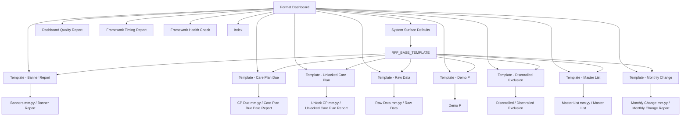
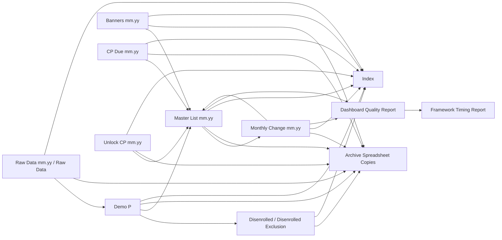
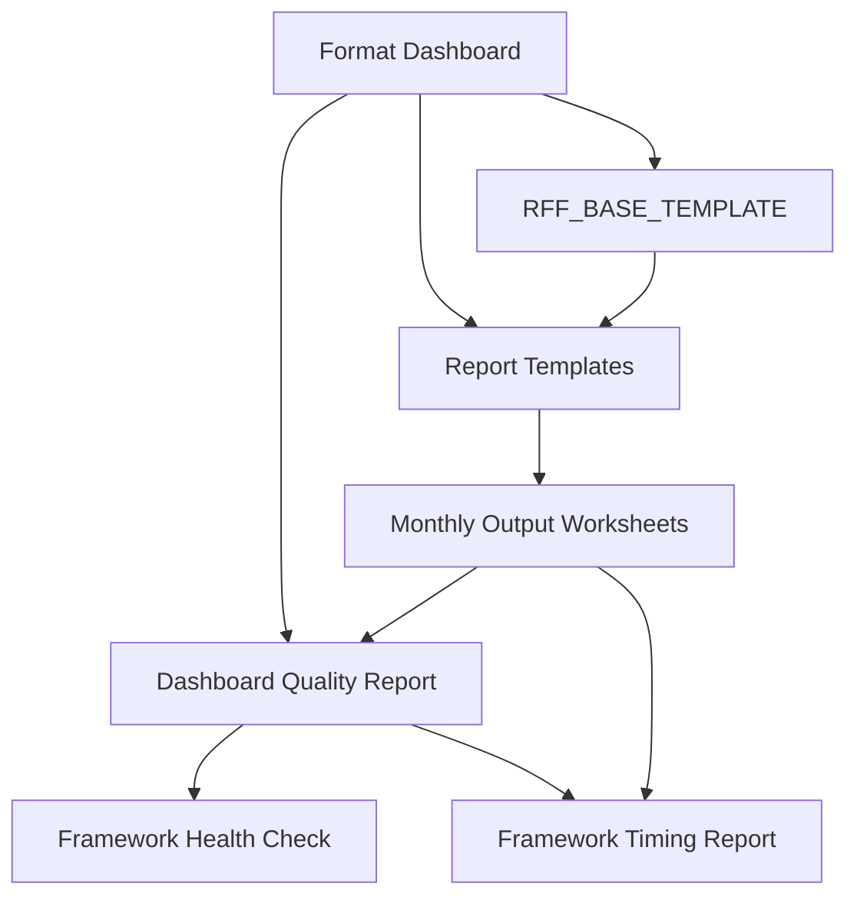

# Complete Worksheet Inventory — Master_List v1.6.29 Current Production Script

## Inventory Basis

This worksheet inventory is derived from the v1.6.29 production script constants, default Format Dashboard sheet definitions, default sheet behaviors, default system surfaces, template names, workbook ordering rules, and functions that create, read, write, hide, delete, archive, validate, or format worksheets.

## Worksheet Inventory

| Worksheet Name | Sheet Type | Owner | Created By | Read By | Written By | Deleted By | Hidden | Protected | Template Based | Format Dashboard Controlled | Dashboard Controlled | Base Template | Base Color | Row Mode | Minimum Rows | Buffer Rows | Test Rows | Archive Eligible | Notes |
|---|---|---|---|---|---|---|---|---|---|---|---|---|---|---|---:|---:|---:|---|---|
| Format Dashboard | System / Dashboard Configuration | Framework | `setupReportFormattingDashboardFromScriptDefaults_`, `rebuildFormatDashboardDefaults`, `quickSystemSetup` | `loadDashboardConfig_`, `loadGlobalSettings_`, `loadSheetDefinitions_`, `loadColumnDefinitions_`, `loadSheetBehaviors_`, `loadSheetHeaders_`, `loadTitleRows_`, `buildDashboardSectionIndex_`, `getDashboardConfigCacheKey_`, dashboard verification helpers | `writeDashboardTitle_`, `writeDashboardDefaultsFast_`, `upsertDashboardSheetDefinitionBaseColor_`, `upsertDashboardColumnDefinitionRows_`, `saveActiveLayoutToDashboardSettings`, `saveFormatDashboardConfigChanges_` | Not normally deleted; legacy diagnostic cleanup does not target this sheet | No; system surface default visibility is `VISIBLE` | Yes; system surface locked flag is `true` | No | Yes | Yes | None | `RFF_SYSTEM_SHEET_TITLE_COLOR` / `#79b5d2` | System surface | 80 | Not applicable | Not applicable | No | Governing configuration surface for global settings, title rows, sheet definitions, columns, behaviors, headers, and system surfaces. |
| Dashboard Quality Report | System / Quality Report | Framework QA | `initializeDashboardQualitySheet_`, `rebuildDashboardQualityReportShellCompact_`, `runDashboardQualityFull`, `runDashboardQualityStartUp` | `getLiveDashboardAuditStatus_`, `getLiveTemplateValidationStatus_`, dashboard quality readers, combined dashboard builders | `saveDashboardQualitySectionRows_`, `replaceDashboardQualitySectionRows_`, `replaceDashboardQualitySectionsRows_`, `appendCombinedDashboardSignOffRows_`, `writeTemplateValidationReport_`, `saveDashboardQualityRowsForTemplateValidation_`, `saveDashboardQualityRowsForHealthCheck_` | `deleteLegacyStandaloneQualityReports_`, `deleteLegacyQualityReportSheet_` for legacy duplicates only | No; system surface default visibility is `VISIBLE` | Yes; system surface locked flag is `true` | No | Yes for sections and style standards | Yes | None | `RFF_SYSTEM_SHEET_TITLE_COLOR` / `#79b5d2` | System surface | 60 | Not applicable | Not applicable | No | Unified quality, validation, dashboard verification, template validation, smoke validation, and sign-off surface. `RFF_VALIDATION_SHEET`, `RFF_DASHBOARD_QUALITY_SHEET`, and `RFF_TEST_DASHBOARD_SHEET` resolve to this surface. |
| Framework Timing Report | System / Timing Report | Framework Diagnostics | `initializeFrameworkTimingSheet_`, `rebuildFrameworkTimingReportShellCompact_`, timing writers | `getRuntimeTimingReportName_`, `getFrameworkTimingDetailRows_`, `getLatestFrameworkTimingRowsByProcess_`, `getMostRecentTimingDurationForSectionKey_`, performance summary helpers | `markFrameworkStep_`, `markRuntimeStep_`, `appendFrameworkTimingRows_`, `trimTimingReportRows_`, `writeFrameworkTimingPerformanceRecommendations`, timing shell builders | Not normally deleted; diagnostic row clearing can clear contents | No; system surface default visibility is `VISIBLE` | Yes; system surface locked flag is `true` | No | Yes for diagnostics shell/surface standards | Yes | None | `RFF_SYSTEM_SHEET_TITLE_COLOR` / `#79b5d2` | System surface | 70 | Not applicable | Not applicable | No | Unified timing surface. `RFF_TIMING_SHEET`, `RFF_FRAMEWORK_TIMING_SHEET`, and `RFF_TIMING_SUMMARY_SHEET` resolve to this sheet. |
| Framework Health Check | System / Health Report | Framework QA | `writeFrameworkHealthCheckReport_`, `runDashboardQualityTemplateAndFormatSections_`, `runDashboardQualityFull` | `getSystemAndTestingSheetNames_`, health and dashboard quality helpers | `writeFrameworkHealthCheckReport_`, `saveDashboardQualityRowsForHealthCheck_` | `deleteLegacyStandaloneQualityReports_` for legacy/standalone report cleanup | Not specified in default system surfaces; treated as diagnostic surface | Yes by diagnostic convention; not listed in `getDefaultSystemSurfaceRows_` locked rows | No | Yes for diagnostics | Yes | None | System diagnostic colors | Diagnostic | Not specified | Not applicable | Not applicable | No | Named by `RFF_HEALTH_CHECK_SHEET`; used as a health-check output/report surface even though it is not included in default system surface rows. |
| RFF_BASE_TEMPLATE | Base Template / System Template | Framework Template Engine | `ensureBaseTemplateSheet_`, `createOrRefreshAllReportTemplates`, `quickBuildAllTemplates` | Template creation and formatting helpers | `ensureBaseTemplateSheet_`, base template format writers | Not normally deleted | Yes; system surface default visibility is `HIDDEN`; also listed in `SYSTEM_SHEETS_TO_HIDE` | Yes; system surface locked flag is `true` | Yes | Yes for system surface registration | Yes | None | `RFF_SYSTEM_SHEET_TITLE_COLOR` / `#79b5d2` | Base template | 900 | Not applicable | Not applicable | No | Hidden framework base sheet used as the foundational format/template surface for report templates. |
| Template - Banner Report | Template / Report Template | Framework Template Engine | `createOrRefreshAllReportTemplates`, `createOrRefreshReportTemplate_`, template refresh helpers | `getReportTemplateSheet_`, `applyDashboardTemplateToSheet_`, `createOutputSheetFromDashboardTemplate_`, validation helpers | Template formatting and validation helpers | Rebuilt/replaced by template refresh when required | Usually hidden by `hideTemplates_` / `hideSystemSheets_`; template visibility can be toggled | Yes by template governance | Yes | Yes | Yes | `RFF_BASE_TEMPLATE` | `#65A9CC` | FIXED | 375 | 125 | 500 | No | Template source for Banner Report monthly output; sheet definition row sets template row count to 500 and test rows to 500. |
| Template - Care Plan Due | Template / Report Template | Framework Template Engine | `createOrRefreshAllReportTemplates`, `createOrRefreshReportTemplate_`, template refresh helpers | `getReportTemplateSheet_`, `applyDashboardTemplateToSheet_`, `formatCarePlanDueOrUnlockedFromDashboard_`, validation helpers | Template formatting and validation helpers | Rebuilt/replaced by template refresh when required | Usually hidden by `hideTemplates_` / `hideSystemSheets_`; template visibility can be toggled | Yes by template governance | Yes | Yes | Yes | `RFF_BASE_TEMPLATE` | `#65CC99` | FIXED | 365 | 135 | 500 | No | Template source for Care Plan Due Date Report monthly output. |
| Template - Unlocked Care Plan | Template / Report Template | Framework Template Engine | `createOrRefreshAllReportTemplates`, `createOrRefreshReportTemplate_`, template refresh helpers | `getReportTemplateSheet_`, `applyDashboardTemplateToSheet_`, `formatCarePlanDueOrUnlockedFromDashboard_`, validation helpers | Template formatting and validation helpers | Rebuilt/replaced by template refresh when required | Usually hidden by `hideTemplates_` / `hideSystemSheets_`; template visibility can be toggled | Yes by template governance | Yes | Yes | Yes | `RFF_BASE_TEMPLATE` | `#65CCC3` | FIXED | 365 | 135 | 500 | No | Template source for Unlocked Care Plan Report monthly output. |
| Template - Raw Data | Template / Report Template | Framework Template Engine | `createOrRefreshAllReportTemplates`, `createOrRefreshReportTemplate_`, template refresh helpers | `getReportTemplateSheet_`, `applyDashboardTemplateToSheet_`, `formatMonthlyRawDataSheetFromSource_`, validation helpers | Template formatting and validation helpers | Rebuilt/replaced by template refresh when required | Usually hidden by `hideTemplates_` / `hideSystemSheets_`; template visibility can be toggled | Yes by template governance | Yes | Yes | Yes | `RFF_BASE_TEMPLATE` | `#657FCC` | FIXED | 5937 | 563 | 6500 | No | Template source for formatted Raw Data monthly output; largest default worksheet footprint. |
| Template - Demo P | Template / Report Template | Framework Template Engine | `createOrRefreshDemoPTemplate_`, `createOrRefreshAllReportTemplates`, template refresh helpers | `getReportTemplateSheet_`, `applyDemoPTemplateToSheet_`, `createActiveDemoPFromRawData_`, validation helpers | `createOrRefreshDemoPTemplate_`, template formatting helpers | Rebuilt/replaced by template refresh when required | Usually hidden by `hideTemplates_` / `hideSystemSheets_`; template visibility can be toggled | Yes by template governance | Yes | Yes | Yes | `RFF_BASE_TEMPLATE` | `#657FCC` | FIXED | 2125 | 375 | 2500 | No | Template source for the active Demo P worksheet; also named by `DEMO_P_TEMPLATE_SHEET`. |
| Template - Disenrolled Exclusion | Template / Report Template | Framework Template Engine | `createOrRefreshAllReportTemplates`, `createOrRefreshReportTemplate_`, template refresh helpers | `getReportTemplateSheet_`, `createDisenrolledExclusionSheetFromDashboardTemplate_`, validation helpers | Template formatting and validation helpers | Rebuilt/replaced by template refresh when required | Usually hidden by `hideTemplates_` / `hideSystemSheets_`; template visibility can be toggled | Yes by template governance | Yes | Yes | Yes | `RFF_BASE_TEMPLATE` | `#CC65A1` | FIXED | 725 | 75 | 1000 | No | Template source for the Disenrolled Exclusion worksheet. |
| Template - Master List | Template / Report Template | Framework Template Engine | `createOrRefreshMasterListTemplate_`, `createOrRefreshAllReportTemplates`, template refresh helpers | `getReportTemplateSheet_`, `createMasterListSheetFromTemplate_`, `createMasterList`, validation helpers | `createOrRefreshMasterListTemplate_`, template formatting helpers | Rebuilt/replaced by template refresh when required | Usually hidden by `hideTemplates_` / `hideSystemSheets_`; template visibility can be toggled | Yes by template governance | Yes | Yes | Yes | `RFF_BASE_TEMPLATE` | `#7665CC` | FIXED | 343 | 157 | 500 | No | Template source for monthly Master List output; also named by `MASTER_LIST_TEMPLATE_SHEET`. |
| Template - Monthly Change | Template / Report Template | Framework Template Engine | `rebuildProductionMonthlyChangeTemplate`, `createOrRefreshAllReportTemplates`, template refresh helpers | `getReportTemplateSheet_`, `getOrBuildMonthlyChangeReport_`, `buildMonthlyChangeReportForMonth_`, validation helpers | Monthly change template builders and formatting helpers | Rebuilt/replaced by template refresh when required | Usually hidden by `hideTemplates_` / `hideSystemSheets_`; template visibility can be toggled | Yes by template governance | Yes | Yes | Yes | `RFF_BASE_TEMPLATE` | `#A165CC` | FIXED | 900 | 100 | 1000 | No | Template source for Monthly Change Report output. |
| Banners mm.yy / Banner Report | Banners | Monthly Import / Report Output | Imported by user or created/formatted by `formatBannerReport`, `formatMonthlyBannerSheet_`, `createOutputSheetFromDashboardTemplate_` | `getCurrentBannersSheet_`, `syncBannerSourceIntoData_`, `syncMasterListFromBanners_`, `validateActiveBannerFormatterOutput`, `createIndexSheet` | `formatBannerReport`, `formatMonthlyBannerSheet_`, `applyStandardFormatting_`, source sync/format helpers | `archiveMonthlyImportSheets`, `archiveMonthlySheetsBySpecs_`, `copySheetToArchiveAndDeleteLocal_` when archive workflow is used | Behavior default is `HIDDEN`; monthly import sheets may be hidden by `hideMonthlyImportSheets` | No explicit worksheet protection in defaults | Yes | Yes | Yes | `Template - Banner Report` | `#65A9CC` | FIXED | 375 | 125 | 500 | Yes | Monthly banner source/output; output naming pattern is `Banners mm.yy`; report title is `Banner Report`; end date source is last day of prompt month. |
| CP Due mm.yy / Care Plan Due Date Report | CP Due Date | Monthly Import / Report Output | Imported by user or created/formatted by `formatCarePlanDueReport`, `formatCarePlanDueOrUnlockedFromDashboard_`, `createOutputSheetFromDashboardTemplate_` | `getCurrentCarePlanDueSheet_`, `syncCarePlanDueSourceIntoData_`, `syncMasterListFromCarePlanDue_`, `createIndexSheet` | `formatCarePlanDueReport`, `formatCarePlanDueOrUnlockedFromDashboard_`, `applyStandardFormatting_`, source sync/format helpers | `archiveMonthlyImportSheets`, `archiveMonthlySheetsBySpecs_`, `copySheetToArchiveAndDeleteLocal_` when archive workflow is used | Behavior default is `HIDDEN`; monthly import sheets may be hidden by `hideMonthlyImportSheets` | No explicit worksheet protection in defaults | Yes | Yes | Yes | `Template - Care Plan Due` | `#65CC99` | FIXED | 365 | 135 | 500 | Yes | Monthly care-plan-due source/output; output naming pattern is `CP Due mm.yy`; report title is `Care Plan Due Date Report`; end date is pulled from spreadsheet. |
| Unlock CP mm.yy / Unlocked Care Plan Report | Unlock CP | Monthly Import / Report Output | Imported by user or created/formatted by `formatUnlockedCarePlanReport`, `formatCarePlanDueOrUnlockedFromDashboard_`, `createOutputSheetFromDashboardTemplate_` | `getCurrentUnlockedCarePlanSheet_`, `syncUnlockedCarePlanSourceIntoData_`, `syncMasterListFromUnlockedCarePlan_`, `createIndexSheet` | `formatUnlockedCarePlanReport`, `formatCarePlanDueOrUnlockedFromDashboard_`, `applyStandardFormatting_`, source sync/format helpers | `archiveMonthlyImportSheets`, `archiveMonthlySheetsBySpecs_`, `copySheetToArchiveAndDeleteLocal_` when archive workflow is used | Behavior default is `HIDDEN`; monthly import sheets may be hidden by `hideMonthlyImportSheets` | No explicit worksheet protection in defaults | Yes | Yes | Yes | `Template - Unlocked Care Plan` | `#65CCC3` | FIXED | 365 | 135 | 500 | Yes | Monthly unlocked-care-plan source/output; output naming pattern is `Unlock CP mm.yy`; report title is `Unlocked Care Plan Report`; end date is pulled from spreadsheet. |
| Raw Data mm.yy / Raw Data | Raw Data | Monthly Raw Data Pipeline | Imported by user or created/formatted by `formatRawData`, `formatMonthlyRawDataSheetFromSource_`, `createRawDataOutputSheetFromTemplateFast_` | `getRawDataSourceDataForOutput_`, `createActiveDemoPFromRawData_`, `updateExistingDemoPFromRawData_`, `splitRawDataRowsIntoActiveAndDisenrolled_`, `archiveActiveRawDataSheet`, `createIndexSheet` | `formatRawData`, `formatMonthlyRawDataSheetFromSource_`, `prepareRawDataSourceSheetForDashboardFormat_`, `ensureRawDataHeaderRows_`, `syncRawDataBannerColumns_` | `archiveActiveRawDataSheet`, `archiveRawSourceAndDeleteLocal_`, `archiveMonthlyImportSheets`, `copySheetToArchiveAndDeleteLocal_` when archive workflow is used | Behavior default is `HIDDEN`; auto-archive can delete local raw after archive when enabled | No explicit worksheet protection in defaults | Yes | Yes | Yes | `Template - Raw Data` | `#657FCC` | FIXED | 5937 | 563 | 6500 | Yes | Raw monthly source/output sheet; output naming pattern is `Raw Data mm.yy`; archive behavior is controlled by `RFF_ENABLE_AUTO_ARCHIVE_RAW_DATA` and `RFF_DELETE_LOCAL_RAW_AFTER_ARCHIVE`. |
| Demo P | Demo P | Active Processing Sheet | `processDemoP`, `createActiveDemoPFromRawData_`, `getOrCreateDemoPProcessingSheet_`, `buildDemoPFromScratch` | Master List creation, monthly change, sync, contact processing, disenrollment exclusion, QA, index creation | `processDemoP`, `updateDemoPMonthlySync`, `createActiveDemoPFromRawData_`, `updateExistingDemoPFromRawData_`, `flattenDemoPContactsToPrimaryRows_`, `assignPrimaryPMRRows_`, Demo P formatting helpers | `deleteSheetIfExistsForDemoPProcess_` for process replacement; archive routines may move prior monthly active sheets | Behavior default is `VISIBLE` | No explicit worksheet protection in defaults | Yes | Yes | Yes | `Template - Demo P` | `#657FCC` | FIXED | 2125 | 375 | 2500 | Yes for monthly active archive workflows | Active participant processing worksheet. Output naming pattern is `Demo P`, not month-suffixed in the default sheet definition. |
| Disenrolled | Disenrolled Exclusion | Exclusion / Control Worksheet | `createDisenrolledList`, `createDisenrolledExclusionSheetFromDashboardTemplate_` | `loadDisenrolledExclusionPMRsForPart3_`, `loadDisenrolledPMRSetForMonth_`, Master List filters, monthly change/disenrollment helpers | `createDisenrolledList`, `appendDisenrolledDeltasToExclusionSheet_`, `moveDisenrolledPMRsFromDemoPToExclusion_`, `removeActiveDemoPPMRsFromDisenrolledExclusion_` | Not normally deleted; archive active sheet workflow can archive matching monthly active surfaces | Behavior default is `VISIBLE` | No explicit worksheet protection in defaults | Yes | Yes | Yes | `Template - Disenrolled Exclusion` | `#CC65A1` | FIXED | 725 | 75 | 1000 | Yes for monthly active archive workflows | Output naming pattern is `Disenrolled`; framework constant `DISENROLLED_EXCLUSION_SHEET` is `Disenrolled Exclusion`, so logic must account for display/name variants. |
| Master List mm.yy / Master List | Master List | Primary Production Output | `createMasterList`, `createMasterListSheetFromTemplate_`, `copyPreviousMasterListToCurrentMonth_` | Monthly change, sync, merge, validation, index, sorting, QA, dashboard reports | `createMasterList`, `copyQualifyingDemoPRowsToMasterList_`, `syncMasterListMonthlySourcesIntoData_`, `updateMasterListFromMonthlyChangeActions_`, `updatePrimaryRowsFromDemoPForPMRs_`, `mergeSecondaryRowsFromDemoPForPMRs_` | `deletePMRBlocksFromMasterListBySet_` deletes rows; archive active sheet workflows can move old sheets | Behavior default is `VISIBLE` | No explicit worksheet protection in defaults | Yes | Yes | Yes | `Template - Master List` | `#7665CC` | FIXED | 343 | 157 | 500 | Yes for monthly active archive workflows | Primary monthly production output; output naming pattern is `Master List mm.yy`. |
| Monthly Change mm.yy / Monthly Change Report | Monthly Change | Monthly Delta / Review Output | `buildMonthlyChangeReport`, `buildMonthlyChangeReportForMonth_`, `getOrBuildMonthlyChangeReport_`, `rebuildProductionMonthlyChangeTemplate` | `getChangedPMRsFromMonthlyChangeReport_`, `updateMasterListFromMonthlyChangeActions_`, QA/report helpers | `buildMonthlyChangeReport`, `populateMonthlyChangeReportSections_`, `formatMonthlyChangeSubsectionBlock`, `addMCRRow_`, `compareSingleFieldAndAdd_` | Not normally deleted; archive active sheet workflows can move old sheets | Behavior default is `VISIBLE` | No explicit worksheet protection in defaults | Yes | Yes | Yes | `Template - Monthly Change` | `#A165CC` | FIXED | 900 | 100 | 1000 | Yes for monthly active archive workflows | Monthly change output; output naming pattern is `Monthly Change mm.yy`; only default behavior row with a `true` special behavior flag in column 5. |
| Index | Index | Workbook Navigation | `createIndexSheet` | Workbook navigation helpers; users | `createIndexSheet`, index formatting helpers | Not normally deleted | Generally visible; workbook tab order places it first | No explicit worksheet protection in defaults | No | No | Yes through framework constants | None | Not specified | Fixed framework index layout | 100 fixed rows | Not applicable | Not applicable | No | Index constants define header row count 4, data start row 5, buffer column 5, total columns 9, and fixed row count 100. |
| Archived worksheet copies in archive spreadsheet | Archive Copy | Archive Workbook | `copySheetToArchiveAndDeleteLocal_`, `archiveRawDataSheet_`, `archiveMonthlySheetsBySpecs_` | Archive review workflows; not part of active workbook reads except archive operations | Archive copy helpers | Local source sheet may be deleted by `copySheetToArchiveAndDeleteLocal_` after copy; archive copies are retained | Depends on copied source sheet state | Depends on copied source sheet state | Inherits copied source formatting/template state | No after archive copy | No after archive copy | Inherits source base template lineage | Inherits source tab/style color | Inherits source | Inherits source | Inherits source | Inherits source | Destination surface | Archive spreadsheet ID is configured by `RFF_ARCHIVE_SPREADSHEET_ID`; raw data local deletion depends on archive flags. |

## Sheet Type Defaults From Format Dashboard

| Sheet Type | Report Title | Template Name | Output Naming Pattern | Base Color | Use Prompt Date | End Date Source | Template Row Count | Row Mode | Minimum Rows | Buffer Rows | Test Rows | Use Test Rows | Default Visibility | Format Dashboard Controlled | Notes |
|---|---|---|---|---|---|---|---:|---|---:|---:|---:|---|---|---|---|
| Banners | Banner Report | Template - Banner Report | Banners mm.yy | #65A9CC | Yes | Last Day of Prompt Month | 500 | FIXED | 375 | 125 | 500 | No | HIDDEN | Yes | Monthly import/output source used for banner synchronization into Master List. |
| CP Due Date | Care Plan Due Date Report | Template - Care Plan Due | CP Due mm.yy | #65CC99 | Yes | Pulled From Spreadsheet | 500 | FIXED | 365 | 135 | 500 | No | HIDDEN | Yes | Monthly care-plan-due source for synchronization into Master List. |
| Unlock CP | Unlocked Care Plan Report | Template - Unlocked Care Plan | Unlock CP mm.yy | #65CCC3 | Yes | Pulled From Spreadsheet | 500 | FIXED | 365 | 135 | 500 | No | HIDDEN | Yes | Monthly unlocked-care-plan source for synchronization into Master List. |
| Raw Data | Raw Data | Template - Raw Data | Raw Data mm.yy | #657FCC | Yes | Last Day of Prompt Month | 6500 | FIXED | 5937 | 563 | 6500 | No | HIDDEN | Yes | Raw monthly source for Demo P and downstream production outputs. |
| Demo P | Demo P | Template - Demo P | Demo P | #657FCC | Yes | Last Day of Prompt Month | 2500 | FIXED | 2125 | 375 | 2500 | No | VISIBLE | Yes | Active processing sheet. |
| Disenrolled Exclusion | Disenrolled Exclusion | Template - Disenrolled Exclusion | Disenrolled | #CC65A1 | Yes | Last Day of Prompt Month | 1000 | FIXED | 725 | 75 | 1000 | No | VISIBLE | Yes | Exclusion/control sheet for disenrolled PMRs. |
| Master List | Master List | Template - Master List | Master List mm.yy | #7665CC | Yes | Last Day of Prompt Month | 500 | FIXED | 343 | 157 | 500 | No | VISIBLE | Yes | Primary monthly production output. |
| Monthly Change | Monthly Change Report | Template - Monthly Change | Monthly Change mm.yy | #A165CC | Yes | Last Day of Prompt Month | 1000 | FIXED | 900 | 100 | 1000 | No | VISIBLE | Yes | Monthly delta/review output. |

## System Surface Defaults

| Worksheet Name | System Type | Minimum Rows | Visibility | Title Color | Font Color | Protected / Locked | Notes |
|---|---|---:|---|---|---|---|---|
| Format Dashboard | Format Dashboard | 80 | VISIBLE | #79b5d2 | #000000 | Yes | Dashboard configuration surface. |
| Dashboard Quality Report | Dashboard Quality Report | 60 | VISIBLE | #79b5d2 | #000000 | Yes | Unified quality report surface. |
| Framework Timing Report | Framework Timing Report | 70 | VISIBLE | #79b5d2 | #000000 | Yes | Unified timing report surface. |
| RFF_BASE_TEMPLATE | RFF_BASE_TEMPLATE | 900 | HIDDEN | #79b5d2 | #000000 | Yes | Hidden framework base template. |

## Worksheet Dependency Diagram — Configuration, Templates, and Outputs

## Worksheet Dependency Diagram — Monthly Processing Flow

## Worksheet Dependency Diagram — System and Diagnostic Surfaces

