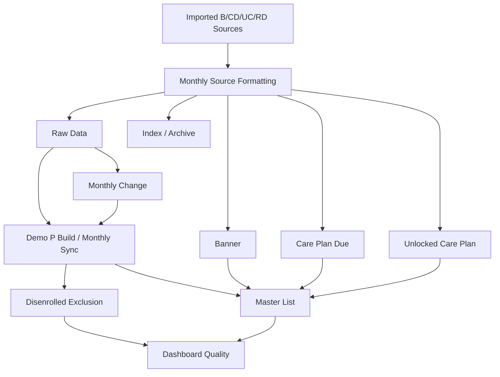
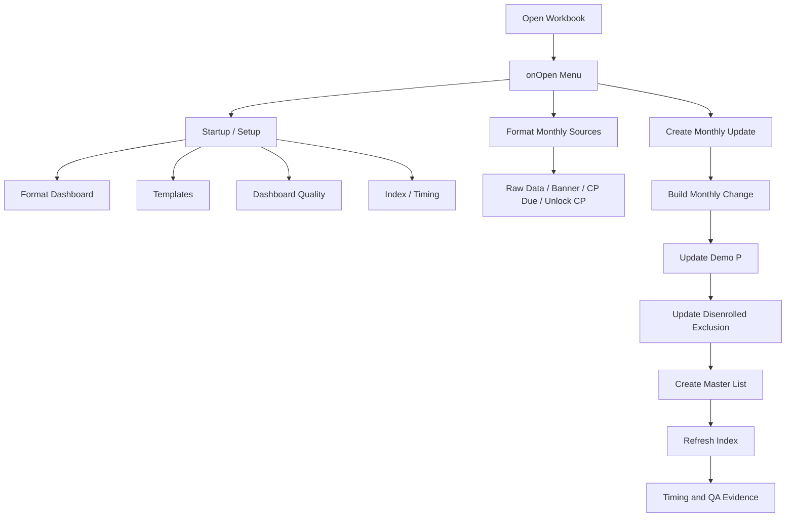

# Master List Framework Specification v2.2

**Status:** Current rebuilt framework specification
**Implementation authority:** **Master_List/Current Production Script/v1.8.9_Current_Production**
**Prior governing baseline reviewed:** **Master_List/Specs/v1.9_Master_List_Framework_Specifications_Final_Governing_Edition.pdf**
**Current draft package reviewed:** **Master_List/Specs/ML _Framework_v2.0_Drafts**
**Supporting references reviewed:** **Master_List/Specs**, **Master_List/Audit Summary**, and **Master_List/v2_Framework_Reference**
**Build output:** **Master_List/Specs/Framework_Build_Specification_v1.0.md**

## Framework Overview

The Master List Framework is a single-file Google Apps Script production framework for monthly source formatting, Demo P processing, Monthly Change reporting, Disenrolled Exclusion governance, Master List generation, Banner synchronization, Care Plan Due synchronization, Unlocked Care Plan synchronization, dashboard-governed formatting, template governance, Index/archive lifecycle management, timing instrumentation, quality validation, and release-readiness evidence.

This specification rebuilds the prior v1.9 governing framework into a current v1.8.9 implementation-bound specification. Historical framework documents, v2.0 drafts, audit summaries, and v2 reference inventories are supporting sources. The current production script is the source of truth when any supporting document conflicts with implementation.

### Current Production Baseline

| Item | Current Value |
|---|---|
| Production script | **Master_List/Current Production Script/v1.8.9_Current_Production** |
| Framework version constant | `1.8.9` |
| Production script length | 15,871 lines |
| Declared functions | 679 |
| Public Apps Script-callable functions | 64 |
| Internal underscore helpers | 615 |
| Dashboard configuration sections | A-H |
| Dashboard Quality sections | A-R |

### Framework Purpose

The framework exists to:

1. Preserve monthly source data and processing evidence.
2. Produce governed monthly report outputs from approved templates.
3. Maintain Primary PMR row ownership as the participant-level synchronization destination.
4. Convert Raw Data into Demo P participant/contact rows.
5. Compare current and prior month source data through Monthly Change reporting.
6. Maintain Disenrolled Exclusion records and Demo P replacement retention.
7. Synchronize Banner, Care Plan Due, and Unlocked Care Plan data into Master List output.
8. Maintain Index visibility across active workbook tabs and external archive tabs.
9. Validate dashboard, template, source, workflow, and output readiness.
10. Preserve Framework Timing and Dashboard Quality evidence for maintenance and release decisions.

### Protected Design Principles

| Principle | Governance Rule |
|---|---|
| Production source of truth | Production v1.8.9 governs behavior over prior specs, drafts, reports, and inventories. |
| Single-file Apps Script architecture | The framework remains a single production script until an approved versioned migration changes this. |
| Dashboard-governed configuration | Format Dashboard is the editable configuration surface where loaders and validators support runtime values. |
| Template-first output | Governed reports are created from templates, populated in batch, then finalized with targeted fixes. |
| Primary PMR ownership | Participant-level synchronized fields belong on the Primary PMR row. |
| Consolidated QA | Dashboard Quality Report is the single consolidated QA and signoff surface. |
| Safe lifecycle management | Sheet hide/archive/restore/delete operations must validate protected surfaces and workbook safety first. |
| Public compatibility | Public callbacks, menu strings, trigger entry points, web routes, and wrappers are protected. |

## Framework Architecture

### Architecture Layers

| Layer | Responsibility |
|---|---|
| Constants and feature flags | Define version, sheet types, prefixes, templates, archive defaults, row constants, timing limits, date behavior, and guarded feature switches. |
| Runtime configuration | Load Format Dashboard sections, document properties, and workbook state. |
| Runtime cache | Cache dashboard config, sheet lookups, headers, header maps, dimensions, template signatures, timing state, and dashboard quality state. |
| Formatting/template layer | Build templates, validate signatures, copy template structure, apply row/column/header formatting, and preserve hidden template state. |
| Workflow layer | Run startup, monthly source formatting, Monthly Update, Demo P, Monthly Change, Disenrolled Exclusion, Master List, Index, archive, restore, and QA workflows. |
| Data-transformation layer | Normalize headers and PMR keys, flatten Raw Data, compare current/prior data, map source rows, and synchronize participant-level fields. |
| Quality and timing layer | Write Dashboard Quality Sections A-R and Framework Timing sections; classify performance and validation evidence. |
| Governance layer | Protect approved public surfaces, naming standards, sheet schemas, dashboard sections, templates, mappings, safe-change rules, and versioning. |

### Module Organization

The implementation is physically one Apps Script file but logically divided into subsystems: configuration, runtime cache, dashboard setup/load/validation, template creation/validation, report formatting, monthly processing, Demo P processing, Monthly Change, Master List, Disenrolled Exclusion, Index/archive/restore, Dashboard Quality, Framework Timing, health checks, workflow sync verification, sheet organization, and general utilities.

### Dependency Boundaries

- Production logic may read historical intent only through implemented constants, helpers, dashboard defaults, and workflow code.
- Dashboard values are authoritative only when production loaders read them and validators accept them.
- Templates are authoritative for formatting but not for business transformations.
- Reports and PDFs are evidence artifacts; they do not override production code.
- Archive workbook data is runtime data, not repository implementation source.

## Configuration Framework

### Configuration Authority Order

| Authority | Examples | Change Control |
|---|---|---|
| Production constants | Version, sheet types, names, prefixes, templates, row constants, feature flags, archive ID default. | Versioned code review required. |
| Format Dashboard | Sheet definitions, behaviors, tab organization, columns, headers, system surfaces. | Editable at runtime after validation. |
| Document properties | Archive spreadsheet ID override, restore web app URL, signatures, busy/deferred state, quality-section state. | Runtime/deployment configuration. |
| Runtime cache | Dashboard, headers, maps, dimensions, monthly sheets, timing state. | Non-authoritative optimization; must be invalidated after mutations. |

### Format Dashboard Sections

| Section | Implemented Scope |
|---|---|
| **SECTION A - GLOBAL SETTINGS** | Header row, data start row, frozen rows/columns, row heights, default formats, font, color, HSL levels, border style, template version. |
| **SECTION B - TITLE ROWS** | Title row purposes, value source, labels, target cells, heights, font size/weight, fill level, alignment, wrap, notes. |
| **SECTION C - SHEET DEFINITIONS** | Sheet type, report title, template name, output naming pattern, base color, prompt-date usage, end-date source, template row/column counts, row mode, minimum rows, buffer rows. |
| **SECTION D - SHEET BEHAVIORS** | Title-row use, filters, alternating colors, subheaders, hidden template state, output visibility. |
| **SECTION E - SYSTEM SHEET SURFACES** | System sheet name, display name, sort order, output visibility, title colors, use-global-defaults flag, notes. |
| **SECTION F - TAB ORGANIZATION & INDEX** | Sheet/prefix category ownership, group, rank/range, and special handling for Index and tab organization. |
| **SECTION G - COLUMN DEFINITIONS** | Header-level width, header font size, date-column flag, hidden-column flag, wrap, horizontal/vertical alignment, number format. |
| **SECTION H - SHEET HEADERS** | Sheet type, column order, header name, source-of-data lineage. |

### Version and Feature Flags

Feature flags protect controlled rollout of template refresh, signature cache, staged builds, fast template refresh, full rebuild forcing, output formatting extension, duplicate-template-format enforcement, workflow busy handling, index refresh deferral, and archive behavior. These flags are protected implementation defaults and must not be changed from documentation alone.

### Cache Governance

Cache invalidation is required after dashboard rebuilds, template refreshes, sheet creation/deletion/renaming, header changes, dimension changes, monthly archive/delete operations, Dashboard Quality writes, timing writes, and Index rebuilds. Cached values are never authoritative beyond the current execution context.

## Workflow Architecture

### Menu and Entry Model

`onOpen` creates the workbook menu and connects user-facing operations to public Apps Script-callable functions. Public functions omit trailing underscores. Internal helpers use trailing underscores. Callback names are protected because menus, triggers, web routes, compatibility wrappers, and users may rely on them.

### Startup Workflow

Startup and setup workflows create or refresh system sheets, dashboard defaults, templates, Dashboard Quality shell, Framework Timing shell, Index, and archive/restore configuration surfaces. Startup validation must not destroy business data or rewrite non-owned operational sheets.

### Monthly Source Formatting Workflow

`formatMonthlySheets` prompts for one locked report month and processes the expected source route codes:

| Route | Meaning | Output Ownership |
|---|---|---|
| `B` | Banner source import | Banner formatting workflow and Banner monthly output. |
| `CD` | Care Plan Due source import | Care Plan Due monthly output. |
| `UC` | Unlocked Care Plan source import | Unlocked Care Plan monthly output. |
| `RD` | Raw Data source import | Raw Data monthly output and downstream Demo P source. |

Missing optional imports are skipped and logged when safe; invalid active source sheets and missing required dependencies fail before mutation.

### Create Monthly Update Workflow

The implemented all-in-one monthly workflow order is:

1. Prompt for the locked report month.
2. Run monthly preflight validation.
3. Build Monthly Change Report for the month.
4. Update Demo P monthly synchronization from Raw Data for changed PMRs.
5. Create/update Disenrolled Exclusion and remove qualifying Demo P rows.
6. Create Master List from updated Demo P and synchronized source data.
7. Refresh Index.
8. Skip full-workbook sheet sorting by design at the final monthly-update step while preserving index/timing evidence.
9. Notify completion and return workflow outputs.

### Standalone Workflow Rule

Standalone public callbacks remain supported for targeted troubleshooting, recovery, or partial monthly operation. Standalone paths must preserve the same validation, ownership, template, timing, cache, and safe-mutation rules as the all-in-one workflow.

### Concurrency Controls

Workflow busy state and deferred Index state prevent overlapping critical workflows and avoid unsafe sheet organization during active processing. Locking is also used for web-app restore routes where archive restoration could collide with active workbook mutation.

## Data Architecture

### Data Ownership

| Data Surface | Owner | Notes |
|---|---|---|
| Raw Data | Source formatting and Demo P/Monthly Change workflows | Source evidence must remain available until downstream validation is complete. |
| Demo P | Demo P processing workflow | Flattened participant/contact operational source for Master List and Disenrollment. |
| Primary PMR Row | Demo P / Raw Data processing | Participant-level output ownership marker; not reassigned downstream. |
| Monthly Change | Monthly Change workflow | Current/prior comparison evidence and Demo P monthly sync dependency. |
| Disenrolled Exclusion | Disenrollment workflow | Exclusion records and retained disenrollment evidence. |
| Master List | Master List workflow | Primary operational output; contains Primary PMR rows only. |
| Banner | Banner workflow | Synchronizes Banner indicators/summary data to Master List Primary PMR rows. |
| Care Plan Due | Care Plan Due workflow | Synchronizes due-date care plan data to Master List Primary PMR rows. |
| Unlocked Care Plan | Unlocked Care Plan workflow | Synchronizes unlocked care plan data to Master List Primary PMR rows. |
| Archive - Demo P | Demo P retention | Stores replaced Demo P rows before monthly body rewrite. |
| External archive workbook | Archive/Index workflows | Cold storage for monthly sheets and Index archive grid. |

### Data Flow

### Transformation Rules

- PMR identifiers must be normalized before matching.
- Header lookups should use normalized header maps rather than raw column positions.
- Demo P flattening converts Raw Data participant/contact information into governed rows and generated processing columns.
- Monthly Change compares current and prior month records across protected change categories.
- Master List receives participant-level synchronized values only on Primary PMR rows.
- Disenrollment processing appends governed exclusion records and removes qualifying Demo P rows only after validation.

## Sheet Architecture

### Sheet Categories

| Category | Sheets / Prefixes |
|---|---|
| Index | **Index** |
| Core operational | **Demo P**, **Disenrolled Exclusion** |
| Monthly active | **Master List mm.yy**, **Monthly Change mm.yy**, **Raw Data mm.yy** |
| Monthly sub-reports | **Banners mm.yy**, **CP Due mm.yy**, **Unlock CP mm.yy** |
| Source data | **Raw Data - Banners**, **Raw Data - Raw Data**, **Raw Data - CP Due**, **Raw Data - Unlocked CP** |
| Unformatted imports | **B**, **CD**, **UC**, **RD** |
| Archive | **Archive - Demo P**, external archive workbook sheets |
| System/configuration | **Framework Timing Report**, **Dashboard Quality Report**, **Format Dashboard** |
| Templates | **Template - Banner Report**, **Template - Care Plan Due**, **Template - Unlocked Care Plan**, **Template - Raw Data**, **Template - Demo P**, **Template - Disenrolled Exclusion**, **Template - Master List**, **Template - Monthly Change**, **RFF_BASE_TEMPLATE** |

### Tab Organization and Lifecycle

| Sheet / Prefix | Group | Rank / Handling | Visibility |
|---|---|---|---|
| Index | System & Configuration | Rank 1 | Never hidden. |
| Demo P | Core Operational | Rank 2 | Never hidden. |
| Disenrolled Exclusion | Core Operational | Rank 10 | Never hidden. |
| Master List mm.yy | Monthly Active | Dynamic rank beginning 21 | Visible operational output. |
| Monthly Change mm.yy | Monthly Active | Dynamic rank beginning 22 | Visible operational output. |
| Raw Data mm.yy | Monthly Active | Dynamic rank beginning 23 | Hidden after creation where configured. |
| Banners / CP Due / Unlock CP mm.yy | Monthly Sub-Reports | Dynamic ranks beginning 24-26 | Hidden after creation / monthly import menu lifecycle. |
| Raw Data - source sheets | Source Data | Dynamic ranks beginning 27-30 | Moved to archive after creation where configured. |
| B / CD / UC / RD | Unformatted | Ranks 300-303 | Source imports. |
| Archive - Demo P | Core Operational | Rank 350 | Always hidden. |
| Framework Timing Report | System & Configuration | Rank 500 | Hidden/shown by system-sheet menu. |
| Dashboard Quality Report | System & Configuration | Rank 501 | Hidden/shown by system-sheet menu. |
| Format Dashboard | System & Configuration | Rank 502 | Hidden/shown by system-sheet menu. |
| Templates | Template | Ranks 801-809 | Hidden/shown by template menu; base template always hidden. |

### Protected Sheet Rules

Framework-owned system sheets, templates, `Index`, `Archive - Demo P`, and `RFF_` sheets are protected from unsafe deletion. Sheet lifecycle operations must avoid permanently exposing hidden templates/system sheets unless a menu action explicitly shows them.

## Column Architecture

Column behavior is governed by Format Dashboard Section G. Header order and source lineage are governed by Section H. Column standards include width, header font size, date flag, hidden flag, wrap, horizontal alignment, vertical alignment, and number format. Header standards include sheet type, order, header name, and source-of-data lineage.

### Column Categories

| Category | Examples / Use |
|---|---|
| Required identity columns | Participant PMR identifiers, names, DOB, enrollment status, Primary PMR Row. |
| Source columns | Imported Raw Data, Banner, Care Plan Due, Unlocked Care Plan fields. |
| Generated processing columns | Primary PMR Row, sort/order fields, update status/month/source tracking, helper fields. |
| Synchronization columns | Banner summary, care plan due/unlocked care plan fields, participant-level merged values. |
| Validation columns | Fields used by quality checks, report validation, duplicate detection, and workflow sync checks. |
| Hidden helper columns | Columns needed for processing or audit but hidden in governed outputs. |
| Presentation columns | Width, wrap, alignment, date/number/text formats, header font size. |

## Mapping Architecture

Mapping is implemented by production helpers and documented by dashboard source lineage. Source mapping must preserve normalized headers, normalized PMR keys, source row lookup maps, generated row values, and Primary PMR row ownership.

### Mapping Standards

1. Use normalized PMR keys for participant matching.
2. Use normalized headers/header maps for column lookup.
3. Treat production source-to-output helpers as the mapping authority.
4. Preserve source lineage in Format Dashboard Section H.
5. Synchronize participant-level source data to Primary PMR rows only.
6. Fail before mutation when required identity or source columns are missing.
7. Log warnings for optional source gaps that do not compromise governed output.

### Major Mapping Paths

| Source | Destination | Governance |
|---|---|---|
| Raw Data | Demo P | Flatten participant/contact rows and generate Primary PMR ownership. |
| Raw Data current/prior | Monthly Change | Compare protected categories and write monthly change sections. |
| Demo P | Master List | Copy Primary PMR operational participant rows. |
| Demo P | Disenrolled Exclusion | Append qualifying disenrolled Primary PMR rows and remove retained rows. |
| Banner | Master List | Synchronize Banner data to Primary PMR rows. |
| Care Plan Due | Master List | Synchronize care-plan due fields to Primary PMR rows. |
| Unlocked Care Plan | Master List | Synchronize unlocked care-plan fields to Primary PMR rows. |
| Local workbook / external archive | Index | Inventory active and archived tabs and expose restore paths. |

## Template Architecture

Templates are created from Format Dashboard sheet definitions, behaviors, column definitions, header definitions, and global/title presentation settings. The framework supports smart refresh through expected signatures, document-property signatures, and sheet-note signatures.

### Template Inventory

- **Template - Banner Report**.
- **Template - Care Plan Due**.
- **Template - Unlocked Care Plan**.
- **Template - Raw Data**.
- **Template - Demo P**.
- **Template - Disenrolled Exclusion**.
- **Template - Master List**.
- **Template - Monthly Change**.
- **RFF_BASE_TEMPLATE**.

### Template Lifecycle

1. Load dashboard configuration.
2. Ensure base template exists.
3. Resolve sheet definitions, behaviors, columns, and headers.
4. Compare expected and stored signatures.
5. Use metadata-only refresh when signatures match and smart refresh is enabled.
6. Rebuild template when missing, structurally invalid, signature-mismatched, or forced.
7. Validate minimum structure and formatting.
8. Restore governed hidden-template visibility.

### Template Standards

- Templates must have governed title/header rows.
- Header row is row 4 and data begins row 5.
- Date columns use governed date formatting.
- Hidden columns are governed through column definitions.
- Filters, alternating colors, title rows, and subheaders are governed through sheet behaviors.
- Template changes require coordinated dashboard, validator, timing, QA, and documentation updates.

## Dashboard Architecture

### Format Dashboard Governance

Format Dashboard is the editable configuration dashboard. It stores current framework defaults and allows supported formatting/configuration edits. It is rebuilt only through governed callbacks and validated through Dashboard Quality.

### Dashboard Quality Governance

Dashboard Quality Report is the consolidated QA artifact. It contains Sections A-R:

| Section | Title | Ownership |
|---|---|---|
| A | Global Inputs Verification | Dashboard global/title inputs. |
| B | Sheet Definitions Verification | Sheet definitions. |
| C | Sheet Behavior Verification | Sheet behaviors. |
| D | Column Definitions Verification | Column definitions. |
| E | Sheet Headers Verification | Header definitions and lineage. |
| F | Tab Organization & Index Verification | Tab organization/index configuration. |
| G | Template Structure & Validation | Template existence, structure, formatting, and signatures. |
| H | Format Dashboard Changelog | Dashboard configuration changes. |
| I | Framework Health Check | Required functions, menus, dashboards, templates, timing, workflow, archive, and web surfaces. |
| J | Performance Summary | Framework Timing performance summary. |
| K | Raw Data Validation | Raw Data readiness and quality. |
| L | Care Plan Sync Validation | Care Plan Due / Unlocked Care Plan synchronization readiness. |
| M | Workflow & Synchronization Verification | Workflow/sync expectations, contact processing, Banner, Care Plan, and Primary PMR verification. |
| N | Demo P Quality Validation | Demo P processing quality. |
| O | Disenrolled Exclusion Validation | Disenrollment output quality. |
| P | Monthly Change Validation | Monthly Change report quality. |
| Q | Summary | Consolidated status. |
| R | Signoff | Governance signoff. |

Dashboard Quality writes are section-scoped and must preserve shell structure. Tests should update only assigned sections where possible.

### Framework Timing Governance

Framework Timing Report records process summary, performance issues, optimization recommendations, detailed timing log, and timing evidence. Timing data feeds Dashboard Quality performance and health checks.

## Processing Modules

### Startup and System Setup Module

Purpose: create/repair governed framework system surfaces without overwriting business data.

Inputs: active spreadsheet, constants, dashboard defaults, template definitions, document properties.

Outputs: Format Dashboard, Dashboard Quality Report, Framework Timing Report, templates, Index, archive configuration.

### Monthly Source Formatting Module

Purpose: convert unformatted imported source tabs into governed formatted monthly reports.

Inputs: route-coded source sheets, prompt month, dashboard/template definitions.

Outputs: Raw Data, Banner, Care Plan Due, and Unlocked Care Plan monthly outputs.

### Demo P Module

Purpose: build and maintain the flattened participant/contact processing sheet.

Inputs: Raw Data, existing Demo P, Monthly Change dependency, Disenrolled Exclusion state.

Outputs: Demo P body, Primary PMR ownership, update tracking, Archive - Demo P retained rows.

Business rules:

- Raw Data structure is validated before Demo P processing.
- Primary PMR row assignment occurs during Raw Data / Demo P processing.
- Demo P monthly sync requires Monthly Change availability.
- Replacement rows are validated for PMR coverage before rewrite.
- Replaced rows are archived before Demo P body mutation.

### Monthly Change Module

Purpose: compare current and prior source data and produce governed change evidence.

Inputs: current and prior month source sheets, normalized headers, PMR keys, dashboard/template configuration.

Outputs: Monthly Change report sections for enrollment, disenrollment, demographic, caseload, contact, Banner, and Care Plan categories where implemented.

### Disenrolled Exclusion Module

Purpose: maintain governed exclusion records and remove qualifying rows from Demo P.

Inputs: Demo P, month parts, governed disenrollment fields.

Outputs: Disenrolled Exclusion rows, retained Demo P body, old-row visibility handling, validation evidence.

### Master List Module

Purpose: produce the primary operational participant output.

Inputs: updated Demo P, Master List template, Banner output, Care Plan Due output, Unlocked Care Plan output.

Outputs: Master List containing Primary PMR rows and synchronized participant-level fields.

### Index, Archive, and Restore Module

Purpose: inventory local and archived sheets, support sheet restore, and manage lifecycle actions.

Inputs: active workbook sheets, external archive workbook, archive spreadsheet ID, restore web app URL.

Outputs: Index active grid, archive grid, restore links/actions, copied archive sheets, restored local sheets.

### Dashboard Quality and Health Module

Purpose: validate dashboard, templates, workflow sync, data quality, timing, and release readiness.

Inputs: dashboard, templates, current sheets, timing data, properties, required function registry.

Outputs: Dashboard Quality Sections A-R, framework health evidence, summary, signoff.

## Reporting Architecture

The framework generates workbook-native reports, not repository artifacts. Runtime reports include operational reports, source outputs, Dashboard Quality Report, Framework Timing Report, and Index. Binary PDF exports are review evidence only and should not be committed as implementation artifacts unless explicitly requested.

### Report Standards

- Reports must use dashboard/template-governed formatting.
- Reports must use governed monthly naming patterns.
- Reports must validate required input dependencies before destructive actions.
- Reports must preserve timing and quality evidence when available.
- Reports that produce or archive sheets must refresh Index when safe.

## Validation Framework

### Validation Layers

| Layer | Purpose |
|---|---|
| Active sheet validation | Prevent invalid source/output/system/template sheets from being processed. |
| Dashboard validation | Validate global settings, sheet definitions, behaviors, tab organization, columns, headers, and changelog state. |
| Template validation | Validate template existence, dimensions, headers, formatting, signatures, filters, hidden columns, and row/column counts. |
| Workflow preflight | Validate month selection, required source sheets, required headers, PMR identity, and downstream dependencies. |
| Data-integrity validation | Validate replacement coverage, row counts, synchronization readiness, duplicate/missing keys, and report-specific constraints. |
| Runtime validation | Smoke tests, health checks, workflow synchronization verification, and Dashboard Quality sections. |

### Fail-Fast Rules

Blocking failures must stop before mutation when missing required dependencies, invalid active sheet, unsafe monthly state, invalid PMR identity, missing required headers, archive restore conflict, destructive-operation preflight failure, or data-integrity conditions would corrupt governed output.

Best-effort warnings may be used for noncritical formatting, optional telemetry, optional Dashboard Quality section writes, Index visibility polish, system/template hiding, or timing recommendations when core data integrity is safe.

## Quality Assurance Framework

QA is consolidated into Dashboard Quality. The QA framework validates startup, dashboard configuration, tab organization, templates, raw data, care plan sync, workflow synchronization, Demo P, Disenrolled Exclusion, Monthly Change, performance, framework health, summary, and signoff.

### Acceptance Criteria

A framework build or release is not ready unless:

1. Production script version is identified.
2. Public entry points remain callable.
3. Format Dashboard Sections A-H validate.
4. Templates validate or have documented rebuild requirements.
5. Dashboard Quality Sections A-R are current for the relevant workflow scope.
6. Framework Timing has no unresolved critical runtime findings for release-blocking workflows.
7. Source data and output reports pass required workflow validations.
8. Archive/Index/restore behavior is validated when lifecycle behavior changes.
9. Documentation is synchronized to the production implementation.

## Error Handling Framework

The framework uses explicit errors for unsafe states and warning logs for recoverable noncritical issues. Error handling must preserve user-visible feedback through notifications/alerts and technical evidence through timing, logs, and Dashboard Quality where safe.

### Error Categories

| Category | Handling |
|---|---|
| Missing dependency | Stop workflow and notify user. |
| Invalid active sheet | Stop before processing. |
| Missing required header | Stop before data mutation. |
| PMR identity failure | Stop because matching/sync would be unsafe. |
| Archive/restore conflict | Stop or require explicit resolution. |
| Optional visibility/timing issue | Log warning and continue if output integrity is unaffected. |
| Dashboard Quality write issue | Warn when QA section write is optional; stop only if validation result is required to proceed. |

## Performance Framework

Performance governance preserves v1.9 batch-processing standards while documenting v1.8.9 implementation patterns.

### Performance Standards

- Use batch reads and writes.
- Prefer in-memory arrays and maps/sets.
- Cache dashboard config, headers, header maps, sheet dimensions, monthly sheet lookup, template signatures, and timing state.
- Avoid repeated full-sheet reads where governed ranges are available.
- Avoid `getValue`, `setValue`, and `getRange` inside loops when batch APIs are available.
- Use compact Dashboard Quality section writes.
- Minimize `SpreadsheetApp.flush()`.
- Batch formatting, row hiding, deletion, and resizing where practical.

### High-Complexity Areas

Template rebuild, Dashboard Quality full validation, Monthly Change comparisons, Demo P monthly sync, Master List synchronization, tab organization, archive/index inventory, and external restore workflows require timing evidence and careful dependency review.

## Framework Governance

### Protected Standards

Protected surfaces include:

- Public function names.
- Menu callback strings.
- Trigger entry points.
- Web-app parameters.
- Sheet names and prefixes.
- Template names.
- Format Dashboard section names and columns.
- Dashboard Quality section names and columns.
- Framework Timing schema.
- Tab organization rules.
- Header names and source lineage.
- Primary PMR row ownership.
- Source-to-output mapping behavior.
- Archive/Index/restore behavior.
- Runtime cache invalidation.
- Safe deletion and protected sheet rules.

### Versioning

Every production script receives a new version. Earlier production versions must not be overwritten. Documentation must be updated when production behavior changes, especially when public interfaces, dashboard sections, templates, mappings, validation, report behavior, Index/archive lifecycle, or protected standards change.

### Safe-Change Requirements

Before removing or renaming a function, constant, configuration key, menu entry, trigger, sheet, template, header, property key, or wrapper, maintainers must verify direct callers, indirect callers, menu strings, trigger references, web routes, `google.script.run`, dynamic invocation, properties, templates, validators, health checks, Dashboard Quality sections, and external consumers.

## Function Organization

The implementation contains 679 functions. Public entry points are Apps Script-callable and protected. Internal helpers are trailing-underscore functions and are protected when referenced by workflows, callbacks, validators, registries, dynamic invocation, or tests.

### Public Entry Point Inventory

- `configureArchiveSpreadsheetId`
- `setupReportFormattingDashboard`
- `rebuildFormatDashboardDefaults`
- `quickSystemSetup`
- `quickBuildAllTemplates`
- `refreshFrameworkTimingReport`
- `writeFrameworkTimingPerformanceRecommendations`
- `onEdit`
- `onOpen`
- `toggleFrameworkTiming`
- `formatDashboard`
- `saveActiveLayoutToDashboardSettings`
- `clearDiagnosticsAndTimingLogs`
- `createOrRefreshAllReportTemplates`
- `hideReportTemplates`
- `showReportTemplates`
- `validateReportTemplates`
- `formatMonthlySheets`
- `formatBannerReport`
- `validateActiveBannerFormatterOutput`
- `archiveActiveRawDataSheet`
- `runFrameworkSmokeValidation`
- `hideMonthlyImportSheets`
- `hideMonthlyActiveSheets`
- `archiveMonthlyImportSheets`
- `archiveMonthlyActiveSheets`
- `formatMonthlyChangeSubheaderRow`
- `formatMonthlyChangeSubsectionBlock`
- `getMonthlyChangeSubsectionLabels`
- `formatRawData`
- `formatCarePlanDueReport`
- `formatUnlockedCarePlanReport`
- `buildDemoPFromScratch`
- `updateDemoPMonthlySync`
- `processDemoP`
- `formatDemoPStructure`
- `buildMonthlyChangeReport`
- `runMonthlyUpdate`
- `createMasterList`
- `configureIndexRestoreWebAppUrl`
- `createIndexSheet`
- `restoreSheetFromActiveIndexRow`
- `restoreSheetFromArchiveWorkbook`
- `doGet`
- `assignSortOrderAndHideExtraRows`
- `showAllMasterListRows`
- `hideTemplates`
- `showTemplates`
- `enforceGlobalSheetSortOrder`
- `hideSystemSheetsNow`
- `showSystemSheetsNow`
- `createDisenrolledList`
- `runDashboardQualityStartUp`
- `runDashboardQualityQuick`
- `runDashboardQualityValidateTemplates`
- `runDashboardQualityFull`
- `runAllFrameworkTestsAndBuildDashboard`
- `repairAllTemplateDateFormats`
- `buildCombinedFrameworkTestDashboard`
- `runFrameworkHealthCheck`
- `runWorkflowSyncVerification`
- `setupSystemSheets`
- `verifyFrameworkConfiguration`
- `rebuildProductionMonthlyChangeTemplate`

### Logical Function Groups

| Group | Responsibilities |
|---|---|
| Configuration | Constants, dashboard defaults, archive/restore properties, runtime cache. |
| Menu/trigger/web | `onOpen`, `onEdit`, `doGet`, menu callbacks, web restore routes. |
| Dashboard | Format Dashboard setup/load/repair/validation, changelog, layout snapshot. |
| Template | Template creation, smart refresh, signatures, validation, hiding/showing. |
| Formatting | Monthly source formatting, universal canvas formatting, row/column/date formatting. |
| Demo P | Raw Data flattening, Primary PMR assignment, monthly sync, archive retention. |
| Monthly Change | Prior/current comparison, subsections, subheaders, report formatting. |
| Disenrollment | Disenrolled Exclusion append/remove/format/validation. |
| Master List | Primary-row copy, Banner/Care Plan sync, final output formatting. |
| Index/archive/restore | Active/archive inventories, archive copy/delete, restore actions, web restore. |
| Quality/timing | Dashboard Quality Sections A-R, timing logs, performance summary, health checks. |
| Utilities | Headers, dates, colors, range operations, safe deletion, sorting, normalization. |

## Framework Maintenance

Future work must start from the current production script, current framework specification, current dashboard/template defaults, current audit summaries, and current validation/timing evidence. Historical specs should be used to preserve approved governance, not to reintroduce retired behavior.

### Maintenance Workflow

1. Identify the active production script and version.
2. Review current framework spec, drafts, reports, and audits.
3. Verify affected functions, callers, menus, triggers, properties, sheets, headers, templates, validators, and QA sections.
4. Implement minimal versioned changes.
5. Regenerate or update documentation when behavior changes.
6. Run dashboard/template/workflow validation appropriate to the change.
7. Run repository preparation and verify intended text/source-only diffs.

## Appendices

### Appendix A — Framework Terminology

| Term | Definition |
|---|---|
| Primary PMR Row | Participant representative row that owns participant-level synchronized output. |
| Format Dashboard | Editable dashboard configuration surface. |
| Dashboard Quality Report | Consolidated QA, validation, summary, and signoff surface. |
| Framework Timing Report | Runtime timing and performance evidence surface. |
| Template-first output | Pattern that creates reports from governed templates before writing data. |
| Tab Organization & Index | Format Dashboard Section F governance for sheet/prefix ordering and Index lifecycle. |
| External archive workbook | Cold-storage workbook for archived monthly tabs. |
| Safe deletion | Protected deletion path that rejects framework-owned sheets and validates workbook state. |

### Appendix B — Sheet Inventory

| Sheet / Family | Type |
|---|---|
| Index | System/index. |
| Format Dashboard | Configuration dashboard. |
| Dashboard Quality Report | Quality dashboard. |
| Framework Timing Report | Timing dashboard. |
| RFF_BASE_TEMPLATE | Base template. |
| Template - Banner Report | Output template. |
| Template - Care Plan Due | Output template. |
| Template - Unlocked Care Plan | Output template. |
| Template - Raw Data | Output template. |
| Template - Demo P | Output template. |
| Template - Disenrolled Exclusion | Output template. |
| Template - Master List | Output template. |
| Template - Monthly Change | Output template. |
| Demo P | Core operational. |
| Disenrolled Exclusion | Core operational. |
| Master List mm.yy | Monthly active. |
| Monthly Change mm.yy | Monthly active. |
| Raw Data mm.yy | Monthly active/source output. |
| Banners mm.yy | Monthly sub-report. |
| CP Due mm.yy | Monthly sub-report. |
| Unlock CP mm.yy | Monthly sub-report. |
| Raw Data - Banners | Source data. |
| Raw Data - Raw Data | Source data. |
| Raw Data - CP Due | Source data. |
| Raw Data - Unlocked CP | Source data. |
| B / CD / UC / RD | Unformatted imports. |
| Archive - Demo P | Hidden Demo P retention. |

### Appendix C — Dashboard Quality Reference

- **SECTION A - GLOBAL INPUTS VERIFICATION**
- **SECTION B - SHEET DEFINITIONS VERIFICATION**
- **SECTION C - SHEET BEHAVIOR VERIFICATION**
- **SECTION D - COLUMN DEFINITIONS VERIFICATION**
- **SECTION E - SHEET HEADERS VERIFICATION**
- **SECTION F - TAB ORGANIZATION & INDEX VERIFICATION**
- **SECTION G - TEMPLATE STRUCTURE & VALIDATION**
- **SECTION H - FORMAT DASHBOARD CHANGELOG**
- **SECTION I - FRAMEWORK HEALTH CHECK**
- **SECTION J - PERFORMANCE SUMMARY**
- **SECTION K - RAW DATA VALIDATION**
- **SECTION L - CARE PLAN SYNC VALIDATION**
- **SECTION M - WORKFLOW & SYNCHRONIZATION VERIFICATION**
- **SECTION N - DEMO P QUALITY VALIDATION**
- **SECTION O - DISENROLLED EXCLUSION VALIDATION**
- **SECTION P - MONTHLY CHANGE VALIDATION**
- **SECTION Q - SUMMARY**
- **SECTION R - SIGNOFF**

### Appendix D — Workflow Diagram

### Appendix E — Configuration Reference

| Area | Representative Identifiers |
|---|---|
| Version | `MASTER_LIST_MERGE_ML_VERSION`, `RFF_VERSION`. |
| Archive | `RFF_ARCHIVE_SPREADSHEET_ID`, archive document property. |
| Restore | `ML_INDEX_RESTORE_WEB_APP_URL`. |
| Workflow state | `ML_WORKFLOW_BUSY`, `ML_WORKFLOW_BUSY_STARTED`, `ML_INDEX_REFRESH_DEFERRED`. |
| Dashboard | `RFF_DASHBOARD_SHEET`, section constants A-H, dashboard read width. |
| Templates | `RFF_BASE_TEMPLATE_NAME`, template names, template signature properties. |
| Rows | `HEADER_ROW`, `DATA_START_ROW`, Index row constants. |
| Timing | Timing sheet, runtime logs, performance thresholds, lookback limits. |

### Appendix F — Validation Reference

- Dashboard global/title verification.
- Sheet definition verification.
- Sheet behavior verification.
- Column definition verification.
- Header definition verification.
- Tab organization and Index verification.
- Template structure and validation.
- Framework health check.
- Raw Data validation.
- Care Plan sync validation.
- Workflow and synchronization verification.
- Demo P quality validation.
- Disenrolled Exclusion validation.
- Monthly Change validation.
- Summary and signoff.

### Appendix G — Source Material Status

| Source | Use in Rebuild |
|---|---|
| v1.9 governing framework PDF | Prior governance baseline and coverage model. |
| Current v2.0 drafts | Drafted current-state language and section ideas, updated only where v1.8.9 implements them. |
| Historical specs | Supporting context for dashboard quality, timing, system sheets, and governance decisions. |
| v2 framework reference | Supporting inventories for architecture, cache, templates, wrappers, validation, worksheets, and data flow. |
| Audit summaries | Current review and validation evidence, including v1.8.9 function inventory and exhaustive review. |
| v1.8.9 production script | Implementation source of truth. |

### Appendix H — Additional Data That Would Improve Future Builds

The framework can be maintained from this specification and production source. For a future appendix-only expansion, the most useful additional data would be validated live workbook exports of the current Format Dashboard, Dashboard Quality Report, Framework Timing Report, template tabs, and Index sheet after v1.8.9 deployment. These are not required to document the implemented code architecture, but they would allow exact live-runtime appendix tables to be regenerated without relying only on script defaults.
