<!-- markdownlint-disable MD013 MD024 MD060 -->

# Master List Framework v1.6.29 Complete Wrapper Inventory

Authoritative implementation: `Master_List/Current Production Script/v.1.6.29_Current_Production_Script`.

Wrapper definition used for this inventory: any production function whose primary role is to expose a stable public/menu/trigger/dashboard callable name, alias another implementation, invoke an implementation through timing/error/dashboard orchestration, or delegate to lower-level helper implementations without owning the core algorithm.

Total wrapper functions identified: **273**.

## Wrapper Inventory

| Wrapper Function | Underlying Function | Purpose | Consumer | Public/Internal | Menu Accessible | Trigger Accessible | Dashboard Accessible | Uses Format Dashboard (Yes/No) | Dashboard Sections Referenced | Formatting Driven (Yes/No) | Notes |
|---|---|---|---|---|---|---|---|---|---|---|---|
| `getAllUniqueHeaders_` | `normalizeHeader_`; `getDefaultHeaderSets_` | Internal wrapper/helper that delegates to lower-level implementation functions. | External Apps Script / menu / trigger / direct call | Internal | No | No | No | No | None directly referenced | No | Source section: HELPER FUNCTIONS; starts at production line 357. Preserve wrapper name if public, menu callback, trigger callback, or dashboard consumer. |
| `setupReportFormattingDashboard` | `setupReportFormattingDashboardFromScriptDefaults_` | Public API wrapper/entry point that delegates to underlying production implementation while preserving a stable callable name. | External Apps Script / menu / trigger / direct call | Public | No | Yes | Yes | Yes | None directly referenced | Yes | Source section: HELPER FUNCTIONS; starts at production line 571. Preserve wrapper name if public, menu callback, trigger callback, or dashboard consumer. |
| `appendDashboardSectionRows_` | `h_`; `normalizeSectionRowForWidth_` | Internal wrapper/helper that delegates to lower-level implementation functions. | writeDashboardDefaultsFast_ | Internal | No | No | Yes | No | None directly referenced | Yes | Source section: HELPER FUNCTIONS; starts at production line 575. Preserve wrapper name if public, menu callback, trigger callback, or dashboard consumer. |
| `rebuildFormatDashboardDefaults` | `setupReportFormattingDashboardFromScriptDefaults_` | Private menu callback wrapper that delegates a menu action to the production implementation. | quickSystemSetup; formatDashboard | Public | Yes | Yes | Yes | Yes | None directly referenced | Yes | Source section: HELPER FUNCTIONS; starts at production line 693. Preserve wrapper name if public, menu callback, trigger callback, or dashboard consumer. |
| `setupReportFormattingDashboardFromScriptDefaults_` | `writeDashboardDefaultsFast_`; `clearDashboardConfigCache_`; `showSheetIfNeeded_`; `runFrameworkTimed_` | Timed workflow wrapper that exposes a stable entry point and delegates execution inside framework timing instrumentation. | setupReportFormattingDashboard; rebuildFormatDashboardDefaults | Internal | No | No | Yes | Yes | None directly referenced | Yes | Source section: HELPER FUNCTIONS; starts at production line 697. Preserve wrapper name if public, menu callback, trigger callback, or dashboard consumer. |
| `getSheetDefinitionByTypeOrNull_` | `normalizeDashboardSheetTypeKey_` | Internal alias/delegation wrapper used to centralize a lower-level implementation behind a stable helper name. | getSheetDefinitionByType_ | Internal | No | No | Yes | Yes | None directly referenced | No | Source section: HELPER FUNCTIONS; starts at production line 730. Preserve wrapper name if public, menu callback, trigger callback, or dashboard consumer. |
| `getSheetDefinitionByType_` | `getSheetDefinitionByTypeOrNull_` | Internal alias/delegation wrapper used to centralize a lower-level implementation behind a stable helper name. | trimOutputSheetToDataSize_; formatMonthlyBannerSheet_; formatMonthlyDashboardSheetFromSource_; formatMonthlyRawDataSheetFromSource_; formatBannerReport; applyStandardFormatting_; applyCurrentVsOlderTabColors_; applyDashboardSortOrderAlternatingColors_; formatMonthlyChangeSubsectionBlock; formatRawData; createOutputSheetFromDashboardTemplate_; createRawDataOutputSheetFromTemplateFast_; ... | Internal | No | No | No | No | None directly referenced | No | Source section: HELPER FUNCTIONS; starts at production line 737. Preserve wrapper name if public, menu callback, trigger callback, or dashboard consumer. |
| `sortSheetDefinitionsByProductionOrder_` | `normalizeKey_`; `getRequiredFrameworkSheetTypes_` | Internal wrapper/helper that delegates to lower-level implementation functions. | createOrRefreshAllReportTemplates; setReportTemplateVisibility_; validateReportTemplatesCore_ | Internal | No | No | No | No | None directly referenced | No | Source section: HELPER FUNCTIONS; starts at production line 743. Preserve wrapper name if public, menu callback, trigger callback, or dashboard consumer. |
| `notify_` | `External service / native Apps Script API` | Internal alias/delegation wrapper used to centralize a lower-level implementation behind a stable helper name. | showQuickStartToast_; notifyErrorWithTiming_; writeCombinedFrameworkTimingReport_; toggleFrameworkTiming; saveActiveLayoutToDashboardSettings; clearDiagnosticsAndTimingLogs; formatMonthlySheets; promptForLockedYearReportMonth_; runFrameworkSmokeValidation; archiveRawSourceAndDeleteLocal_; hideMonthlySheetsBySpecs_; notifyArchiveMonthlySheetsResult_; ... | Internal | No | No | No | No | None directly referenced | No | Source section: HELPER FUNCTIONS; starts at production line 757. Preserve wrapper name if public, menu callback, trigger callback, or dashboard consumer. |
| `showQuickStartToast_` | `External service / native Apps Script API` | Internal alias/delegation wrapper used to centralize a lower-level implementation behind a stable helper name. | quickSystemSetup; quickBuildAllTemplates | Internal | No | No | No | No | None directly referenced | Yes | Source section: HELPER FUNCTIONS; starts at production line 807. Preserve wrapper name if public, menu callback, trigger callback, or dashboard consumer. |
| `quickSystemSetup` | `rebuildFormatDashboardDefaults`; `showQuickStartToast_`; `runFrameworkSmokeValidation`; `createIndexSheet`; `runDashboardQualityStartUp`; `setupSystemSheets` | Private menu callback wrapper that delegates a menu action to the production implementation. | External Apps Script / menu / trigger / direct call | Public | Yes | Yes | Yes | Yes | Operational Dashboard sections | No | Source section: HELPER FUNCTIONS; starts at production line 812. Preserve wrapper name if public, menu callback, trigger callback, or dashboard consumer. |
| `quickBuildAllTemplates` | `showQuickStartToast_`; `createOrRefreshAllReportTemplates`; `runDashboardQualityValidateTemplates` | Private menu callback wrapper that delegates a menu action to the production implementation. | External Apps Script / menu / trigger / direct call | Public | Yes | Yes | Yes | Yes | Operational Dashboard sections | Yes | Source section: HELPER FUNCTIONS; starts at production line 826. Preserve wrapper name if public, menu callback, trigger callback, or dashboard consumer. |
| `notifyErrorWithTiming_` | `External service / native Apps Script API` | Internal alias/delegation wrapper used to centralize a lower-level implementation behind a stable helper name. | formatRawData; buildDemoPFromScratch; updateDemoPMonthlySync; processDemoP; runMonthlyUpdate; updateMasterListForMonth_ | Internal | No | No | No | No | None directly referenced | No | Source section: HELPER FUNCTIONS; starts at production line 834. Preserve wrapper name if public, menu callback, trigger callback, or dashboard consumer. |
| `spreadsheetSerialDateToLocalDate_` | `isReasonableReportDate_` | Internal wrapper/helper that delegates to lower-level implementation functions. | coerceToValidDate_; convertMonthlyChangeReportDateValues_ | Internal | No | No | No | No | None directly referenced | Yes | Source section: HELPER FUNCTIONS; starts at production line 894. Preserve wrapper name if public, menu callback, trigger callback, or dashboard consumer. |
| `getTodayLocalDate_` | `createLocalDateOnly_` | Internal alias/delegation wrapper used to centralize a lower-level implementation behind a stable helper name. | isExpiredContactPhoneDate_; createDisenrolledExclusionSheetFromDashboardTemplate_; applyDisenrolledExclusionCreateFormattingOnly_; buildDatedDisenrolledOutputName_ | Internal | No | No | No | No | None directly referenced | Yes | Source section: HELPER FUNCTIONS; starts at production line 923. Preserve wrapper name if public, menu callback, trigger callback, or dashboard consumer. |
| `formatDateDisplay_` | `coerceToValidDate_` | Internal alias/delegation wrapper used to centralize a lower-level implementation behind a stable helper name. | displayValueForReport_; formatMergeAuditValueForDisplay_ | Internal | No | No | Yes | No | None directly referenced | Yes | Source section: HELPER FUNCTIONS; starts at production line 957. Preserve wrapper name if public, menu callback, trigger callback, or dashboard consumer. |
| `dateKey_` | `coerceToValidDate_` | Internal alias/delegation wrapper used to centralize a lower-level implementation behind a stable helper name. | isSameDate_; getMonthlySheetLookupCacheKey_ | Internal | No | No | No | No | None directly referenced | Yes | Source section: HELPER FUNCTIONS; starts at production line 962. Preserve wrapper name if public, menu callback, trigger callback, or dashboard consumer. |
| `isSameDate_` | `dateKey_` | Internal alias/delegation wrapper used to centralize a lower-level implementation behind a stable helper name. | compareRawDemoPForSectionReport_; compareRawDemoPForChanges_; buildMonthlyChangeSectionRows_ | Internal | No | No | No | No | None directly referenced | Yes | Source section: HELPER FUNCTIONS; starts at production line 967. Preserve wrapper name if public, menu callback, trigger callback, or dashboard consumer. |
| `isSameMonth_` | `monthKey_` | Internal alias/delegation wrapper used to centralize a lower-level implementation behind a stable helper name. | compareRawDemoPForChanges_ | Internal | No | No | No | No | None directly referenced | No | Source section: HELPER FUNCTIONS; starts at production line 971. Preserve wrapper name if public, menu callback, trigger callback, or dashboard consumer. |
| `buildMonthlySheetName_` | `buildStandardMonthlySheetName_` | Internal alias/delegation wrapper used to centralize a lower-level implementation behind a stable helper name. | buildMonthlyChangeReportForMonth_; getOrBuildMonthlyChangeReport_; createMasterList; createIndexSheet; organizeWorkbookTabs_; copyPreviousMasterListToCurrentMonth_ | Internal | No | No | No | No | None directly referenced | No | Source section: HELPER FUNCTIONS; starts at production line 976. Preserve wrapper name if public, menu callback, trigger callback, or dashboard consumer. |
| `buildStandardMonthlySheetName_` | `coerceToValidDate_` | Internal alias/delegation wrapper used to centralize a lower-level implementation behind a stable helper name. | buildMonthlySheetName_; getMonthlySheetByPrefixAndDate_; buildMonthlySheetNameNoDashAfterPrefix_; createIndexSheet; organizeWorkbookTabs_ | Internal | No | No | No | No | None directly referenced | Yes | Source section: HELPER FUNCTIONS; starts at production line 981. Preserve wrapper name if public, menu callback, trigger callback, or dashboard consumer. |
| `getHeaders_` | `getHeaderCacheKey_` | Internal wrapper/helper that delegates to lower-level implementation functions. | getHeaderMap_; getDataValues_; ensurePrimaryPMRRowColumn_; ensureHeaders_; copyChangedPMRsFromDemoPToMasterList_; applyDashboardSortOrderAlternatingColors_; getRawDataCurrentHeadersOrDefaults_; enforceDemoPStrictDashboardSchema_; buildSourceMapByCompositeKeyForDemoPBanner_; prepareRawDataSourceSheetForDashboardFormat_; buildRawDataHeadersForFormatting_; updateDemoPMonthlySync; ... | Internal | No | No | No | No | None directly referenced | No | Source section: HELPER FUNCTIONS; starts at production line 1085. Preserve wrapper name if public, menu callback, trigger callback, or dashboard consumer. |
| `getHeaderMap_` | `getHeaders_`; `buildHeaderIndexMap_`; `getHeaderCacheKey_` | Internal wrapper/helper that delegates to lower-level implementation functions. | getDataValues_; copyPrimaryDemoPRowsToMasterListByHeader_ | Internal | No | No | No | No | None directly referenced | No | Source section: HELPER FUNCTIONS; starts at production line 1105. Preserve wrapper name if public, menu callback, trigger callback, or dashboard consumer. |
| `getPMRIndex_` | `findHeaderIndex_` | Internal alias/delegation wrapper used to centralize a lower-level implementation behind a stable helper name. | validateRawDataPreflightForDemoP_; copyChangedPMRsFromDemoPToMasterList_; buildRowsByPMR_; assignPrimaryPMRRows_; writePMRContactsToParticipantRows_; syncRawDataBannerColumns_; shouldProcessRowByPMR_; updateDemoPMonthlySync; getDemoPMonthlySyncChangedPMRs_; removeActiveDemoPPMRsFromDisenrolledExclusion_; processDemoPDataWithFillBlankMask_; flattenDemoPContactRowsInMemory_; ... | Internal | No | No | No | No | None directly referenced | No | Source section: HELPER FUNCTIONS; starts at production line 1151. Preserve wrapper name if public, menu callback, trigger callback, or dashboard consumer. |
| `getDOBIndex_` | `findHeaderIndex_` | Internal alias/delegation wrapper used to centralize a lower-level implementation behind a stable helper name. | assignPrimaryRowForBlock_; shouldProcessRowByPMR_; rowsWithDOBOnlyForSection_; getRawDemoPDataForCompare_; compareSingleFieldAndAdd_; buildMonthlyChangeSectionRows_; copyPrimaryDemoPRowsToMasterListByHeader_ | Internal | No | No | No | No | None directly referenced | No | Source section: HELPER FUNCTIONS; starts at production line 1187. Preserve wrapper name if public, menu callback, trigger callback, or dashboard consumer. |
| `rawDataSourceHeaderRow_` | `rowLooksLikeParticipantHeader_` | Internal wrapper/helper that delegates to lower-level implementation functions. | getRawDataSourceDataForOutput_ | Internal | No | No | No | No | None directly referenced | No | Source section: HELPER FUNCTIONS; starts at production line 1284. Preserve wrapper name if public, menu callback, trigger callback, or dashboard consumer. |
| `ensurePrimaryPMRRowColumn_` | `getHeaders_`; `buildHeaderIndexMap_`; `clearSheetRuntimeCachesForSheet_` | Internal wrapper/helper that delegates to lower-level implementation functions. | assignPrimaryPMRRows_ | Internal | No | No | No | No | None directly referenced | Yes | Source section: HELPER FUNCTIONS; starts at production line 1299. Preserve wrapper name if public, menu callback, trigger callback, or dashboard consumer. |
| `buildMasterListHeadersBeforeDataCopy_` | `clearSheetRuntimeCachesForSheet_`; `loadDashboardConfig_`; `ensureSheetMinimumColumns_`; `getHeadersForSheetType_` | Internal wrapper/helper that delegates to lower-level implementation functions. | createMasterList | Internal | No | No | Yes | Yes | Format Dashboard resolved configuration | Yes | Source section: HELPER FUNCTIONS; starts at production line 1388. Preserve wrapper name if public, menu callback, trigger callback, or dashboard consumer. |
| `ensureBannerSummaryOutputHeaders_` | `ensureHeaders_` | Internal alias/delegation wrapper used to centralize a lower-level implementation behind a stable helper name. | processMasterListFull_; processMasterListSingleDataPass_; copyPreviousMasterListToCurrentMonth_ | Internal | No | No | No | No | None directly referenced | No | Source section: HELPER FUNCTIONS; starts at production line 1425. Preserve wrapper name if public, menu callback, trigger callback, or dashboard consumer. |
| `ensureContactOutputHeaders_` | `ensureHeaders_` | Internal wrapper/helper that delegates to lower-level implementation functions. | processMasterListFull_; processMasterListSingleDataPass_; copyPreviousMasterListToCurrentMonth_ | Internal | No | No | No | No | None directly referenced | No | Source section: HELPER FUNCTIONS; starts at production line 1429. Preserve wrapper name if public, menu callback, trigger callback, or dashboard consumer. |
| `trimOutputSheetToDataSize_` | `getSheetDefinitionByType_`; `loadDashboardConfig_`; `loadGlobalSettings_`; `resolveTemplateRowCount_`; `forceSheetRowCount_` | Internal wrapper/helper that delegates to lower-level implementation functions. | createMasterList | Internal | No | No | Yes | Yes | Format Dashboard resolved configuration | Yes | Source section: HELPER FUNCTIONS; starts at production line 1443. Preserve wrapper name if public, menu callback, trigger callback, or dashboard consumer. |
| `applyFinalRowHeightLock_` | `lockFinalOutputRowHeights_` | Internal alias/delegation wrapper used to centralize a lower-level implementation behind a stable helper name. | External Apps Script / menu / trigger / direct call | Internal | No | No | No | No | None directly referenced | Yes | Source section: HELPER FUNCTIONS; starts at production line 1488. Preserve wrapper name if public, menu callback, trigger callback, or dashboard consumer. |
| `valuesAreEqual_` | `normalizeCompareValue_` | Internal alias/delegation wrapper used to centralize a lower-level implementation behind a stable helper name. | writeChangedColumnsOnly_; compareRawDemoPForChanges_; compareSingleFieldAndAdd_; getPrimaryRowChangedColumnDetails_; getMergeAuditChangedFields_ | Internal | No | No | No | No | None directly referenced | No | Source section: HELPER FUNCTIONS; starts at production line 1524. Preserve wrapper name if public, menu callback, trigger callback, or dashboard consumer. |
| `normalizeKey_` | `normalizeText_` | Internal alias/delegation wrapper used to centralize a lower-level implementation behind a stable helper name. | normalizeDashboardSheetTypeKey_; sortSheetDefinitionsByProductionOrder_ | Internal | No | No | No | No | None directly referenced | No | Source section: HELPER FUNCTIONS; starts at production line 1532. Preserve wrapper name if public, menu callback, trigger callback, or dashboard consumer. |
| `clearSheetRuntimeCachesForSheet_` | `clearHeaderCacheForSheet_`; `clearSheetDimensionCacheForSheet_` | Internal alias/delegation wrapper used to centralize a lower-level implementation behind a stable helper name. | setUniqueSheetName_; ensurePrimaryPMRRowColumn_; deleteRowNumberBatches_; buildMasterListHeadersBeforeDataCopy_; ensureHeaders_; copyChangedPMRsFromDemoPToMasterList_; formatMonthlyDashboardSheetFromSource_; formatMonthlyRawDataSheetFromSource_; formatRawData; ensureRawDataHeaderRows_; enforceDemoPStrictDashboardSchema_; createOutputSheetFromDashboardTemplate_; ... | Internal | No | No | No | No | None directly referenced | No | Source section: HELPER FUNCTIONS; starts at production line 1566. Preserve wrapper name if public, menu callback, trigger callback, or dashboard consumer. |
| `getMonthlySheetLookupCacheKey_` | `dateKey_` | Internal alias/delegation wrapper used to centralize a lower-level implementation behind a stable helper name. | getMonthlySheetByPrefixAndDate_ | Internal | No | No | No | No | None directly referenced | No | Source section: HELPER FUNCTIONS; starts at production line 1584. Preserve wrapper name if public, menu callback, trigger callback, or dashboard consumer. |
| `clearSheetDimensionCacheForSheet_` | `getSheetDimensionCacheKey_` | Internal alias/delegation wrapper used to centralize a lower-level implementation behind a stable helper name. | clearSheetRuntimeCachesForSheet_; resizeSheetGrid_ | Internal | No | No | No | No | None directly referenced | No | Source section: HELPER FUNCTIONS; starts at production line 1595. Preserve wrapper name if public, menu callback, trigger callback, or dashboard consumer. |
| `getSheetDimensions_` | `getSheetDimensionCacheKey_` | Internal wrapper/helper that delegates to lower-level implementation functions. | getDataValues_; resizeSheetGrid_; resizeSheetRows_; resizeSheetColumns_ | Internal | No | No | No | No | None directly referenced | No | Source section: HELPER FUNCTIONS; starts at production line 1601. Preserve wrapper name if public, menu callback, trigger callback, or dashboard consumer. |
| `dateOnlyLocalClone_` | `coerceToValidDate_`; `createLocalDateOnly_` | Internal alias/delegation wrapper used to centralize a lower-level implementation behind a stable helper name. | External Apps Script / menu / trigger / direct call | Internal | No | No | No | No | None directly referenced | Yes | Source section: HELPER FUNCTIONS; starts at production line 1621. Preserve wrapper name if public, menu callback, trigger callback, or dashboard consumer. |
| `monthKey_` | `coerceToValidDate_` | Internal alias/delegation wrapper used to centralize a lower-level implementation behind a stable helper name. | isSameMonth_; getNewestFormattedMonthlySheetByPrefix_ | Internal | No | No | No | No | None directly referenced | Yes | Source section: HELPER FUNCTIONS; starts at production line 1627. Preserve wrapper name if public, menu callback, trigger callback, or dashboard consumer. |
| `safeSheetName_` | `normalizeText_` | Internal alias/delegation wrapper used to centralize a lower-level implementation behind a stable helper name. | buildDashboardOutputSheetName_ | Internal | No | No | No | No | None directly referenced | No | Source section: HELPER FUNCTIONS; starts at production line 1687. Preserve wrapper name if public, menu callback, trigger callback, or dashboard consumer. |
| `compareValues_` | `normalizeText_` | Internal alias/delegation wrapper used to centralize a lower-level implementation behind a stable helper name. | External Apps Script / menu / trigger / direct call | Internal | No | No | No | No | None directly referenced | No | Source section: HELPER FUNCTIONS; starts at production line 1694. Preserve wrapper name if public, menu callback, trigger callback, or dashboard consumer. |
| `toBool_` | `parseBoolean_` | Internal alias/delegation wrapper used to centralize a lower-level implementation behind a stable helper name. | External Apps Script / menu / trigger / direct call | Internal | No | No | No | No | None directly referenced | No | Source section: HELPER FUNCTIONS; starts at production line 1698. Preserve wrapper name if public, menu callback, trigger callback, or dashboard consumer. |
| `truthy_` | `parseBoolean_` | Internal alias/delegation wrapper used to centralize a lower-level implementation behind a stable helper name. | External Apps Script / menu / trigger / direct call | Internal | No | No | No | No | None directly referenced | No | Source section: HELPER FUNCTIONS; starts at production line 1702. Preserve wrapper name if public, menu callback, trigger callback, or dashboard consumer. |
| `toNumber_` | `numberOrDefault_` | Internal alias/delegation wrapper used to centralize a lower-level implementation behind a stable helper name. | External Apps Script / menu / trigger / direct call | Internal | No | No | No | No | None directly referenced | Yes | Source section: HELPER FUNCTIONS; starts at production line 1706. Preserve wrapper name if public, menu callback, trigger callback, or dashboard consumer. |
| `getThemeColorsFromBase_` | `numberOrDefault_`; `normalizeHex_`; `hexWithHslLightness_` | Internal wrapper/helper that delegates to lower-level implementation functions. | captureActiveSheetLayoutSnapshot_; applyTemplateBaseFormatting_; applyDataRows_; formatMonthlyChangeSubsectionBlock_; applyTemplateFreezeAndTabColor_; applyStandardFormatting_; applyIndexSheetRowFills_; applyCurrentVsOlderTabColors_; applyDashboardSortOrderAlternatingColors_; populateMonthlyChangeReportSections_; createIndexSheet; rebuildProductionMonthlyChangeTemplate | Internal | No | No | No | No | None directly referenced | No | Source section: HELPER FUNCTIONS; starts at production line 1726. Preserve wrapper name if public, menu callback, trigger callback, or dashboard consumer. |
| `hexWithHslLightness_` | `hexToRgb_`; `rgbToHex_`; `rgbToHsl_`; `hslToRgb_` | Internal alias/delegation wrapper used to centralize a lower-level implementation behind a stable helper name. | getThemeColorsFromBase_ | Internal | No | No | No | No | None directly referenced | No | Source section: HELPER FUNCTIONS; starts at production line 1753. Preserve wrapper name if public, menu callback, trigger callback, or dashboard consumer. |
| `hexToRgb_` | `normalizeHex_` | Internal wrapper/helper that delegates to lower-level implementation functions. | hexWithHslLightness_ | Internal | No | No | No | No | None directly referenced | No | Source section: HELPER FUNCTIONS; starts at production line 1760. Preserve wrapper name if public, menu callback, trigger callback, or dashboard consumer. |
| `logBestEffortWarning_` | `External service / native Apps Script API` | Internal alias/delegation wrapper used to centralize a lower-level implementation behind a stable helper name. | styleDashboard_; writeDashboardDefaultsFast_; notify_; hideOldDisenrolledRows_; writeRuntimeTimingReportBestEffort_; rebuildFrameworkTimingReportShellCompact_; trimSheetToColumnCount_; styleFrameworkTimingReport_; appendRuntimeTimingToFrameworkTimingReport_; isFrameworkTimingEnabled_; createOrRefreshAllReportTemplates; ensureGoldenMasterTemplate_; ... | Internal | No | No | No | No | None directly referenced | No | Source section: HELPER FUNCTIONS; starts at production line 1882. Preserve wrapper name if public, menu callback, trigger callback, or dashboard consumer. |
| `logRuntimeTiming_` | `getRuntimeTimingSeverity_`; `formatSeconds_` | Internal wrapper/helper that delegates to lower-level implementation functions. | markRuntimeStep_ | Internal | No | No | No | No | None directly referenced | Yes | Source section: HELPER FUNCTIONS; starts at production line 1886. Preserve wrapper name if public, menu callback, trigger callback, or dashboard consumer. |
| `writeRuntimeTimingReport_` | `writeRuntimeTimingReportBestEffort_` | Internal alias/delegation wrapper used to centralize a lower-level implementation behind a stable helper name. | formatRawData; buildDemoPFromScratch; updateDemoPMonthlySync; processDemoP; buildMonthlyChangeReport; updateMasterListForMonth_; createMasterList | Internal | No | No | No | No | None directly referenced | No | Source section: HELPER FUNCTIONS; starts at production line 1915. Preserve wrapper name if public, menu callback, trigger callback, or dashboard consumer. |
| `writeRuntimeTimingReportBestEffort_` | `writeCombinedFrameworkTimingReport_`; `appendRuntimeTimingToFrameworkTimingReport_` | Internal wrapper/helper that delegates to lower-level implementation functions. | writeRuntimeTimingReport_ | Internal | No | No | No | No | None directly referenced | No | Source section: HELPER FUNCTIONS; starts at production line 1919. Preserve wrapper name if public, menu callback, trigger callback, or dashboard consumer. |
| `writeConsolidatedTimingSummaryReport_` | `writeCombinedFrameworkTimingReport_` | Internal alias/delegation wrapper used to centralize a lower-level implementation behind a stable helper name. | refreshFrameworkTimingReport | Internal | No | No | No | No | None directly referenced | Yes | Source section: HELPER FUNCTIONS; starts at production line 1931. Preserve wrapper name if public, menu callback, trigger callback, or dashboard consumer. |
| `writeCombinedFrameworkTimingReport_` | `getFrameworkTimingRetentionLimit_`; `ensureFrameworkTimingReport_`; `styleFrameworkTimingReport_`; `replaceFrameworkTimingSectionRows_`; `getFrameworkTimingDetailRows_`; `buildFrameworkTimingProcessSummaryRows_`; `buildFrameworkTimingIssueRows_`; `buildFrameworkTimingRecommendationRows_` | Internal wrapper/helper that delegates to lower-level implementation functions. | writeRuntimeTimingReportBestEffort_; writeConsolidatedTimingSummaryReport_; writeFrameworkPerformanceRecommendationsSheet_; runDashboardQualityFull; updateDashboardQualitySummaryTimingAndSignoffSections_; updateDashboardQualityTimingSummarySection_; verifyFrameworkConfiguration; writeFrameworkTimingReportBestEffort_ | Internal | No | No | No | No | None directly referenced | No | Source section: HELPER FUNCTIONS; starts at production line 1935. Preserve wrapper name if public, menu callback, trigger callback, or dashboard consumer. |
| `collectExistingFrameworkTimingSectionBlocks_` | `getFrameworkTimingSectionRegistry_`; `findFrameworkTimingSectionRow_`; `findNextFrameworkTimingSectionRow_`; `trimTrailingBlankRows_` | Internal wrapper/helper that delegates to lower-level implementation functions. | rebuildFrameworkTimingReportShellCompact_ | Internal | No | No | No | No | None directly referenced | No | Source section: HELPER FUNCTIONS; starts at production line 2012. Preserve wrapper name if public, menu callback, trigger callback, or dashboard consumer. |
| `initializeFrameworkTimingSheet_` | `getFrameworkTimingReportSheetName_`; `rebuildFrameworkTimingReportShellCompact_`; `hasFrameworkTimingReportShell_`; `styleFrameworkTimingReport_`; `showSheetIfNeeded_` | Internal wrapper/helper that delegates to lower-level implementation functions. | ensureFrameworkTimingReport_; initializeSystemSheets_ | Internal | No | No | No | No | None directly referenced | No | Source section: HELPER FUNCTIONS; starts at production line 2141. Preserve wrapper name if public, menu callback, trigger callback, or dashboard consumer. |
| `ensureFrameworkTimingReport_` | `initializeFrameworkTimingSheet_` | Internal alias/delegation wrapper used to centralize a lower-level implementation behind a stable helper name. | writeCombinedFrameworkTimingReport_; appendRuntimeTimingToFrameworkTimingReport_; collectDashboardQualityPerformanceSummaryRows_ | Internal | No | No | No | No | None directly referenced | No | Source section: HELPER FUNCTIONS; starts at production line 2160. Preserve wrapper name if public, menu callback, trigger callback, or dashboard consumer. |
| `trimSheetToColumnCount_` | `External service / native Apps Script API` | Internal wrapper/helper that delegates to lower-level implementation functions. | writeDashboardDefaultsFast_; styleFrameworkTimingReport_; applyDashboardQualityReportColumnSettings_ | Internal | No | No | No | No | None directly referenced | Yes | Source section: HELPER FUNCTIONS; starts at production line 2164. Preserve wrapper name if public, menu callback, trigger callback, or dashboard consumer. |
| `getFrameworkTimingSectionForId_` | `getFrameworkTimingSectionRegistry_` | Internal alias/delegation wrapper used to centralize a lower-level implementation behind a stable helper name. | styleFrameworkTimingReport_; replaceFrameworkTimingSectionRows_; getFrameworkTimingDetailStartRow_; getFrameworkTimingDetailRows_ | Internal | No | No | No | No | None directly referenced | No | Source section: HELPER FUNCTIONS; starts at production line 2281. Preserve wrapper name if public, menu callback, trigger callback, or dashboard consumer. |
| `ensureFrameworkTimingReportShell_` | `rebuildFrameworkTimingReportShellCompact_`; `hasFrameworkTimingReportShell_` | Internal alias/delegation wrapper used to centralize a lower-level implementation behind a stable helper name. | External Apps Script / menu / trigger / direct call | Internal | No | No | No | No | None directly referenced | No | Source section: HELPER FUNCTIONS; starts at production line 2360. Preserve wrapper name if public, menu callback, trigger callback, or dashboard consumer. |
| `getFrameworkTimingDetailStartRow_` | `findFrameworkTimingSectionRow_`; `getFrameworkTimingSectionForId_` | Internal alias/delegation wrapper used to centralize a lower-level implementation behind a stable helper name. | External Apps Script / menu / trigger / direct call | Internal | No | No | No | No | None directly referenced | No | Source section: HELPER FUNCTIONS; starts at production line 2369. Preserve wrapper name if public, menu callback, trigger callback, or dashboard consumer. |
| `writeFrameworkPerformanceRecommendationsSheet_` | `writeCombinedFrameworkTimingReport_` | Internal alias/delegation wrapper used to centralize a lower-level implementation behind a stable helper name. | writeFrameworkTimingPerformanceRecommendations | Internal | No | No | No | No | None directly referenced | No | Source section: HELPER FUNCTIONS; starts at production line 2580. Preserve wrapper name if public, menu callback, trigger callback, or dashboard consumer. |
| `refreshFrameworkTimingReport` | `writeConsolidatedTimingSummaryReport_` | Public API wrapper/entry point that delegates to underlying production implementation while preserving a stable callable name. | External Apps Script / menu / trigger / direct call | Public | No | Yes | No | No | None directly referenced | No | Source section: HELPER FUNCTIONS; starts at production line 2666. Preserve wrapper name if public, menu callback, trigger callback, or dashboard consumer. |
| `writeFrameworkTimingPerformanceRecommendations` | `writeFrameworkPerformanceRecommendationsSheet_` | Public API wrapper/entry point that delegates to underlying production implementation while preserving a stable callable name. | External Apps Script / menu / trigger / direct call | Public | No | Yes | No | No | None directly referenced | No | Source section: HELPER FUNCTIONS; starts at production line 2670. Preserve wrapper name if public, menu callback, trigger callback, or dashboard consumer. |
| `isFrameworkTimingEnabled_` | `External service / native Apps Script API` | Internal wrapper/helper that delegates to lower-level implementation functions. | toggleFrameworkTiming; runFrameworkTimed_ | Internal | No | No | No | No | None directly referenced | No | Source section: MENU FUNCTIONS; starts at production line 2803. Preserve wrapper name if public, menu callback, trigger callback, or dashboard consumer. |
| `toggleFrameworkTiming` | `isFrameworkTimingEnabled_` | Private menu callback wrapper that delegates a menu action to the production implementation. | External Apps Script / menu / trigger / direct call | Public | Yes | Yes | No | No | None directly referenced | No | Source section: MENU FUNCTIONS; starts at production line 2812. Preserve wrapper name if public, menu callback, trigger callback, or dashboard consumer. |
| `hideTemplates_` | `hideReportTemplates` | Private menu callback wrapper that delegates a menu action to the production implementation. | External Apps Script / menu / trigger / direct call | Internal | Yes | No | Yes | No | None directly referenced | Yes | Source section: MENU FUNCTIONS; starts at production line 2820. Preserve wrapper name if public, menu callback, trigger callback, or dashboard consumer. |
| `showTemplates_` | `showReportTemplates` | Private menu callback wrapper that delegates a menu action to the production implementation. | External Apps Script / menu / trigger / direct call | Internal | Yes | No | Yes | No | None directly referenced | Yes | Source section: MENU FUNCTIONS; starts at production line 2824. Preserve wrapper name if public, menu callback, trigger callback, or dashboard consumer. |
| `hideSystemSheets_` | `hideSystemSheetsNow` | Private menu callback wrapper that delegates a menu action to the production implementation. | External Apps Script / menu / trigger / direct call | Internal | Yes | No | Yes | No | None directly referenced | Yes | Source section: MENU FUNCTIONS; starts at production line 2828. Preserve wrapper name if public, menu callback, trigger callback, or dashboard consumer. |
| `showSystemSheets_` | `showSystemSheetsNow` | Private menu callback wrapper that delegates a menu action to the production implementation. | External Apps Script / menu / trigger / direct call | Internal | Yes | No | Yes | No | None directly referenced | Yes | Source section: MENU FUNCTIONS; starts at production line 2832. Preserve wrapper name if public, menu callback, trigger callback, or dashboard consumer. |
| `formatDashboard` | `rebuildFormatDashboardDefaults` | Public API wrapper/entry point that delegates to underlying production implementation while preserving a stable callable name. | External Apps Script / menu / trigger / direct call | Public | No | Yes | Yes | Yes | None directly referenced | Yes | Source section: MENU FUNCTIONS; starts at production line 2836. Preserve wrapper name if public, menu callback, trigger callback, or dashboard consumer. |
| `saveActiveLayoutToDashboardSettings` | `saveFormatDashboardConfigChanges_`; `resolveSheetDefinitionForLayoutSnapshot_`; `captureActiveSheetLayoutSnapshot_`; `upsertDashboardSheetDefinitionBaseColor_`; `upsertDashboardColumnDefinitionRows_`; `writeDashboardLayoutSnapshotSection_`; `loadDashboardConfig_`; `isSystemOrTestingSheet_`; `...` | Private menu callback wrapper that delegates a menu action to the production implementation. | External Apps Script / menu / trigger / direct call | Public | Yes | Yes | Yes | Yes | Format Dashboard resolved configuration | Yes | Source section: MENU FUNCTIONS; starts at production line 2840. Preserve wrapper name if public, menu callback, trigger callback, or dashboard consumer. |
| `saveFormatDashboardConfigChanges_` | `styleDashboard_`; `clearDashboardConfigCache_`; `loadDashboardConfig_` | Internal wrapper/helper that delegates to lower-level implementation functions. | saveActiveLayoutToDashboardSettings | Internal | No | No | Yes | Yes | Format Dashboard resolved configuration | Yes | Source section: MENU FUNCTIONS; starts at production line 2879. Preserve wrapper name if public, menu callback, trigger callback, or dashboard consumer. |
| `resolveSheetDefinitionForLayoutSnapshot_` | `normalizeDashboardSheetTypeKey_`; `getSheetTypeForOrganization_` | Internal wrapper/helper that delegates to lower-level implementation functions. | saveActiveLayoutToDashboardSettings | Internal | No | No | Yes | Yes | None directly referenced | No | Source section: MENU FUNCTIONS; starts at production line 2892. Preserve wrapper name if public, menu callback, trigger callback, or dashboard consumer. |
| `getDefaultLayoutSnapshotBorderConfig_` | `normalizeHex_` | Internal wrapper/helper that delegates to lower-level implementation functions. | captureActiveSheetLayoutSnapshot_ | Internal | No | No | No | No | None directly referenced | No | Source section: MENU FUNCTIONS; starts at production line 2977. Preserve wrapper name if public, menu callback, trigger callback, or dashboard consumer. |
| `clearDiagnosticsAndTimingLogs` | `runFrameworkTimed_` | Private menu callback wrapper that delegates a menu action to the production implementation. | External Apps Script / menu / trigger / direct call | Public | Yes | Yes | No | No | None directly referenced | No | Source section: MENU FUNCTIONS; starts at production line 3150. Preserve wrapper name if public, menu callback, trigger callback, or dashboard consumer. |
| `getDefaultSheetDefinitionRowsWithColumnCounts_` | `normalizeDashboardSheetTypeKey_`; `numberOrDefault_`; `getDefaultSheetDefinitionRows_`; `getDefaultSheetHeaderRows_` | Internal wrapper/helper that delegates to lower-level implementation functions. | writeDashboardDefaultsFast_ | Internal | No | No | Yes | Yes | None directly referenced | Yes | Source section: FORMAT DASHBOARD AND GLOBAL DEFAULTS FUNCTIONS; starts at production line 3391. Preserve wrapper name if public, menu callback, trigger callback, or dashboard consumer. |
| `getDefaultSheetHeaderRows_` | `getDefaultHeaderSets_` | Internal wrapper/helper that delegates to lower-level implementation functions. | writeDashboardDefaultsFast_; getDefaultSheetDefinitionRowsWithColumnCounts_ | Internal | No | No | No | No | None directly referenced | No | Source section: FORMAT DASHBOARD AND GLOBAL DEFAULTS FUNCTIONS; starts at production line 3429. Preserve wrapper name if public, menu callback, trigger callback, or dashboard consumer. |
| `createOrRefreshAllReportTemplates` | `sortSheetDefinitionsByProductionOrder_`; `ensureGoldenMasterTemplate_`; `summarizeTemplateRefreshModes_`; `loadDashboardConfig_`; `createOrRefreshTemplateFromDashboard_`; `runFrameworkTimed_` | Private menu callback wrapper that delegates a menu action to the production implementation. | quickBuildAllTemplates | Public | Yes | Yes | Yes | Yes | Format Dashboard resolved configuration | Yes | Source section: TEMPLATE FUNCTIONS AND VALIDATION FORMATTERS; starts at production line 3781. Preserve wrapper name if public, menu callback, trigger callback, or dashboard consumer. |
| `hideReportTemplates` | `setReportTemplateVisibility_`; `loadDashboardConfig_`; `runFrameworkTimed_` | Timed workflow wrapper that exposes a stable entry point and delegates execution inside framework timing instrumentation. | hideTemplates_; createMasterList | Public | No | Yes | Yes | Yes | Format Dashboard resolved configuration | Yes | Source section: TEMPLATE FUNCTIONS AND VALIDATION FORMATTERS; starts at production line 3871. Preserve wrapper name if public, menu callback, trigger callback, or dashboard consumer. |
| `showReportTemplates` | `setReportTemplateVisibility_`; `loadDashboardConfig_`; `runFrameworkTimed_` | Timed workflow wrapper that exposes a stable entry point and delegates execution inside framework timing instrumentation. | showTemplates_ | Public | No | Yes | Yes | Yes | Format Dashboard resolved configuration | Yes | Source section: TEMPLATE FUNCTIONS AND VALIDATION FORMATTERS; starts at production line 3878. Preserve wrapper name if public, menu callback, trigger callback, or dashboard consumer. |
| `validateReportTemplates` | `validateReportTemplatesCore_`; `loadDashboardConfig_`; `runFrameworkTimed_` | Timed workflow wrapper that exposes a stable entry point and delegates execution inside framework timing instrumentation. | External Apps Script / menu / trigger / direct call | Public | No | Yes | Yes | Yes | Format Dashboard resolved configuration | Yes | Source section: TEMPLATE FUNCTIONS AND VALIDATION FORMATTERS; starts at production line 3918. Preserve wrapper name if public, menu callback, trigger callback, or dashboard consumer. |
| `validateReportTemplatesCore_` | `sortSheetDefinitionsByProductionOrder_`; `loadDashboardConfig_`; `validateTemplateFromDashboard_`; `writeTemplateValidationReport_` | Internal wrapper/helper that delegates to lower-level implementation functions. | validateReportTemplates; runDashboardQualityTemplateAndFormatSections_ | Internal | No | No | Yes | Yes | Format Dashboard resolved configuration; Operational Dashboard sections | Yes | Source section: TEMPLATE FUNCTIONS AND VALIDATION FORMATTERS; starts at production line 3926. Preserve wrapper name if public, menu callback, trigger callback, or dashboard consumer. |
| `getTitleRowConfigForSheet_` | `normalizeDashboardSheetTypeKey_`; `getDefaultTitleRowRows_`; `parseTitleRowConfigRow_` | Internal alias/delegation wrapper used to centralize a lower-level implementation behind a stable helper name. | applyTitleRows_; applyHeaderRow_ | Internal | No | No | Yes | Yes | None directly referenced | No | Source section: TEMPLATE FUNCTIONS AND VALIDATION FORMATTERS; starts at production line 4115. Preserve wrapper name if public, menu callback, trigger callback, or dashboard consumer. |
| `getBehaviorForSheetType_` | `normalizeDashboardSheetTypeKey_`; `getDefaultBehavior_` | Internal alias/delegation wrapper used to centralize a lower-level implementation behind a stable helper name. | createOrRefreshTemplateFromDashboard_; applyDashboardTemplateFormattingToActiveReportSheet_; validateTemplateFromDashboard_; applyOutputVisibilityPolicy_; applyDemoPTemplateToSheet_; createDisenrolledExclusionSheetFromDashboardTemplate_ | Internal | No | No | Yes | Yes | None directly referenced | No | Source section: TEMPLATE FUNCTIONS AND VALIDATION FORMATTERS; starts at production line 4304. Preserve wrapper name if public, menu callback, trigger callback, or dashboard consumer. |
| `refreshTemplateMetadataOnly_` | `resolveTemplateRowCount_`; `writeTemplateMetadata_`; `storeTemplateFormatSignature_`; `getHeadersForSheetType_`; `applyGovernedTextAndNumberFormats_` | Internal wrapper/helper that delegates to lower-level implementation functions. | createOrRefreshTemplateFromDashboard_ | Internal | No | No | Yes | No | None directly referenced | Yes | Source section: TEMPLATE FUNCTIONS AND VALIDATION FORMATTERS; starts at production line 4418. Preserve wrapper name if public, menu callback, trigger callback, or dashboard consumer. |
| `promoteStagedTemplateBuild_` | `hideSheetIfNeeded_` | Internal wrapper/helper that delegates to lower-level implementation functions. | buildTemplateFromDashboardSafely_ | Internal | No | No | Yes | No | None directly referenced | Yes | Source section: TEMPLATE FUNCTIONS AND VALIDATION FORMATTERS; starts at production line 4464. Preserve wrapper name if public, menu callback, trigger callback, or dashboard consumer. |
| `applyTemplateRowHeights_` | `External service / native Apps Script API` | Internal alias/delegation wrapper used to centralize a lower-level implementation behind a stable helper name. | applyTemplateBaseFormatting_ | Internal | No | No | Yes | No | None directly referenced | Yes | Source section: TEMPLATE FUNCTIONS AND VALIDATION FORMATTERS; starts at production line 4583. Preserve wrapper name if public, menu callback, trigger callback, or dashboard consumer. |
| `applyFinalRowHeightLockForSheetType_` | `lockFinalOutputRowHeights_` | Internal alias/delegation wrapper used to centralize a lower-level implementation behind a stable helper name. | External Apps Script / menu / trigger / direct call | Internal | No | No | No | No | None directly referenced | Yes | Source section: TEMPLATE FUNCTIONS AND VALIDATION FORMATTERS; starts at production line 4589. Preserve wrapper name if public, menu callback, trigger callback, or dashboard consumer. |
| `applyGlobalDefaultRowHeightsToSheet_` | `loadDashboardConfig_`; `safeSetRowHeights_` | Internal wrapper/helper that delegates to lower-level implementation functions. | createIndexSheet | Internal | No | No | Yes | Yes | Format Dashboard resolved configuration | Yes | Source section: TEMPLATE FUNCTIONS AND VALIDATION FORMATTERS; starts at production line 4630. Preserve wrapper name if public, menu callback, trigger callback, or dashboard consumer. |
| `applyRowHeightRuns_` | `safeSetRowHeights_` | Internal alias/delegation wrapper used to centralize a lower-level implementation behind a stable helper name. | lockFinalOutputRowHeights_ | Internal | No | No | No | No | None directly referenced | Yes | Source section: TEMPLATE FUNCTIONS AND VALIDATION FORMATTERS; starts at production line 4674. Preserve wrapper name if public, menu callback, trigger callback, or dashboard consumer. |
| `hideTemplateIfNeeded_` | `hideSheetIfNeeded_` | Internal wrapper/helper that delegates to lower-level implementation functions. | buildTemplateFromDashboard_ | Internal | No | No | Yes | No | None directly referenced | Yes | Source section: TEMPLATE FUNCTIONS AND VALIDATION FORMATTERS; starts at production line 4681. Preserve wrapper name if public, menu callback, trigger callback, or dashboard consumer. |
| `resolveTemplateRowCount_` | `numberOrDefault_` | Internal wrapper/helper that delegates to lower-level implementation functions. | trimOutputSheetToDataSize_; createOrRefreshTemplateFromDashboard_; refreshTemplateMetadataOnly_; applyDashboardTemplateFormattingToActiveReportSheet_; validateTemplateFromDashboard_; createDisenrolledExclusionSheetFromDashboardTemplate_; repairAllTemplateDateFormats | Internal | No | No | Yes | No | None directly referenced | Yes | Source section: TEMPLATE FUNCTIONS AND VALIDATION FORMATTERS; starts at production line 4696. Preserve wrapper name if public, menu callback, trigger callback, or dashboard consumer. |
| `ensureTitleRowConfig_` | `parseTitleRowConfigRow_`; `normalizeTitleTargetCell_` | Internal wrapper/helper that delegates to lower-level implementation functions. | applyTitleRows_ | Internal | No | No | No | No | None directly referenced | No | Source section: TEMPLATE FUNCTIONS AND VALIDATION FORMATTERS; starts at production line 4769. Preserve wrapper name if public, menu callback, trigger callback, or dashboard consumer. |
| `applyColumnWidths_` | `applyColumnWidthsInRuns_` | Internal wrapper/helper that delegates to lower-level implementation functions. | applyTemplateBaseFormatting_; applyUniversalFastCanvasFormatting_; enforceDemoPPostFlattenFormatting_; createMasterListSheetFromTemplate_; formatMonthlyChangeReportSectionSheet_ | Internal | No | No | No | No | None directly referenced | Yes | Source section: TEMPLATE FUNCTIONS AND VALIDATION FORMATTERS; starts at production line 4887. Preserve wrapper name if public, menu callback, trigger callback, or dashboard consumer. |
| `applyDateAndNumberFormats_` | `enforceDateAndNumberFormatsForHeaders_` | Internal alias/delegation wrapper used to centralize a lower-level implementation behind a stable helper name. | External Apps Script / menu / trigger / direct call | Internal | No | No | Yes | No | None directly referenced | Yes | Source section: TEMPLATE FUNCTIONS AND VALIDATION FORMATTERS; starts at production line 4934. Preserve wrapper name if public, menu callback, trigger callback, or dashboard consumer. |
| `enforceTemplateDateAndNumberFormats_` | `enforceDateAndNumberFormatsForHeaders_`; `getHeadersForSheetType_` | Internal alias/delegation wrapper used to centralize a lower-level implementation behind a stable helper name. | buildTemplateFromDashboard_; repairAllTemplateDateFormats | Internal | No | No | Yes | No | None directly referenced | Yes | Source section: TEMPLATE FUNCTIONS AND VALIDATION FORMATTERS; starts at production line 4938. Preserve wrapper name if public, menu callback, trigger callback, or dashboard consumer. |
| `getGoogleSheetsNumberFormat_` | `isDateFormatText_` | Internal wrapper/helper that delegates to lower-level implementation functions. | enforceDateAndNumberFormatsForHeaders_; validateTemplateFromDashboard_ | Internal | No | No | Yes | No | None directly referenced | Yes | Source section: TEMPLATE FUNCTIONS AND VALIDATION FORMATTERS; starts at production line 5007. Preserve wrapper name if public, menu callback, trigger callback, or dashboard consumer. |
| `applyHiddenColumnSettings_` | `applyHiddenColumnSettingsInRuns_` | Internal alias/delegation wrapper used to centralize a lower-level implementation behind a stable helper name. | applyTemplateBaseFormatting_; applyUniversalFastCanvasFormatting_; enforceDemoPPostFlattenFormatting_; formatMonthlyChangeReportSectionSheet_ | Internal | No | No | No | No | None directly referenced | Yes | Source section: TEMPLATE FUNCTIONS AND VALIDATION FORMATTERS; starts at production line 5031. Preserve wrapper name if public, menu callback, trigger callback, or dashboard consumer. |
| `writeTemplateMetadata_` | `External service / native Apps Script API` | Internal wrapper/helper that delegates to lower-level implementation functions. | refreshTemplateMetadataOnly_; buildTemplateFromDashboard_ | Internal | No | No | Yes | Yes | None directly referenced | Yes | Source section: TEMPLATE FUNCTIONS AND VALIDATION FORMATTERS; starts at production line 5206. Preserve wrapper name if public, menu callback, trigger callback, or dashboard consumer. |
| `compactTemplateFormatSignature_` | `h_`; `computeStableHash_` | Internal wrapper/helper that delegates to lower-level implementation functions. | buildTemplateFormatSignature_ | Internal | No | No | Yes | No | None directly referenced | Yes | Source section: TEMPLATE FUNCTIONS AND VALIDATION FORMATTERS; starts at production line 5257. Preserve wrapper name if public, menu callback, trigger callback, or dashboard consumer. |
| `getStoredTemplateFormatSignature_` | `getTemplateFormatSignatureKey_` | Internal wrapper/helper that delegates to lower-level implementation functions. | createOrRefreshTemplateFromDashboard_; validateTemplateFromDashboard_ | Internal | No | No | Yes | No | None directly referenced | Yes | Source section: TEMPLATE FUNCTIONS AND VALIDATION FORMATTERS; starts at production line 5286. Preserve wrapper name if public, menu callback, trigger callback, or dashboard consumer. |
| `getStoredTemplateFormatSignatureFromSheet_` | `External service / native Apps Script API` | Internal wrapper/helper that delegates to lower-level implementation functions. | createOrRefreshTemplateFromDashboard_; validateTemplateFromDashboard_ | Internal | No | No | Yes | No | None directly referenced | Yes | Source section: TEMPLATE FUNCTIONS AND VALIDATION FORMATTERS; starts at production line 5295. Preserve wrapper name if public, menu callback, trigger callback, or dashboard consumer. |
| `storeTemplateFormatSignature_` | `getTemplateFormatSignatureKey_` | Internal alias/delegation wrapper used to centralize a lower-level implementation behind a stable helper name. | refreshTemplateMetadataOnly_; buildTemplateFromDashboardSafely_; buildTemplateFromDashboard_ | Internal | No | No | Yes | No | None directly referenced | Yes | Source section: TEMPLATE FUNCTIONS AND VALIDATION FORMATTERS; starts at production line 5315. Preserve wrapper name if public, menu callback, trigger callback, or dashboard consumer. |
| `resizeSheetRows_` | `getSheetDimensions_`; `resizeSheetGrid_` | Internal alias/delegation wrapper used to centralize a lower-level implementation behind a stable helper name. | External Apps Script / menu / trigger / direct call | Internal | No | No | No | No | None directly referenced | No | Source section: TEMPLATE FUNCTIONS AND VALIDATION FORMATTERS; starts at production line 5468. Preserve wrapper name if public, menu callback, trigger callback, or dashboard consumer. |
| `resizeSheetColumns_` | `getSheetDimensions_`; `resizeSheetGrid_` | Internal alias/delegation wrapper used to centralize a lower-level implementation behind a stable helper name. | External Apps Script / menu / trigger / direct call | Internal | No | No | No | No | None directly referenced | Yes | Source section: TEMPLATE FUNCTIONS AND VALIDATION FORMATTERS; starts at production line 5473. Preserve wrapper name if public, menu callback, trigger callback, or dashboard consumer. |
| `getHeadersForSheetType_` | `normalizeDashboardSheetTypeKey_` | Internal alias/delegation wrapper used to centralize a lower-level implementation behind a stable helper name. | buildMasterListHeadersBeforeDataCopy_; createOrRefreshTemplateFromDashboard_; refreshTemplateMetadataOnly_; buildTemplateFromDashboard_; enforceTemplateDateAndNumberFormats_; formatMonthlyChangeSubsectionBlock_; formatMonthlyDashboardSheetFromSource_; formatMonthlyRawDataSheetFromSource_; applyDashboardTemplateFormattingToActiveReportSheet_; validateTemplateFromDashboard_; formatRawData; enforceDemoPStrictDashboardSchema_; ... | Internal | No | No | Yes | Yes | None directly referenced | No | Source section: TEMPLATE FUNCTIONS AND VALIDATION FORMATTERS; starts at production line 5477. Preserve wrapper name if public, menu callback, trigger callback, or dashboard consumer. |
| `showSheetIfNeeded_` | `External service / native Apps Script API` | Internal wrapper/helper that delegates to lower-level implementation functions. | setupReportFormattingDashboardFromScriptDefaults_; initializeFrameworkTimingSheet_; setReportTemplateVisibility_; restorePreviouslyHiddenSheets_; applyOutputVisibilityPolicy_; initializeDashboardQualitySheet_ | Internal | No | No | No | No | None directly referenced | Yes | Source section: TEMPLATE FUNCTIONS AND VALIDATION FORMATTERS; starts at production line 5495. Preserve wrapper name if public, menu callback, trigger callback, or dashboard consumer. |
| `hideSheetIfNeeded_` | `External service / native Apps Script API` | Internal wrapper/helper that delegates to lower-level implementation functions. | ensureGoldenMasterTemplate_; setReportTemplateVisibility_; promoteStagedTemplateBuild_; hideTemplateIfNeeded_; restorePreviouslyHiddenSheets_; autoHidePreviousMonthSheetsAfterWorkflow_; archiveRawDataSheet_; copySheetToArchiveAndDeleteLocal_; applyOutputVisibilityPolicy_ | Internal | No | No | No | No | None directly referenced | Yes | Source section: TEMPLATE FUNCTIONS AND VALIDATION FORMATTERS; starts at production line 5507. Preserve wrapper name if public, menu callback, trigger callback, or dashboard consumer. |
| `formatMonthlySheets` | `h_`; `buildPromptedMonthContext_`; `formatMonthlyBannerSheet_`; `formatMonthlyDashboardSheetFromSource_`; `formatMonthlyRawDataSheetFromSource_`; `promptForLockedYearReportMonth_`; `runFrameworkTimed_` | Private menu callback wrapper that delegates a menu action to the production implementation. | External Apps Script / menu / trigger / direct call | Public | Yes | Yes | Yes | Yes | None directly referenced | Yes | Source section: TEMPLATE FUNCTIONS AND VALIDATION FORMATTERS; starts at production line 5521. Preserve wrapper name if public, menu callback, trigger callback, or dashboard consumer. |
| `formatBannerReport` | `h_`; `getSheetDefinitionByType_`; `loadDashboardConfig_`; `promptForLockedYearReportMonth_`; `formatReportDateLabel_`; `buildBannerReportOutputName_`; `deleteSheetIfExists_`; `writeBannerReportDates_`; `...` | Private menu callback wrapper that delegates a menu action to the production implementation. | External Apps Script / menu / trigger / direct call | Public | Yes | Yes | Yes | Yes | Format Dashboard resolved configuration | Yes | Source section: TEMPLATE FUNCTIONS AND VALIDATION FORMATTERS; starts at production line 5653. Preserve wrapper name if public, menu callback, trigger callback, or dashboard consumer. |
| `validateActiveBannerFormatterOutput` | `validateBannerFormatterOutput_`; `runFrameworkTimed_` | Timed workflow wrapper that exposes a stable entry point and delegates execution inside framework timing instrumentation. | External Apps Script / menu / trigger / direct call | Public | No | Yes | Yes | Yes | None directly referenced | Yes | Source section: TEMPLATE FUNCTIONS AND VALIDATION FORMATTERS; starts at production line 5721. Preserve wrapper name if public, menu callback, trigger callback, or dashboard consumer. |
| `archiveActiveRawDataSheet` | `archiveRawDataSheet_`; `runFrameworkTimed_` | Timed workflow wrapper that exposes a stable entry point and delegates execution inside framework timing instrumentation. | External Apps Script / menu / trigger / direct call | Public | No | Yes | No | Yes | None directly referenced | No | Source section: TEMPLATE FUNCTIONS AND VALIDATION FORMATTERS; starts at production line 5743. Preserve wrapper name if public, menu callback, trigger callback, or dashboard consumer. |
| `getCurrentBannersSheet_` | `getNewestFormattedMonthlySheetByPrefix_`; `getMonthlySheetByPrefixAndDate_` | Internal wrapper/helper that delegates to lower-level implementation functions. | syncRawDataBannerColumns_; syncBannerSourceIntoData_; syncMasterListFromBanners_ | Internal | No | No | No | No | None directly referenced | No | Source section: TEMPLATE FUNCTIONS AND VALIDATION FORMATTERS; starts at production line 5875. Preserve wrapper name if public, menu callback, trigger callback, or dashboard consumer. |
| `getCurrentUnlockedCarePlanSheet_` | `getNewestFormattedMonthlySheetByPrefix_`; `getMonthlySheetByPrefixAndDate_` | Internal wrapper/helper that delegates to lower-level implementation functions. | syncUnlockedCarePlanSourceIntoData_; syncMasterListFromUnlockedCarePlan_ | Internal | No | No | No | No | None directly referenced | No | Source section: TEMPLATE FUNCTIONS AND VALIDATION FORMATTERS; starts at production line 5887. Preserve wrapper name if public, menu callback, trigger callback, or dashboard consumer. |
| `getCurrentCarePlanDueSheet_` | `getNewestFormattedMonthlySheetByPrefix_`; `getMonthlySheetByPrefixAndDate_` | Internal wrapper/helper that delegates to lower-level implementation functions. | syncCarePlanDueSourceIntoData_; syncMasterListFromCarePlanDue_ | Internal | No | No | No | No | None directly referenced | No | Source section: TEMPLATE FUNCTIONS AND VALIDATION FORMATTERS; starts at production line 5896. Preserve wrapper name if public, menu callback, trigger callback, or dashboard consumer. |
| `getPreviousMasterListSheet_` | `getMonthlySheetByPrefixAndDate_` | Internal alias/delegation wrapper used to centralize a lower-level implementation behind a stable helper name. | updateMasterListForMonth_ | Internal | No | No | No | No | None directly referenced | No | Source section: TEMPLATE FUNCTIONS AND VALIDATION FORMATTERS; starts at production line 5908. Preserve wrapper name if public, menu callback, trigger callback, or dashboard consumer. |
| `getCurrentMasterListSheet_` | `getMonthlySheetByPrefixAndDate_` | Internal alias/delegation wrapper used to centralize a lower-level implementation behind a stable helper name. | External Apps Script / menu / trigger / direct call | Internal | No | No | No | No | None directly referenced | No | Source section: TEMPLATE FUNCTIONS AND VALIDATION FORMATTERS; starts at production line 5914. Preserve wrapper name if public, menu callback, trigger callback, or dashboard consumer. |
| `applyStandardFormattingAfterHeadersAndData_` | `applyStandardFormatting_` | Internal wrapper/helper that delegates to lower-level implementation functions. | applyDisenrolledExclusionCreateFormattingOnly_ | Internal | No | No | Yes | No | None directly referenced | Yes | Source section: TEMPLATE FUNCTIONS AND VALIDATION FORMATTERS; starts at production line 5963. Preserve wrapper name if public, menu callback, trigger callback, or dashboard consumer. |
| `forceStandardTitleCellAlignment_` | `External service / native Apps Script API` | Internal wrapper/helper that delegates to lower-level implementation functions. | applyStandardFormatting_; applyDisenrolledExclusionCreateFormattingOnly_ | Internal | No | No | No | No | None directly referenced | No | Source section: TEMPLATE FUNCTIONS AND VALIDATION FORMATTERS; starts at production line 5973. Preserve wrapper name if public, menu callback, trigger callback, or dashboard consumer. |
| `restorePreviouslyHiddenSheets_` | `showSheetIfNeeded_`; `hideSheetIfNeeded_` | Internal wrapper/helper that delegates to lower-level implementation functions. | updateMasterListForMonth_ | Internal | No | No | No | No | None directly referenced | No | Source section: TEMPLATE FUNCTIONS AND VALIDATION FORMATTERS; starts at production line 5991. Preserve wrapper name if public, menu callback, trigger callback, or dashboard consumer. |
| `finalizeWorkflowAfterCreateOrUpdate_` | `createIndexSheet` | Internal alias/delegation wrapper used to centralize a lower-level implementation behind a stable helper name. | updateMasterListForMonth_ | Internal | No | No | No | No | None directly referenced | Yes | Source section: TEMPLATE FUNCTIONS AND VALIDATION FORMATTERS; starts at production line 6008. Preserve wrapper name if public, menu callback, trigger callback, or dashboard consumer. |
| `hidePreviousMonthSheets_` | `autoHidePreviousMonthSheetsAfterWorkflow_` | Internal alias/delegation wrapper used to centralize a lower-level implementation behind a stable helper name. | updateMasterListForMonth_ | Internal | No | No | No | No | None directly referenced | Yes | Source section: TEMPLATE FUNCTIONS AND VALIDATION FORMATTERS; starts at production line 6016. Preserve wrapper name if public, menu callback, trigger callback, or dashboard consumer. |
| `autoHidePreviousMonthSheetsAfterWorkflow_` | `hideSheetIfNeeded_`; `extractFirstDateFromSheetName_` | Internal wrapper/helper that delegates to lower-level implementation functions. | hidePreviousMonthSheets_; updateMasterListForMonth_ | Internal | No | No | No | No | None directly referenced | Yes | Source section: TEMPLATE FUNCTIONS AND VALIDATION FORMATTERS; starts at production line 6020. Preserve wrapper name if public, menu callback, trigger callback, or dashboard consumer. |
| `organizeSheetTabs_` | `getMonthDateParts_`; `enforceGlobalSheetSortOrder_` | Internal alias/delegation wrapper used to centralize a lower-level implementation behind a stable helper name. | External Apps Script / menu / trigger / direct call | Internal | No | No | No | No | None directly referenced | No | Source section: TEMPLATE FUNCTIONS AND VALIDATION FORMATTERS; starts at production line 6079. Preserve wrapper name if public, menu callback, trigger callback, or dashboard consumer. |
| `getLiveDashboardAuditStatus_` | `getLiveSheetStatus_` | Internal alias/delegation wrapper used to centralize a lower-level implementation behind a stable helper name. | appendCombinedDashboardSignOffRows_ | Internal | No | No | Yes | Yes | None directly referenced | Yes | Source section: TEMPLATE FUNCTIONS AND VALIDATION FORMATTERS; starts at production line 6112. Preserve wrapper name if public, menu callback, trigger callback, or dashboard consumer. |
| `getLiveTemplateValidationStatus_` | `getLiveSheetStatus_` | Internal alias/delegation wrapper used to centralize a lower-level implementation behind a stable helper name. | appendCombinedDashboardSignOffRows_ | Internal | No | No | Yes | No | None directly referenced | Yes | Source section: TEMPLATE FUNCTIONS AND VALIDATION FORMATTERS; starts at production line 6116. Preserve wrapper name if public, menu callback, trigger callback, or dashboard consumer. |
| `getLiveFrameworkHealthStatus_` | `getLiveSheetStatus_` | Internal alias/delegation wrapper used to centralize a lower-level implementation behind a stable helper name. | appendCombinedDashboardSignOffRows_ | Internal | No | No | No | No | None directly referenced | No | Source section: TEMPLATE FUNCTIONS AND VALIDATION FORMATTERS; starts at production line 6120. Preserve wrapper name if public, menu callback, trigger callback, or dashboard consumer. |
| `buildParticipantContactKey_` | `normalizePMR_`; `normalizeKeyPart_` | Internal wrapper/helper that delegates to lower-level implementation functions. | writePMRContactsToParticipantRows_ | Internal | No | No | No | No | None directly referenced | No | Source section: TEMPLATE FUNCTIONS AND VALIDATION FORMATTERS; starts at production line 6292. Preserve wrapper name if public, menu callback, trigger callback, or dashboard consumer. |
| `isExpiredContactPhoneDate_` | `coerceToValidDate_`; `getTodayLocalDate_` | Internal alias/delegation wrapper used to centralize a lower-level implementation behind a stable helper name. | writePMRContactsToParticipantRows_ | Internal | No | No | No | No | None directly referenced | Yes | Source section: TEMPLATE FUNCTIONS AND VALIDATION FORMATTERS; starts at production line 6301. Preserve wrapper name if public, menu callback, trigger callback, or dashboard consumer. |
| `getMostRecentDateFromRowsByHeader_` | `coerceToValidDate_` | Internal wrapper/helper that delegates to lower-level implementation functions. | compareRawDemoPForSectionReport_ | Internal | No | No | No | No | None directly referenced | Yes | Source section: TEMPLATE FUNCTIONS AND VALIDATION FORMATTERS; starts at production line 6331. Preserve wrapper name if public, menu callback, trigger callback, or dashboard consumer. |
| `isDateInStrictLocalRangeInclusive_` | `coerceToValidDate_`; `createLocalDateOnly_` | Internal wrapper/helper that delegates to lower-level implementation functions. | isDateDisplayInReportWindow_; buildMonthlyChangeSectionRows_ | Internal | No | No | No | No | None directly referenced | Yes | Source section: TEMPLATE FUNCTIONS AND VALIDATION FORMATTERS; starts at production line 6343. Preserve wrapper name if public, menu callback, trigger callback, or dashboard consumer. |
| `isDateDisplayInReportWindow_` | `isDateInStrictLocalRangeInclusive_` | Internal alias/delegation wrapper used to centralize a lower-level implementation behind a stable helper name. | External Apps Script / menu / trigger / direct call | Internal | No | No | No | No | None directly referenced | Yes | Source section: TEMPLATE FUNCTIONS AND VALIDATION FORMATTERS; starts at production line 6354. Preserve wrapper name if public, menu callback, trigger callback, or dashboard consumer. |
| `collectFrameworkHealthCheckRows_` | `collectFrameworkSmokeValidationRows_`; `appendRequiredFunctionChecks_`; `getRequiredHelperFunctionNames_`; `getRequiredMenuFunctionNames_`; `getRequiredDashboardFunctionNames_`; `getRequiredTemplateFunctionNames_`; `getRequiredValidationFunctionNames_`; `getRequiredTimingFunctionNames_` | Internal wrapper/helper that delegates to lower-level implementation functions. | runFrameworkSmokeValidation; runFrameworkHealthCheck | Internal | No | No | Yes | Yes | None directly referenced | Yes | Source section: TEMPLATE FUNCTIONS AND VALIDATION FORMATTERS; starts at production line 6382. Preserve wrapper name if public, menu callback, trigger callback, or dashboard consumer. |
| `runDashboardQualityMasterListHealthCheck_` | `saveDashboardQualitySectionRows_` | Internal wrapper/helper that delegates to lower-level implementation functions. | External Apps Script / menu / trigger / direct call | Internal | No | No | Yes | Yes | Operational Dashboard sections | Yes | Source section: TEMPLATE FUNCTIONS AND VALIDATION FORMATTERS; starts at production line 6473. Preserve wrapper name if public, menu callback, trigger callback, or dashboard consumer. |
| `applyDashboardTemplateFormattingToActiveReportSheet_` | `getBehaviorForSheetType_`; `resolveTemplateRowCount_`; `applyTemplateBaseFormatting_`; `applyTemplateFreezeAndTabColor_`; `resizeSheetGrid_`; `getHeadersForSheetType_` | Internal wrapper/helper that delegates to lower-level implementation functions. | applyDemoPTemplateToSheet_; createDisenrolledExclusionSheetFromDashboardTemplate_ | Internal | No | No | Yes | No | None directly referenced | Yes | Source section: TEMPLATE FUNCTIONS AND VALIDATION FORMATTERS; starts at production line 6493. Preserve wrapper name if public, menu callback, trigger callback, or dashboard consumer. |
| `isDateLikeHeader_` | `normalizeHeader_` | Internal wrapper/helper that delegates to lower-level implementation functions. | formatDateColumnsByHeader_; applyGovernedTextAndNumberFormats_ | Internal | No | No | No | No | None directly referenced | Yes | Source section: TEMPLATE FUNCTIONS AND VALIDATION FORMATTERS; starts at production line 6564. Preserve wrapper name if public, menu callback, trigger callback, or dashboard consumer. |
| `buildMonthlySheetNameNoDashAfterPrefix_` | `buildStandardMonthlySheetName_` | Internal alias/delegation wrapper used to centralize a lower-level implementation behind a stable helper name. | createIndexSheet; organizeWorkbookTabs_ | Internal | No | No | No | No | None directly referenced | No | Source section: TEMPLATE FUNCTIONS AND VALIDATION FORMATTERS; starts at production line 6573. Preserve wrapper name if public, menu callback, trigger callback, or dashboard consumer. |
| `renameSheetSafely_` | `deleteSheetIfExists_` | Internal wrapper/helper that delegates to lower-level implementation functions. | External Apps Script / menu / trigger / direct call | Internal | No | No | No | No | None directly referenced | No | Source section: TEMPLATE FUNCTIONS AND VALIDATION FORMATTERS; starts at production line 6589. Preserve wrapper name if public, menu callback, trigger callback, or dashboard consumer. |
| `archiveRawDataSheet_` | `hideSheetIfNeeded_`; `deleteArchiveSheetIfExists_` | Internal wrapper/helper that delegates to lower-level implementation functions. | archiveActiveRawDataSheet; archiveRawSourceAndDeleteLocal_ | Internal | No | No | No | No | None directly referenced | No | Source section: TEMPLATE FUNCTIONS AND VALIDATION FORMATTERS; starts at production line 6744. Preserve wrapper name if public, menu callback, trigger callback, or dashboard consumer. |
| `archiveMonthlyImportSheets` | `h_`; `buildPromptedMonthContext_`; `promptForLockedYearReportMonth_`; `archiveMonthlySheetsBySpecs_`; `notifyArchiveMonthlySheetsResult_`; `enforceGlobalSheetSortOrder_`; `runFrameworkTimed_` | Private menu callback wrapper that delegates a menu action to the production implementation. | External Apps Script / menu / trigger / direct call | Public | Yes | Yes | No | No | None directly referenced | No | Source section: TEMPLATE FUNCTIONS AND VALIDATION FORMATTERS; starts at production line 6815. Preserve wrapper name if public, menu callback, trigger callback, or dashboard consumer. |
| `archiveMonthlyActiveSheets` | `h_`; `buildPromptedMonthContext_`; `promptForLockedYearReportMonth_`; `archiveMonthlySheetsBySpecs_`; `notifyArchiveMonthlySheetsResult_`; `generateArchiveFileIndex_`; `enforceGlobalSheetSortOrder_`; `runFrameworkTimed_` | Private menu callback wrapper that delegates a menu action to the production implementation. | External Apps Script / menu / trigger / direct call | Public | Yes | Yes | No | No | None directly referenced | No | Source section: TEMPLATE FUNCTIONS AND VALIDATION FORMATTERS; starts at production line 6832. Preserve wrapper name if public, menu callback, trigger callback, or dashboard consumer. |
| `notifyArchiveMonthlySheetsResult_` | `External service / native Apps Script API` | Internal wrapper/helper that delegates to lower-level implementation functions. | archiveMonthlyImportSheets; archiveMonthlyActiveSheets | Internal | No | No | No | No | None directly referenced | No | Source section: TEMPLATE FUNCTIONS AND VALIDATION FORMATTERS; starts at production line 6937. Preserve wrapper name if public, menu callback, trigger callback, or dashboard consumer. |
| `formatMonthlyChangeSubheaderRow` | `formatMonthlyChangeSubsectionBlock` | Public API wrapper/entry point that delegates to underlying production implementation while preserving a stable callable name. | External Apps Script / menu / trigger / direct call | Public | No | Yes | Yes | No | None directly referenced | Yes | Source section: TEMPLATE FUNCTIONS AND VALIDATION FORMATTERS; starts at production line 6963. Preserve wrapper name if public, menu callback, trigger callback, or dashboard consumer. |
| `formatMonthlyChangeSubsectionBlock` | `getSheetDefinitionByType_`; `loadDashboardConfig_`; `formatMonthlyChangeSubsectionBlock_` | Public API wrapper/entry point that delegates to underlying production implementation while preserving a stable callable name. | formatMonthlyChangeSubheaderRow | Public | No | Yes | Yes | Yes | Format Dashboard resolved configuration | Yes | Source section: TEMPLATE FUNCTIONS AND VALIDATION FORMATTERS; starts at production line 6967. Preserve wrapper name if public, menu callback, trigger callback, or dashboard consumer. |
| `numberFormatsMatch_` | `normalizeNumberFormatForCompare_` | Internal alias/delegation wrapper used to centralize a lower-level implementation behind a stable helper name. | validateTemplateFromDashboard_ | Internal | No | No | Yes | No | None directly referenced | Yes | Source section: TEMPLATE FUNCTIONS AND VALIDATION FORMATTERS; starts at production line 7004. Preserve wrapper name if public, menu callback, trigger callback, or dashboard consumer. |
| `writeTemplateValidationReport_` | `deleteLegacyQualityReportSheet_`; `saveDashboardQualityRowsForTemplateValidation_` | Internal alias/delegation wrapper used to centralize a lower-level implementation behind a stable helper name. | validateReportTemplatesCore_ | Internal | No | No | Yes | Yes | Operational Dashboard sections | Yes | Source section: TEMPLATE FUNCTIONS AND VALIDATION FORMATTERS; starts at production line 7156. Preserve wrapper name if public, menu callback, trigger callback, or dashboard consumer. |
| `formatRawData` | `h_`; `getSheetDefinitionByType_`; `notifyErrorWithTiming_`; `getRawDataSourceDataForOutput_`; `clearSheetRuntimeCachesForSheet_`; `startRuntimeTiming_`; `writeRuntimeTimingReport_`; `loadDashboardConfig_`; `...` | Private menu callback wrapper that delegates a menu action to the production implementation. | External Apps Script / menu / trigger / direct call | Public | Yes | Yes | Yes | Yes | Format Dashboard resolved configuration | Yes | Source section: TEMPLATE FUNCTIONS AND VALIDATION FORMATTERS; starts at production line 7162. Preserve wrapper name if public, menu callback, trigger callback, or dashboard consumer. |
| `ensureRawDataHeaderRows_` | `clearSheetRuntimeCachesForSheet_`; `rowLooksLikeParticipantHeader_` | Internal wrapper/helper that delegates to lower-level implementation functions. | External Apps Script / menu / trigger / direct call | Internal | No | No | No | No | None directly referenced | No | Source section: TEMPLATE FUNCTIONS AND VALIDATION FORMATTERS; starts at production line 7249. Preserve wrapper name if public, menu callback, trigger callback, or dashboard consumer. |
| `rowLooksLikeParticipantHeader_` | `normalizeHeader_` | Internal wrapper/helper that delegates to lower-level implementation functions. | rawDataSourceHeaderRow_; ensureRawDataHeaderRows_ | Internal | No | No | No | No | None directly referenced | No | Source section: TEMPLATE FUNCTIONS AND VALIDATION FORMATTERS; starts at production line 7267. Preserve wrapper name if public, menu callback, trigger callback, or dashboard consumer. |
| `getRawDataCurrentHeadersOrDefaults_` | `getHeaders_`; `getRawDataDemoPSourceHeaders_` | Internal alias/delegation wrapper used to centralize a lower-level implementation behind a stable helper name. | External Apps Script / menu / trigger / direct call | Internal | No | No | No | No | None directly referenced | No | Source section: TEMPLATE FUNCTIONS AND VALIDATION FORMATTERS; starts at production line 7277. Preserve wrapper name if public, menu callback, trigger callback, or dashboard consumer. |
| `mapRowsToHeaders_` | `buildHeaderIndexMap_` | Internal wrapper/helper that delegates to lower-level implementation functions. | formatMonthlyDashboardSheetFromSource_; formatMonthlyRawDataSheetFromSource_; formatRawData; formatCarePlanDueOrUnlockedFromDashboard_; buildDemoPFreshRowsForPMRs_; updateExistingDemoPFromRawData_; createActiveDemoPFromRawData_ | Internal | No | No | No | No | None directly referenced | No | Source section: TEMPLATE FUNCTIONS AND VALIDATION FORMATTERS; starts at production line 7340. Preserve wrapper name if public, menu callback, trigger callback, or dashboard consumer. |
| `applyOutputVisibilityPolicy_` | `normalizeDashboardSheetTypeKey_`; `loadDashboardConfig_`; `getBehaviorForSheetType_`; `showSheetIfNeeded_`; `hideSheetIfNeeded_` | Internal wrapper/helper that delegates to lower-level implementation functions. | formatMonthlyBannerSheet_; formatMonthlyDashboardSheetFromSource_; formatMonthlyRawDataSheetFromSource_; formatBannerReport; formatCarePlanDueOrUnlockedFromDashboard_; organizeWorkbookTabs_ | Internal | No | No | Yes | Yes | Format Dashboard resolved configuration | Yes | Source section: TEMPLATE FUNCTIONS AND VALIDATION FORMATTERS; starts at production line 7402. Preserve wrapper name if public, menu callback, trigger callback, or dashboard consumer. |
| `formatCarePlanDueReport` | `formatCarePlanDueOrUnlockedFromDashboard_` | Private menu callback wrapper that delegates a menu action to the production implementation. | External Apps Script / menu / trigger / direct call | Public | Yes | Yes | Yes | Yes | None directly referenced | Yes | Source section: TEMPLATE FUNCTIONS AND VALIDATION FORMATTERS; starts at production line 7726. Preserve wrapper name if public, menu callback, trigger callback, or dashboard consumer. |
| `formatUnlockedCarePlanReport` | `formatCarePlanDueOrUnlockedFromDashboard_` | Private menu callback wrapper that delegates a menu action to the production implementation. | External Apps Script / menu / trigger / direct call | Public | Yes | Yes | Yes | Yes | None directly referenced | Yes | Source section: TEMPLATE FUNCTIONS AND VALIDATION FORMATTERS; starts at production line 7735. Preserve wrapper name if public, menu callback, trigger callback, or dashboard consumer. |
| `prepareCarePlanSourceSheetForDashboardFormat_` | `clearSheetRuntimeCachesForSheet_` | Internal alias/delegation wrapper used to centralize a lower-level implementation behind a stable helper name. | formatMonthlyDashboardSheetFromSource_; formatCarePlanDueOrUnlockedFromDashboard_ | Internal | No | No | Yes | No | None directly referenced | Yes | Source section: TEMPLATE FUNCTIONS AND VALIDATION FORMATTERS; starts at production line 7893. Preserve wrapper name if public, menu callback, trigger callback, or dashboard consumer. |
| `prepareRawDataSourceSheetForDashboardFormat_` | `getHeaders_` | Internal alias/delegation wrapper used to centralize a lower-level implementation behind a stable helper name. | External Apps Script / menu / trigger / direct call | Internal | No | No | Yes | No | None directly referenced | Yes | Source section: TEMPLATE FUNCTIONS AND VALIDATION FORMATTERS; starts at production line 7900. Preserve wrapper name if public, menu callback, trigger callback, or dashboard consumer. |
| `buildRawDataHeadersForFormatting_` | `getHeaders_` | Internal alias/delegation wrapper used to centralize a lower-level implementation behind a stable helper name. | External Apps Script / menu / trigger / direct call | Internal | No | No | Yes | No | None directly referenced | Yes | Source section: TEMPLATE FUNCTIONS AND VALIDATION FORMATTERS; starts at production line 7914. Preserve wrapper name if public, menu callback, trigger callback, or dashboard consumer. |
| `processRawDataApprovedSyncColumns_` | `getDataValues_`; `clearSheetRuntimeCachesForSheet_`; `getRawDataApprovedAddedColumns_`; `writeChangedColumnsOnly_`; `assignPrimaryPMRRowsInData_` | Internal wrapper/helper that delegates to lower-level implementation functions. | formatMonthlyRawDataSheetFromSource_; formatRawData | Internal | No | No | No | No | None directly referenced | Yes | Source section: TEMPLATE FUNCTIONS AND VALIDATION FORMATTERS; starts at production line 7931. Preserve wrapper name if public, menu callback, trigger callback, or dashboard consumer. |
| `syncMasterListMonthlySourcesIntoData_` | `syncBannerSourceIntoData_`; `syncUnlockedCarePlanSourceIntoData_`; `syncCarePlanDueSourceIntoData_` | Internal alias/delegation wrapper used to centralize a lower-level implementation behind a stable helper name. | processMasterListSingleDataPass_ | Internal | No | No | No | No | None directly referenced | No | Source section: SYNC FUNCTIONS; starts at production line 8151. Preserve wrapper name if public, menu callback, trigger callback, or dashboard consumer. |
| `shouldProcessRowByPMR_` | `normalizePMR_`; `getPMRIndex_`; `getDOBIndex_`; `normalizeCompareValue_`; `isPrimaryPMRRowValue_` | Internal wrapper/helper that delegates to lower-level implementation functions. | writePMRContactsToParticipantRows_; syncRowsFromSourceMapData_; syncRowsFromSourceMap_; populateParticipantNameData_; populateDemoPNameData_; updateBannerColumnData_; combineAddressesData_; handleLanguageData_; splitPhoneNumbersData_; combineNotesSummaryData_ | Internal | No | No | No | No | None directly referenced | No | Source section: SYNC FUNCTIONS; starts at production line 8375. Preserve wrapper name if public, menu callback, trigger callback, or dashboard consumer. |
| `getDefaultDemoPMetadataHeaderRows_v155_` | `h_` | Internal wrapper/helper that delegates to lower-level implementation functions. | External Apps Script / menu / trigger / direct call | Internal | No | No | No | No | None directly referenced | No | Source section: DEMO P FUNCTIONS; starts at production line 8671. Preserve wrapper name if public, menu callback, trigger callback, or dashboard consumer. |
| `buildDemoPFromScratch` | `h_`; `notifyErrorWithTiming_`; `startRuntimeTiming_`; `writeRuntimeTimingReport_`; `promptForLockedYearReportMonth_`; `enforceDemoPPostFlattenFormatting_`; `createActiveDemoPFromRawData_`; `getCurrentRawDataSheet_` | Private menu callback wrapper that delegates a menu action to the production implementation. | External Apps Script / menu / trigger / direct call | Public | Yes | Yes | No | No | None directly referenced | No | Source section: DEMO P FUNCTIONS; starts at production line 8689. Preserve wrapper name if public, menu callback, trigger callback, or dashboard consumer. |
| `updateDemoPMonthlySync` | `h_`; `notifyErrorWithTiming_`; `getHeaders_`; `normalizePMR_`; `getPMRIndex_`; `getDataValues_`; `deleteRowNumberBatches_`; `clearSheetRuntimeCachesForSheet_`; `...` | Private menu callback wrapper that delegates a menu action to the production implementation. | External Apps Script / menu / trigger / direct call | Public | Yes | Yes | No | No | None directly referenced | Yes | Source section: DEMO P FUNCTIONS; starts at production line 8715. Preserve wrapper name if public, menu callback, trigger callback, or dashboard consumer. |
| `enforceDemoPPostFlattenFormatting_` | `loadDashboardConfig_`; `lockFinalOutputRowHeights_`; `applyColumnWidths_`; `applyHiddenColumnSettings_`; `getHeadersForSheetType_`; `sortSheetAlphabeticallyByParticipantName_` | Internal wrapper/helper that delegates to lower-level implementation functions. | buildDemoPFromScratch; updateDemoPMonthlySync | Internal | No | No | Yes | Yes | Format Dashboard resolved configuration | Yes | Source section: DEMO P FUNCTIONS; starts at production line 8785. Preserve wrapper name if public, menu callback, trigger callback, or dashboard consumer. |
| `getDemoPMonthlySyncChangedPMRs_` | `getMonthlySheetByPrefixAndDate_`; `normalizePMR_`; `getPMRIndex_`; `getDataValues_` | Internal wrapper/helper that delegates to lower-level implementation functions. | updateDemoPMonthlySync | Internal | No | No | No | No | None directly referenced | No | Source section: DEMO P FUNCTIONS; starts at production line 8826. Preserve wrapper name if public, menu callback, trigger callback, or dashboard consumer. |
| `processDemoPFreshRowsInMemory_` | `populateParticipantNameData_`; `populateDemoPNameData_`; `updateBannerColumnData_`; `combineAddressesData_`; `handleLanguageData_`; `splitPhoneNumbersData_`; `runMasterContactProcessData_`; `combineNotesSummaryData_` | Internal wrapper/helper that delegates to lower-level implementation functions. | buildDemoPFreshRowsForPMRs_ | Internal | No | No | No | No | None directly referenced | No | Source section: DEMO P FUNCTIONS; starts at production line 8967. Preserve wrapper name if public, menu callback, trigger callback, or dashboard consumer. |
| `processDemoP` | `h_`; `trimExcessRows_`; `notifyErrorWithTiming_`; `setUniqueSheetName_`; `clearSheetRuntimeCachesForSheet_`; `startRuntimeTiming_`; `writeRuntimeTimingReport_`; `lockFinalOutputRowHeights_`; `...` | Public API wrapper/entry point that delegates to underlying production implementation while preserving a stable callable name. | formatDemoPStructure | Public | No | Yes | Yes | Yes | None directly referenced | Yes | Source section: DEMO P FUNCTIONS; starts at production line 9126. Preserve wrapper name if public, menu callback, trigger callback, or dashboard consumer. |
| `assignPrimaryPMRRowsInData_` | `normalizePMR_`; `getPMRIndex_`; `assignPrimaryRowForBlock_`; `buildParticipantBlocksForSortOrder_` | Internal wrapper/helper that delegates to lower-level implementation functions. | assignPrimaryPMRRows_; processRawDataApprovedSyncColumns_ | Internal | No | No | No | No | None directly referenced | No | Source section: DEMO P FUNCTIONS; starts at production line 9284. Preserve wrapper name if public, menu callback, trigger callback, or dashboard consumer. |
| `formatDemoPStructure` | `processDemoP` | Public API wrapper/entry point that delegates to underlying production implementation while preserving a stable callable name. | External Apps Script / menu / trigger / direct call | Public | No | Yes | Yes | No | None directly referenced | Yes | Source section: DEMO P FUNCTIONS; starts at production line 9305. Preserve wrapper name if public, menu callback, trigger callback, or dashboard consumer. |
| `deleteSheetIfExistsForDemoPProcess_` | `clearMonthlySheetLookupCache_` | Internal wrapper/helper that delegates to lower-level implementation functions. | External Apps Script / menu / trigger / direct call | Internal | No | No | No | No | None directly referenced | No | Source section: DEMO P FUNCTIONS; starts at production line 9388. Preserve wrapper name if public, menu callback, trigger callback, or dashboard consumer. |
| `buildSourceHashByPMR_` | `normalizePMR_`; `buildSourceHashForRows_` | Internal wrapper/helper that delegates to lower-level implementation functions. | populateUniversalMetadataColumns_ | Internal | No | No | No | No | None directly referenced | No | Source section: DEMO P FUNCTIONS; starts at production line 9626. Preserve wrapper name if public, menu callback, trigger callback, or dashboard consumer. |
| `buildSourceHashForRow_` | `buildSourceHashForRows_` | Internal alias/delegation wrapper used to centralize a lower-level implementation behind a stable helper name. | populateUniversalMetadataColumns_ | Internal | No | No | No | No | None directly referenced | No | Source section: DEMO P FUNCTIONS; starts at production line 9667. Preserve wrapper name if public, menu callback, trigger callback, or dashboard consumer. |
| `createOrRefreshDemoPTemplate_` | `getSheetDefinitionByType_`; `loadDashboardConfig_`; `createOrRefreshTemplateFromDashboard_` | Internal alias/delegation wrapper used to centralize a lower-level implementation behind a stable helper name. | getOrCreateDemoPTemplate_ | Internal | No | No | Yes | Yes | Format Dashboard resolved configuration | Yes | Source section: DEMO P FUNCTIONS; starts at production line 9712. Preserve wrapper name if public, menu callback, trigger callback, or dashboard consumer. |
| `getOrCreateDemoPTemplate_` | `createOrRefreshDemoPTemplate_` | Internal alias/delegation wrapper used to centralize a lower-level implementation behind a stable helper name. | External Apps Script / menu / trigger / direct call | Internal | No | No | Yes | No | None directly referenced | Yes | Source section: DEMO P FUNCTIONS; starts at production line 9720. Preserve wrapper name if public, menu callback, trigger callback, or dashboard consumer. |
| `applyDemoPTemplateFormatting_` | `getMonthDateParts_`; `applyStandardFormatting_`; `applyDemoPDateFormattingByHeader_`; `getMonthPartsFromTitleRows_` | Internal wrapper/helper that delegates to lower-level implementation functions. | External Apps Script / menu / trigger / direct call | Internal | No | No | Yes | No | None directly referenced | Yes | Source section: DEMO P FUNCTIONS; starts at production line 9743. Preserve wrapper name if public, menu callback, trigger callback, or dashboard consumer. |
| `buildMonthlyChangeReport` | `h_`; `startRuntimeTiming_`; `writeRuntimeTimingReport_`; `promptForLockedYearReportMonth_`; `buildMonthlyChangeReportForMonth_` | Private menu callback wrapper that delegates a menu action to the production implementation. | External Apps Script / menu / trigger / direct call | Public | Yes | Yes | No | No | None directly referenced | No | Source section: MONTHLY CHANGE FUNCTIONS; starts at production line 9855. Preserve wrapper name if public, menu callback, trigger callback, or dashboard consumer. |
| `rowsWithDOBOnlyForSection_` | `getDOBIndex_`; `normalizeCompareValue_` | Internal alias/delegation wrapper used to centralize a lower-level implementation behind a stable helper name. | compareRawDemoPForSectionReport_ | Internal | No | No | No | No | None directly referenced | No | Source section: MONTHLY CHANGE FUNCTIONS; starts at production line 10233. Preserve wrapper name if public, menu callback, trigger callback, or dashboard consumer. |
| `getChangedColumnsForSectionRows_` | `buildColumnSignaturesForSection_` | Internal wrapper/helper that delegates to lower-level implementation functions. | compareRawDemoPForSectionReport_ | Internal | No | No | No | No | None directly referenced | Yes | Source section: MONTHLY CHANGE FUNCTIONS; starts at production line 10239. Preserve wrapper name if public, menu callback, trigger callback, or dashboard consumer. |
| `buildColumnSignaturesForSection_` | `normalizeCompareValue_` | Internal wrapper/helper that delegates to lower-level implementation functions. | getChangedColumnsForSectionRows_ | Internal | No | No | No | No | None directly referenced | Yes | Source section: MONTHLY CHANGE FUNCTIONS; starts at production line 10255. Preserve wrapper name if public, menu callback, trigger callback, or dashboard consumer. |
| `buildParticipantName_` | `normalizeCompareValue_`; `getFieldValueFromRow_` | Internal wrapper/helper that delegates to lower-level implementation functions. | addMCRRow_ | Internal | No | No | No | No | None directly referenced | No | Source section: MONTHLY CHANGE FUNCTIONS; starts at production line 10616. Preserve wrapper name if public, menu callback, trigger callback, or dashboard consumer. |
| `displayValueForReport_` | `formatDateDisplay_` | Internal alias/delegation wrapper used to centralize a lower-level implementation behind a stable helper name. | addMCRRow_ | Internal | No | No | No | No | None directly referenced | Yes | Source section: MONTHLY CHANGE FUNCTIONS; starts at production line 10633. Preserve wrapper name if public, menu callback, trigger callback, or dashboard consumer. |
| `appendMonthlyChangeCompiledRow_` | `h_`; `padRowToWidth_` | Internal alias/delegation wrapper used to centralize a lower-level implementation behind a stable helper name. | appendMonthlyChangeSectionBlock_ | Internal | No | No | No | No | None directly referenced | No | Source section: MONTHLY CHANGE FUNCTIONS; starts at production line 10775. Preserve wrapper name if public, menu callback, trigger callback, or dashboard consumer. |
| `updateMasterList` | `h_`; `promptForLockedYearReportMonth_`; `updateMasterListForMonth_` | Public API wrapper/entry point that delegates to underlying production implementation while preserving a stable callable name. | External Apps Script / menu / trigger / direct call | Public | No | Yes | No | No | None directly referenced | Yes | Source section: MONTHLY CHANGE FUNCTIONS; starts at production line 11064. Preserve wrapper name if public, menu callback, trigger callback, or dashboard consumer. |
| `createMasterList` | `h_`; `buildMonthlySheetName_`; `setUniqueSheetName_`; `getDataValues_`; `buildMasterListHeadersBeforeDataCopy_`; `trimOutputSheetToDataSize_`; `startRuntimeTiming_`; `writeRuntimeTimingReport_`; `...` | Private menu callback wrapper that delegates a menu action to the production implementation. | External Apps Script / menu / trigger / direct call | Public | Yes | Yes | No | No | None directly referenced | Yes | Source section: MASTER LIST FUNCTIONS; starts at production line 11164. Preserve wrapper name if public, menu callback, trigger callback, or dashboard consumer. |
| `getMasterListTemplateHeaders_` | `getDefaultHeaderSets_` | Internal alias/delegation wrapper used to centralize a lower-level implementation behind a stable helper name. | External Apps Script / menu / trigger / direct call | Internal | No | No | Yes | No | None directly referenced | Yes | Source section: MASTER LIST FUNCTIONS; starts at production line 11304. Preserve wrapper name if public, menu callback, trigger callback, or dashboard consumer. |
| `createOrRefreshMasterListTemplate_` | `getSheetDefinitionByType_`; `loadDashboardConfig_`; `createOrRefreshTemplateFromDashboard_` | Internal alias/delegation wrapper used to centralize a lower-level implementation behind a stable helper name. | getOrCreateMasterListTemplate_ | Internal | No | No | Yes | Yes | Format Dashboard resolved configuration | Yes | Source section: MASTER LIST FUNCTIONS; starts at production line 11311. Preserve wrapper name if public, menu callback, trigger callback, or dashboard consumer. |
| `getOrCreateMasterListTemplate_` | `createOrRefreshMasterListTemplate_` | Internal alias/delegation wrapper used to centralize a lower-level implementation behind a stable helper name. | External Apps Script / menu / trigger / direct call | Internal | No | No | Yes | No | None directly referenced | Yes | Source section: MASTER LIST FUNCTIONS; starts at production line 11319. Preserve wrapper name if public, menu callback, trigger callback, or dashboard consumer. |
| `initializeMasterListTitleRows_` | `clearSheetRuntimeCachesForSheet_`; `writeMasterListTitleDateBlock_` | Internal wrapper/helper that delegates to lower-level implementation functions. | External Apps Script / menu / trigger / direct call | Internal | No | No | No | No | None directly referenced | No | Source section: MASTER LIST FUNCTIONS; starts at production line 11390. Preserve wrapper name if public, menu callback, trigger callback, or dashboard consumer. |
| `copyDemoPHeaderRowsToMasterList_` | `clearHeaderCacheForSheet_`; `writeMasterListTitleDateBlock_` | Internal wrapper/helper that delegates to lower-level implementation functions. | External Apps Script / menu / trigger / direct call | Internal | No | No | No | No | None directly referenced | No | Source section: MASTER LIST FUNCTIONS; starts at production line 11399. Preserve wrapper name if public, menu callback, trigger callback, or dashboard consumer. |
| `formatMasterListSheet_` | `coerceToValidDate_`; `getMonthPartsFromTitleRows_` | Internal alias/delegation wrapper used to centralize a lower-level implementation behind a stable helper name. | rebuildChangedPMRsOnExistingMaster_ | Internal | No | No | Yes | No | None directly referenced | Yes | Source section: MASTER LIST FUNCTIONS; starts at production line 11443. Preserve wrapper name if public, menu callback, trigger callback, or dashboard consumer. |
| `getMonthPartsFromTitleRows_` | `coerceToValidDate_` | Internal wrapper/helper that delegates to lower-level implementation functions. | ensureStandardTitleRows_; applyDemoPTemplateFormatting_; formatMasterListSheet_ | Internal | No | No | No | No | None directly referenced | No | Source section: MASTER LIST FUNCTIONS; starts at production line 11451. Preserve wrapper name if public, menu callback, trigger callback, or dashboard consumer. |
| `createIndexSheet` | `getMonthDateParts_`; `buildMonthlySheetName_`; `buildStandardMonthlySheetName_`; `getThemeColorsFromBase_`; `loadDashboardConfig_`; `applyGlobalDefaultRowHeightsToSheet_`; `rowColToA1_`; `resizeSheetGrid_`; `...` | Private menu callback wrapper that delegates a menu action to the production implementation. | quickSystemSetup; finalizeWorkflowAfterCreateOrUpdate_; buildMonthlyChangeReportForMonth_; runMonthlyUpdate; generateArchiveFileIndex_; handleSpreadsheetChangeForIndex | Public | Yes | Yes | Yes | Yes | Format Dashboard resolved configuration; Operational Dashboard sections | Yes | Source section: MASTER LIST FUNCTIONS; starts at production line 11471. Preserve wrapper name if public, menu callback, trigger callback, or dashboard consumer. |
| `generateArchiveFileIndex_` | `createIndexSheet` | Internal alias/delegation wrapper used to centralize a lower-level implementation behind a stable helper name. | archiveMonthlyActiveSheets | Internal | No | No | No | No | None directly referenced | No | Source section: MASTER LIST FUNCTIONS; starts at production line 11635. Preserve wrapper name if public, menu callback, trigger callback, or dashboard consumer. |
| `enforceGlobalSheetSortOrder_` | `getMonthDateParts_`; `clearMonthlySheetLookupCache_`; `extractFirstDateFromSheetName_` | Private menu callback wrapper that delegates a menu action to the production implementation. | organizeSheetTabs_; hideMonthlySheetsBySpecs_; archiveMonthlyImportSheets; archiveMonthlyActiveSheets | Internal | Yes | No | Yes | Yes | Operational Dashboard sections | Yes | Source section: MASTER LIST FUNCTIONS; starts at production line 11677. Preserve wrapper name if public, menu callback, trigger callback, or dashboard consumer. |
| `isSystemOrTestingSheet_` | `getSystemAndTestingSheetNames_` | Internal wrapper/helper that delegates to lower-level implementation functions. | saveActiveLayoutToDashboardSettings; hideSystemAndTestingSheets_; showSystemSheetsNow | Internal | No | No | Yes | No | None directly referenced | No | Source section: MASTER LIST FUNCTIONS; starts at production line 11890. Preserve wrapper name if public, menu callback, trigger callback, or dashboard consumer. |
| `assignSortOrderAndHideExtraRows` | `applyDashboardSortOrderAlternatingColors_`; `sortSheetAlphabeticallyByParticipantName_` | Public API wrapper/entry point that delegates to underlying production implementation while preserving a stable callable name. | External Apps Script / menu / trigger / direct call | Public | No | Yes | Yes | Yes | None directly referenced | Yes | Source section: MASTER LIST FUNCTIONS; starts at production line 11909. Preserve wrapper name if public, menu callback, trigger callback, or dashboard consumer. |
| `applySortOrderDisplayForMasterList_` | `applyDashboardSortOrderAlternatingColors_`; `sortSheetAlphabeticallyByParticipantName_` | Internal alias/delegation wrapper used to centralize a lower-level implementation behind a stable helper name. | External Apps Script / menu / trigger / direct call | Internal | No | No | Yes | Yes | None directly referenced | No | Source section: MASTER LIST FUNCTIONS; starts at production line 11916. Preserve wrapper name if public, menu callback, trigger callback, or dashboard consumer. |
| `showAllMasterListRows` | `External service / native Apps Script API` | Public API wrapper/entry point that delegates to underlying production implementation while preserving a stable callable name. | External Apps Script / menu / trigger / direct call | Public | No | Yes | No | No | None directly referenced | Yes | Source section: MASTER LIST FUNCTIONS; starts at production line 11949. Preserve wrapper name if public, menu callback, trigger callback, or dashboard consumer. |
| `groupMasterListRowsByPMR_` | `sortMasterListByParticipantNameAndPMR_`; `hideNonPrimaryPMRRows_` | Internal alias/delegation wrapper used to centralize a lower-level implementation behind a stable helper name. | rebuildChangedPMRsOnExistingMaster_ | Internal | No | No | No | No | None directly referenced | No | Source section: MASTER LIST FUNCTIONS; starts at production line 11957. Preserve wrapper name if public, menu callback, trigger callback, or dashboard consumer. |
| `hideRowsWithBlankDOB_` | `hideNonPrimaryPMRRows_` | Internal alias/delegation wrapper used to centralize a lower-level implementation behind a stable helper name. | rebuildChangedPMRsOnExistingMaster_ | Internal | No | No | No | No | None directly referenced | Yes | Source section: MASTER LIST FUNCTIONS; starts at production line 11962. Preserve wrapper name if public, menu callback, trigger callback, or dashboard consumer. |
| `prepareMasterListSortOrderBeforeFormatting_` | `assignPrimaryPMRRows_`; `sortSheetAlphabeticallyByParticipantName_` | Internal alias/delegation wrapper used to centralize a lower-level implementation behind a stable helper name. | updateMasterListForMonth_ | Internal | No | No | Yes | No | None directly referenced | Yes | Source section: MASTER LIST FUNCTIONS; starts at production line 12100. Preserve wrapper name if public, menu callback, trigger callback, or dashboard consumer. |
| `applyFinalMasterListColorAndDisplay_` | `applyDashboardSortOrderAlternatingColors_` | Internal alias/delegation wrapper used to centralize a lower-level implementation behind a stable helper name. | updateMasterListForMonth_; applyMasterListDisplaySettings_ | Internal | No | No | Yes | Yes | None directly referenced | No | Source section: MASTER LIST FUNCTIONS; starts at production line 12107. Preserve wrapper name if public, menu callback, trigger callback, or dashboard consumer. |
| `applyMasterListDisplaySettings_` | `applyFinalMasterListColorAndDisplay_` | Internal alias/delegation wrapper used to centralize a lower-level implementation behind a stable helper name. | External Apps Script / menu / trigger / direct call | Internal | No | No | No | No | None directly referenced | No | Source section: MASTER LIST FUNCTIONS; starts at production line 12113. Preserve wrapper name if public, menu callback, trigger callback, or dashboard consumer. |
| `processMasterListFull_` | `ensureHeaders_`; `ensureBannerSummaryOutputHeaders_`; `ensureContactOutputHeaders_`; `processMasterListSingleDataPass_` | Internal alias/delegation wrapper used to centralize a lower-level implementation behind a stable helper name. | updateMasterListForMonth_; rebuildChangedPMRsOnExistingMaster_ | Internal | No | No | No | No | None directly referenced | No | Source section: MASTER LIST FUNCTIONS; starts at production line 12117. Preserve wrapper name if public, menu callback, trigger callback, or dashboard consumer. |
| `processMasterListDataOnly_` | `processMasterListSingleDataPass_` | Internal alias/delegation wrapper used to centralize a lower-level implementation behind a stable helper name. | rebuildChangedPMRsOnExistingMaster_ | Internal | No | No | No | No | None directly referenced | No | Source section: MASTER LIST FUNCTIONS; starts at production line 12125. Preserve wrapper name if public, menu callback, trigger callback, or dashboard consumer. |
| `populateParticipantNameData_` | `normalizeCompareValue_`; `shouldProcessRowByPMR_` | Internal wrapper/helper that delegates to lower-level implementation functions. | processDemoPDataWithFillBlankMask_; processDemoPFreshRowsInMemory_; processDemoPAsWorkingSource_; createActiveDemoPFromRawData_; processMasterListSingleDataPass_ | Internal | No | No | No | No | None directly referenced | No | Source section: MASTER LIST FUNCTIONS; starts at production line 12164. Preserve wrapper name if public, menu callback, trigger callback, or dashboard consumer. |
| `populateDemoPNameData_` | `normalizeCompareValue_`; `shouldProcessRowByPMR_` | Internal wrapper/helper that delegates to lower-level implementation functions. | processDemoPDataWithFillBlankMask_; processDemoPFreshRowsInMemory_; processDemoPAsWorkingSource_; createActiveDemoPFromRawData_ | Internal | No | No | No | No | None directly referenced | No | Source section: MASTER LIST FUNCTIONS; starts at production line 12183. Preserve wrapper name if public, menu callback, trigger callback, or dashboard consumer. |
| `combineAddressesData_` | `shouldProcessRowByPMR_` | Internal wrapper/helper that delegates to lower-level implementation functions. | processDemoPDataWithFillBlankMask_; processDemoPFreshRowsInMemory_; processDemoPAsWorkingSource_; createActiveDemoPFromRawData_; processMasterListSingleDataPass_ | Internal | No | No | No | No | None directly referenced | No | Source section: MASTER LIST FUNCTIONS; starts at production line 12225. Preserve wrapper name if public, menu callback, trigger callback, or dashboard consumer. |
| `runMasterContactProcessData_` | `writePMRContactsToParticipantRows_` | Internal alias/delegation wrapper used to centralize a lower-level implementation behind a stable helper name. | processDemoPDataWithFillBlankMask_; processDemoPFreshRowsInMemory_; processDemoPAsWorkingSource_; createActiveDemoPFromRawData_; processMasterListSingleDataPass_ | Internal | No | No | No | No | None directly referenced | No | Source section: MASTER LIST FUNCTIONS; starts at production line 12288. Preserve wrapper name if public, menu callback, trigger callback, or dashboard consumer. |
| `rebuildChangedPMRsFromDemoP_` | `rebuildChangedPMRsOnExistingMaster_` | Internal wrapper/helper that delegates to lower-level implementation functions. | External Apps Script / menu / trigger / direct call | Internal | No | No | No | No | None directly referenced | No | Source section: MASTER LIST FUNCTIONS; starts at production line 12320. Preserve wrapper name if public, menu callback, trigger callback, or dashboard consumer. |
| `deletePMRBlocksFromMasterListBySet_` | `deleteRowNumberBatches_`; `clearSheetRuntimeCachesForSheet_`; `buildRowsByPMR_` | Internal wrapper/helper that delegates to lower-level implementation functions. | updateMasterListFromMonthlyChangeActions_ | Internal | No | No | No | No | None directly referenced | No | Source section: MASTER LIST FUNCTIONS; starts at production line 12424. Preserve wrapper name if public, menu callback, trigger callback, or dashboard consumer. |
| `hideSystemSheetsNow` | `hideSystemAndTestingSheets_`; `runFrameworkTimed_` | Timed workflow wrapper that exposes a stable entry point and delegates execution inside framework timing instrumentation. | hideSystemSheets_ | Public | No | Yes | Yes | No | None directly referenced | Yes | Source section: MASTER LIST FUNCTIONS; starts at production line 12579. Preserve wrapper name if public, menu callback, trigger callback, or dashboard consumer. |
| `showSystemSheetsNow` | `getSystemAndTestingSheetNames_`; `isSystemOrTestingSheet_`; `runFrameworkTimed_` | Timed workflow wrapper that exposes a stable entry point and delegates execution inside framework timing instrumentation. | showSystemSheets_ | Public | No | Yes | Yes | No | None directly referenced | Yes | Source section: MASTER LIST FUNCTIONS; starts at production line 12587. Preserve wrapper name if public, menu callback, trigger callback, or dashboard consumer. |
| `formatMergeAuditValueForDisplay_` | `formatDateDisplay_` | Internal alias/delegation wrapper used to centralize a lower-level implementation behind a stable helper name. | getPrimaryRowChangedColumnDetails_ | Internal | No | No | Yes | No | None directly referenced | Yes | Source section: MASTER LIST FUNCTIONS; starts at production line 12709. Preserve wrapper name if public, menu callback, trigger callback, or dashboard consumer. |
| `getMergeAuditParticipantName_` | `getMergeAuditParticipantNameFromRows_` | Internal alias/delegation wrapper used to centralize a lower-level implementation behind a stable helper name. | External Apps Script / menu / trigger / direct call | Internal | No | No | No | No | None directly referenced | No | Source section: MASTER LIST FUNCTIONS; starts at production line 12719. Preserve wrapper name if public, menu callback, trigger callback, or dashboard consumer. |
| `createDisenrolledList` | `h_`; `hideOldDisenrolledRows_`; `promptForLockedYearReportMonth_`; `setLastRawDataDisenrolledBuildResult_`; `moveDisenrolledPMRsFromDemoPToExclusion_`; `getCurrentDemoPSheet_`; `runFrameworkTimed_` | Private menu callback wrapper that delegates a menu action to the production implementation. | External Apps Script / menu / trigger / direct call | Public | Yes | Yes | No | No | None directly referenced | No | Source section: DISENROLLMENT FUNCTIONS; starts at production line 12926. Preserve wrapper name if public, menu callback, trigger callback, or dashboard consumer. |
| `loadDisenrolledPMRSetForMonth_` | `normalizePMR_`; `getPMRIndex_`; `getDataValues_` | Internal wrapper/helper that delegates to lower-level implementation functions. | External Apps Script / menu / trigger / direct call | Internal | No | No | No | No | None directly referenced | No | Source section: DISENROLLMENT FUNCTIONS; starts at production line 13047. Preserve wrapper name if public, menu callback, trigger callback, or dashboard consumer. |
| `appendDisenrolledRowsFromRawDataToExclusion_` | `appendDisenrolledPMRBlocksToExclusion_` | Internal alias/delegation wrapper used to centralize a lower-level implementation behind a stable helper name. | External Apps Script / menu / trigger / direct call | Internal | No | No | No | No | None directly referenced | No | Source section: DISENROLLMENT FUNCTIONS; starts at production line 13065. Preserve wrapper name if public, menu callback, trigger callback, or dashboard consumer. |
| `appendDisenrolledPMRBlocksToExclusion_` | `appendDisenrolledDeltasToExclusionSheet_`; `createDisenrolledExclusionSheetFromDashboardTemplate_` | Internal wrapper/helper that delegates to lower-level implementation functions. | appendDisenrolledRowsFromRawDataToExclusion_ | Internal | No | No | Yes | Yes | None directly referenced | Yes | Source section: DISENROLLMENT FUNCTIONS; starts at production line 13249. Preserve wrapper name if public, menu callback, trigger callback, or dashboard consumer. |
| `getCurrentRawDataSheet_` | `getMonthlySheetByPrefixAndDate_` | Internal alias/delegation wrapper used to centralize a lower-level implementation behind a stable helper name. | buildDemoPFromScratch; updateDemoPMonthlySync; buildMonthlyChangeReportForMonth_; updateMasterListForMonth_ | Internal | No | No | No | No | None directly referenced | No | Source section: DISENROLLMENT FUNCTIONS; starts at production line 13476. Preserve wrapper name if public, menu callback, trigger callback, or dashboard consumer. |
| `getPreviousRawDataSheet_` | `getMonthlySheetByPrefixAndDate_` | Internal alias/delegation wrapper used to centralize a lower-level implementation behind a stable helper name. | buildMonthlyChangeReportForMonth_; updateMasterListForMonth_ | Internal | No | No | No | No | None directly referenced | No | Source section: DISENROLLMENT FUNCTIONS; starts at production line 13481. Preserve wrapper name if public, menu callback, trigger callback, or dashboard consumer. |
| `getCurrentDemoPSheet_` | `getMonthlySheetByPrefixAndDate_` | Internal alias/delegation wrapper used to centralize a lower-level implementation behind a stable helper name. | updateDemoPMonthlySync; updateMasterListForMonth_; createMasterList; createDisenrolledList | Internal | No | No | No | No | None directly referenced | No | Source section: DISENROLLMENT FUNCTIONS; starts at production line 13486. Preserve wrapper name if public, menu callback, trigger callback, or dashboard consumer. |
| `getPreviousDemoPSheet_` | `getMonthlySheetByPrefixAndDate_` | Internal alias/delegation wrapper used to centralize a lower-level implementation behind a stable helper name. | External Apps Script / menu / trigger / direct call | Internal | No | No | No | No | None directly referenced | No | Source section: DISENROLLMENT FUNCTIONS; starts at production line 13494. Preserve wrapper name if public, menu callback, trigger callback, or dashboard consumer. |
| `buildMonthlyChangeReportRow_` | `convertMonthlyChangeReportDateValues_` | Internal wrapper/helper that delegates to lower-level implementation functions. | buildMonthlyChangeSectionRows_ | Internal | No | No | No | No | None directly referenced | No | Source section: DISENROLLMENT FUNCTIONS; starts at production line 13548. Preserve wrapper name if public, menu callback, trigger callback, or dashboard consumer. |
| `formatMonthlyChangeReportSectionSheet_` | `loadDashboardConfig_`; `applyColumnWidths_`; `applyHiddenColumnSettings_`; `stripMonthlyChangeNativeBandings_`; `getMonthlyChangeReportHeaders_` | Internal wrapper/helper that delegates to lower-level implementation functions. | buildMonthlyChangeReportForMonth_; getOrBuildMonthlyChangeReport_ | Internal | No | No | Yes | Yes | Format Dashboard resolved configuration | Yes | Source section: DISENROLLMENT FUNCTIONS; starts at production line 13569. Preserve wrapper name if public, menu callback, trigger callback, or dashboard consumer. |
| `runDashboardQualityStartUp` | `runDashboardQualityDashboardVerificationSections_`; `ensureDashboardQualityReportSheet_`; `runFrameworkTimed_` | Private menu callback wrapper that delegates a menu action to the production implementation. | quickSystemSetup; runDashboardQualityQuick | Public | Yes | Yes | Yes | Yes | Operational Dashboard sections | Yes | Source section: DASHBOARD QUALITY AND FRAMEWORK DASHBOARD FUNCTIONS; starts at production line 13589. Preserve wrapper name if public, menu callback, trigger callback, or dashboard consumer. |
| `appendDashboardVerificationPassIfNoIssues_` | `getDashboardVerificationPassRow_` | Internal alias/delegation wrapper used to centralize a lower-level implementation behind a stable helper name. | collectFormatDashboardGlobalInputVerificationRows_; collectFormatDashboardTitleRowsVerificationRows_; collectFormatDashboardSheetDefinitionVerificationRows_; collectFormatDashboardSheetHeaderVerificationRows_; collectFormatDashboardColumnDefinitionVerificationRows_; collectFormatDashboardSheetBehaviorVerificationRows_ | Internal | No | No | Yes | Yes | None directly referenced | Yes | Source section: DASHBOARD QUALITY AND FRAMEWORK DASHBOARD FUNCTIONS; starts at production line 13660. Preserve wrapper name if public, menu callback, trigger callback, or dashboard consumer. |
| `runDashboardQualitySectionIfDue_` | `External service / native Apps Script API` | Internal alias/delegation wrapper used to centralize a lower-level implementation behind a stable helper name. | runDashboardQualityTemplateAndFormatSections_; runDashboardQualityFull | Internal | No | No | Yes | No | Operational Dashboard sections | Yes | Source section: DASHBOARD QUALITY AND FRAMEWORK DASHBOARD FUNCTIONS; starts at production line 13890. Preserve wrapper name if public, menu callback, trigger callback, or dashboard consumer. |
| `runDashboardQualityQuick` | `runDashboardQualityStartUp` | Public API wrapper/entry point that delegates to underlying production implementation while preserving a stable callable name. | runAllFrameworkTestsAndBuildDashboard | Public | No | Yes | Yes | Yes | Operational Dashboard sections | Yes | Source section: DASHBOARD QUALITY AND FRAMEWORK DASHBOARD FUNCTIONS; starts at production line 13898. Preserve wrapper name if public, menu callback, trigger callback, or dashboard consumer. |
| `runDashboardQualityValidateTemplates` | `runDashboardQualityTemplateAndFormatSections_`; `ensureDashboardQualityReportSheet_`; `runFrameworkTimed_` | Private menu callback wrapper that delegates a menu action to the production implementation. | quickBuildAllTemplates | Public | Yes | Yes | Yes | Yes | Operational Dashboard sections | Yes | Source section: DASHBOARD QUALITY AND FRAMEWORK DASHBOARD FUNCTIONS; starts at production line 13902. Preserve wrapper name if public, menu callback, trigger callback, or dashboard consumer. |
| `getDashboardQualitySectionRegistry_` | `getDashboardQualityFixedSectionStartRow_` | Internal wrapper/helper that delegates to lower-level implementation functions. | External Apps Script / menu / trigger / direct call | Internal | No | No | Yes | Yes | Dashboard Quality Sections A-N; Operational Dashboard sections | Yes | Source section: DASHBOARD QUALITY AND FRAMEWORK DASHBOARD FUNCTIONS; starts at production line 13942. Preserve wrapper name if public, menu callback, trigger callback, or dashboard consumer. |
| `runDashboardQualityPerformanceSummary_` | `collectDashboardQualityPerformanceSummaryRows_`; `saveDashboardQualitySectionRows_` | Internal alias/delegation wrapper used to centralize a lower-level implementation behind a stable helper name. | External Apps Script / menu / trigger / direct call | Internal | No | No | Yes | Yes | Operational Dashboard sections | Yes | Source section: DASHBOARD QUALITY AND FRAMEWORK DASHBOARD FUNCTIONS; starts at production line 14004. Preserve wrapper name if public, menu callback, trigger callback, or dashboard consumer. |
| `runDashboardQualityCarePlanSyncDiagnostics_` | `saveDashboardQualitySectionRows_`; `existsFunctionByName_` | Internal wrapper/helper that delegates to lower-level implementation functions. | External Apps Script / menu / trigger / direct call | Internal | No | No | Yes | Yes | Operational Dashboard sections | Yes | Source section: DASHBOARD QUALITY AND FRAMEWORK DASHBOARD FUNCTIONS; starts at production line 14011. Preserve wrapper name if public, menu callback, trigger callback, or dashboard consumer. |
| `runDashboardQualityFull` | `writeCombinedFrameworkTimingReport_`; `runDashboardQualitySectionIfDue_`; `ensureDashboardQualityReportSheet_`; `buildTimestampedDashboardQualitySectionRows_`; `getDashboardQualitySectionRows_`; `replaceDashboardQualitySectionsRows_`; `appendCombinedDashboardSignOffRows_`; `buildFrameworkSummaryRows_`; `...` | Private menu callback wrapper that delegates a menu action to the production implementation. | runAllFrameworkTestsAndBuildDashboard | Public | Yes | Yes | Yes | Yes | Operational Dashboard sections | Yes | Source section: DASHBOARD QUALITY AND FRAMEWORK DASHBOARD FUNCTIONS; starts at production line 14032. Preserve wrapper name if public, menu callback, trigger callback, or dashboard consumer. |
| `runAllFrameworkTestsAndBuildDashboard` | `runDashboardQualityQuick`; `runDashboardQualityFull`; `runFrameworkTimed_` | Timed workflow wrapper that exposes a stable entry point and delegates execution inside framework timing instrumentation. | External Apps Script / menu / trigger / direct call | Public | No | Yes | Yes | Yes | Operational Dashboard sections | Yes | Source section: DASHBOARD QUALITY AND FRAMEWORK DASHBOARD FUNCTIONS; starts at production line 14085. Preserve wrapper name if public, menu callback, trigger callback, or dashboard consumer. |
| `repairAllTemplateDateFormats` | `loadDashboardConfig_`; `resolveTemplateRowCount_`; `enforceTemplateDateAndNumberFormats_`; `runFrameworkTimed_` | Timed workflow wrapper that exposes a stable entry point and delegates execution inside framework timing instrumentation. | External Apps Script / menu / trigger / direct call | Public | No | Yes | Yes | Yes | Format Dashboard resolved configuration | Yes | Source section: DASHBOARD QUALITY AND FRAMEWORK DASHBOARD FUNCTIONS; starts at production line 14094. Preserve wrapper name if public, menu callback, trigger callback, or dashboard consumer. |
| `trimTrailingBlankRows_` | `rowHasAnyValue_` | Internal alias/delegation wrapper used to centralize a lower-level implementation behind a stable helper name. | collectExistingFrameworkTimingSectionBlocks_; normalizeFrameworkTimingSectionBlock_; collectExistingDashboardQualitySectionBlocks_; normalizeDashboardQualitySectionBlock_ | Internal | No | No | No | No | None directly referenced | No | Source section: DASHBOARD QUALITY AND FRAMEWORK DASHBOARD FUNCTIONS; starts at production line 14179. Preserve wrapper name if public, menu callback, trigger callback, or dashboard consumer. |
| `collectExistingDashboardQualitySectionBlocks_` | `trimTrailingBlankRows_`; `findDashboardQualitySectionRow_`; `findNextDashboardQualitySectionRow_` | Internal wrapper/helper that delegates to lower-level implementation functions. | rebuildDashboardQualityReportShellCompact_ | Internal | No | No | Yes | Yes | Dashboard Quality Sections A-N; Operational Dashboard sections | Yes | Source section: DASHBOARD QUALITY AND FRAMEWORK DASHBOARD FUNCTIONS; starts at production line 14207. Preserve wrapper name if public, menu callback, trigger callback, or dashboard consumer. |
| `buildDefaultDashboardQualitySectionBlock_` | `getDefaultDashboardQualityDetailHeader_`; `getDashboardQualityNotRunMessage_` | Internal wrapper/helper that delegates to lower-level implementation functions. | normalizeDashboardQualitySectionBlock_ | Internal | No | No | Yes | Yes | Operational Dashboard sections | Yes | Source section: DASHBOARD QUALITY AND FRAMEWORK DASHBOARD FUNCTIONS; starts at production line 14233. Preserve wrapper name if public, menu callback, trigger callback, or dashboard consumer. |
| `hasDashboardQualityTemplateShell_` | `findDashboardQualitySectionRow_` | Internal wrapper/helper that delegates to lower-level implementation functions. | initializeDashboardQualitySheet_; ensureDashboardQualityTemplateShell_; saveDashboardQualitySectionRows_; replaceDashboardQualitySectionsRows_; replaceDashboardQualitySectionRows_ | Internal | No | No | Yes | Yes | Dashboard Quality Sections A-N; Operational Dashboard sections | Yes | Source section: DASHBOARD QUALITY AND FRAMEWORK DASHBOARD FUNCTIONS; starts at production line 14348. Preserve wrapper name if public, menu callback, trigger callback, or dashboard consumer. |
| `initializeDashboardQualitySheet_` | `showSheetIfNeeded_`; `rebuildDashboardQualityReportShellCompact_`; `hasDashboardQualityTemplateShell_`; `applyDashboardQualityReportColumnSettings_` | Internal wrapper/helper that delegates to lower-level implementation functions. | initializeSystemSheets_; ensureDashboardQualityReportSheet_ | Internal | No | No | Yes | Yes | Operational Dashboard sections | Yes | Source section: DASHBOARD QUALITY AND FRAMEWORK DASHBOARD FUNCTIONS; starts at production line 14365. Preserve wrapper name if public, menu callback, trigger callback, or dashboard consumer. |
| `ensureDashboardQualityReportSheet_` | `initializeDashboardQualitySheet_` | Internal alias/delegation wrapper used to centralize a lower-level implementation behind a stable helper name. | runDashboardQualityStartUp; runDashboardQualityDashboardVerificationSections_; runDashboardQualityValidateTemplates; runDashboardQualityTemplateAndFormatSections_; runDashboardQualityFull; saveDashboardQualitySectionRows_; buildCombinedFrameworkTestDashboard; updateDashboardQualitySignoffSection_; updateDashboardQualitySummarySection_ | Internal | No | No | Yes | Yes | Operational Dashboard sections | Yes | Source section: DASHBOARD QUALITY AND FRAMEWORK DASHBOARD FUNCTIONS; starts at production line 14406. Preserve wrapper name if public, menu callback, trigger callback, or dashboard consumer. |
| `ensureDashboardQualityTemplateShell_` | `rebuildDashboardQualityReportShellCompact_`; `hasDashboardQualityTemplateShell_` | Internal alias/delegation wrapper used to centralize a lower-level implementation behind a stable helper name. | ensureDashboardQualitySectionShells_ | Internal | No | No | Yes | Yes | Operational Dashboard sections | Yes | Source section: DASHBOARD QUALITY AND FRAMEWORK DASHBOARD FUNCTIONS; starts at production line 14410. Preserve wrapper name if public, menu callback, trigger callback, or dashboard consumer. |
| `ensureDashboardQualitySectionShells_` | `ensureDashboardQualityTemplateShell_` | Internal alias/delegation wrapper used to centralize a lower-level implementation behind a stable helper name. | External Apps Script / menu / trigger / direct call | Internal | No | No | Yes | Yes | Operational Dashboard sections | Yes | Source section: DASHBOARD QUALITY AND FRAMEWORK DASHBOARD FUNCTIONS; starts at production line 14419. Preserve wrapper name if public, menu callback, trigger callback, or dashboard consumer. |
| `getDashboardQualityFixedSectionStartRow_` | `findDashboardQualitySectionRow_` | Internal alias/delegation wrapper used to centralize a lower-level implementation behind a stable helper name. | getDashboardQualitySectionRegistry_ | Internal | No | No | Yes | Yes | Operational Dashboard sections | Yes | Source section: DASHBOARD QUALITY AND FRAMEWORK DASHBOARD FUNCTIONS; starts at production line 14424. Preserve wrapper name if public, menu callback, trigger callback, or dashboard consumer. |
| `styleDashboardQualityReport_` | `applyDashboardQualityReportColumnSettings_`; `styleDashboardQualityUpdatedSections_` | Internal wrapper/helper that delegates to lower-level implementation functions. | verifyFrameworkConfiguration | Internal | No | No | Yes | Yes | Dashboard Quality Sections A-N; Operational Dashboard sections | Yes | Source section: DASHBOARD QUALITY AND FRAMEWORK DASHBOARD FUNCTIONS; starts at production line 14478. Preserve wrapper name if public, menu callback, trigger callback, or dashboard consumer. |
| `normalizeDashboardQualityHeaderLabels_` | `normalizeDashboardQualityOutputRow_` | Internal alias/delegation wrapper used to centralize a lower-level implementation behind a stable helper name. | External Apps Script / menu / trigger / direct call | Internal | No | No | Yes | Yes | Operational Dashboard sections | Yes | Source section: DASHBOARD QUALITY AND FRAMEWORK DASHBOARD FUNCTIONS; starts at production line 14489. Preserve wrapper name if public, menu callback, trigger callback, or dashboard consumer. |
| `normalizeDashboardQualityDataRows_` | `normalizeDashboardQualityOutputRow_` | Internal alias/delegation wrapper used to centralize a lower-level implementation behind a stable helper name. | External Apps Script / menu / trigger / direct call | Internal | No | No | Yes | Yes | Operational Dashboard sections | Yes | Source section: DASHBOARD QUALITY AND FRAMEWORK DASHBOARD FUNCTIONS; starts at production line 14573. Preserve wrapper name if public, menu callback, trigger callback, or dashboard consumer. |
| `getDashboardQualitySectionRows_` | `External service / native Apps Script API` | Internal wrapper/helper that delegates to lower-level implementation functions. | runDashboardQualityDashboardVerificationSections_; runDashboardQualityTemplateAndFormatSections_; runDashboardQualityFull; getStoredDashboardQualityOverallStatus_; getStoredDashboardQualityFailureNotes_; getStoredSectionStatusAndNotes_; getReportOverallStatus_; getReportFailureNotes_ | Internal | No | No | Yes | Yes | Operational Dashboard sections | Yes | Source section: DASHBOARD QUALITY AND FRAMEWORK DASHBOARD FUNCTIONS; starts at production line 14703. Preserve wrapper name if public, menu callback, trigger callback, or dashboard consumer. |
| `deleteLegacyQualityReportSheet_` | `External service / native Apps Script API` | Internal wrapper/helper that delegates to lower-level implementation functions. | writeTemplateValidationReport_; writeFrameworkHealthCheckReport_ | Internal | No | No | Yes | No | None directly referenced | No | Source section: DASHBOARD QUALITY AND FRAMEWORK DASHBOARD FUNCTIONS; starts at production line 14715. Preserve wrapper name if public, menu callback, trigger callback, or dashboard consumer. |
| `saveDashboardQualityRowsForTemplateValidation_` | `saveDashboardQualitySectionRows_` | Internal alias/delegation wrapper used to centralize a lower-level implementation behind a stable helper name. | writeTemplateValidationReport_ | Internal | No | No | Yes | Yes | Operational Dashboard sections | Yes | Source section: DASHBOARD QUALITY AND FRAMEWORK DASHBOARD FUNCTIONS; starts at production line 14733. Preserve wrapper name if public, menu callback, trigger callback, or dashboard consumer. |
| `saveDashboardQualityRowsForHealthCheck_` | `saveDashboardQualitySectionRows_` | Internal wrapper/helper that delegates to lower-level implementation functions. | writeFrameworkHealthCheckReport_ | Internal | No | No | Yes | Yes | Operational Dashboard sections | Yes | Source section: DASHBOARD QUALITY AND FRAMEWORK DASHBOARD FUNCTIONS; starts at production line 14741. Preserve wrapper name if public, menu callback, trigger callback, or dashboard consumer. |
| `getStoredDashboardQualityOverallStatus_` | `getDashboardQualitySectionRows_` | Internal wrapper/helper that delegates to lower-level implementation functions. | getReportOverallStatus_ | Internal | No | No | Yes | Yes | Operational Dashboard sections | Yes | Source section: DASHBOARD QUALITY AND FRAMEWORK DASHBOARD FUNCTIONS; starts at production line 14754. Preserve wrapper name if public, menu callback, trigger callback, or dashboard consumer. |
| `getStoredDashboardQualityFailureNotes_` | `getDashboardQualitySectionRows_` | Internal wrapper/helper that delegates to lower-level implementation functions. | getReportFailureNotes_ | Internal | No | No | Yes | Yes | Operational Dashboard sections | Yes | Source section: DASHBOARD QUALITY AND FRAMEWORK DASHBOARD FUNCTIONS; starts at production line 14763. Preserve wrapper name if public, menu callback, trigger callback, or dashboard consumer. |
| `buildDatedDisenrolledOutputName_` | `getTodayLocalDate_` | Internal alias/delegation wrapper used to centralize a lower-level implementation behind a stable helper name. | External Apps Script / menu / trigger / direct call | Internal | No | No | No | No | None directly referenced | Yes | Source section: DASHBOARD QUALITY AND FRAMEWORK DASHBOARD FUNCTIONS; starts at production line 14775. Preserve wrapper name if public, menu callback, trigger callback, or dashboard consumer. |
| `buildCombinedFrameworkTestDashboard` | `buildCombinedFrameworkTestDashboardRows_`; `getDashboardQualitySectionKeyForTitle_`; `ensureDashboardQualityReportSheet_`; `buildTimestampedDashboardQualitySectionRows_`; `deleteLegacyStandaloneQualityReports_`; `replaceDashboardQualitySectionRows_`; `runFrameworkTimed_` | Timed workflow wrapper that exposes a stable entry point and delegates execution inside framework timing instrumentation. | External Apps Script / menu / trigger / direct call | Public | No | Yes | Yes | Yes | Operational Dashboard sections | Yes | Source section: DASHBOARD QUALITY AND FRAMEWORK DASHBOARD FUNCTIONS; starts at production line 14792. Preserve wrapper name if public, menu callback, trigger callback, or dashboard consumer. |
| `updateDashboardQualitySummaryTimingAndSignoffSections_` | `writeCombinedFrameworkTimingReport_`; `updateDashboardQualitySignoffSection_`; `updateDashboardQualitySummarySection_` | Internal alias/delegation wrapper used to centralize a lower-level implementation behind a stable helper name. | External Apps Script / menu / trigger / direct call | Internal | No | No | Yes | Yes | Operational Dashboard sections | Yes | Source section: DASHBOARD QUALITY AND FRAMEWORK DASHBOARD FUNCTIONS; starts at production line 14826. Preserve wrapper name if public, menu callback, trigger callback, or dashboard consumer. |
| `updateDashboardQualitySignoffSection_` | `ensureDashboardQualityReportSheet_`; `buildTimestampedDashboardQualitySectionRows_`; `replaceDashboardQualitySectionRows_`; `styleDashboardQualityUpdatedSections_`; `appendCombinedDashboardSignOffRows_` | Internal wrapper/helper that delegates to lower-level implementation functions. | updateDashboardQualitySummaryTimingAndSignoffSections_ | Internal | No | No | Yes | Yes | Operational Dashboard sections | Yes | Source section: DASHBOARD QUALITY AND FRAMEWORK DASHBOARD FUNCTIONS; starts at production line 14832. Preserve wrapper name if public, menu callback, trigger callback, or dashboard consumer. |
| `updateDashboardQualitySummarySection_` | `ensureDashboardQualityReportSheet_`; `buildTimestampedDashboardQualitySectionRows_`; `replaceDashboardQualitySectionRows_`; `styleDashboardQualityUpdatedSections_`; `buildFrameworkSummaryRows_` | Internal wrapper/helper that delegates to lower-level implementation functions. | updateDashboardQualitySummaryTimingAndSignoffSections_ | Internal | No | No | Yes | Yes | Operational Dashboard sections | Yes | Source section: DASHBOARD QUALITY AND FRAMEWORK DASHBOARD FUNCTIONS; starts at production line 14844. Preserve wrapper name if public, menu callback, trigger callback, or dashboard consumer. |
| `updateDashboardQualityTimingSummarySection_` | `writeCombinedFrameworkTimingReport_` | Internal alias/delegation wrapper used to centralize a lower-level implementation behind a stable helper name. | External Apps Script / menu / trigger / direct call | Internal | No | No | Yes | No | Operational Dashboard sections | Yes | Source section: DASHBOARD QUALITY AND FRAMEWORK DASHBOARD FUNCTIONS; starts at production line 14855. Preserve wrapper name if public, menu callback, trigger callback, or dashboard consumer. |
| `getReportOverallStatus_` | `getDashboardQualitySectionRows_`; `getStoredDashboardQualityOverallStatus_` | Internal wrapper/helper that delegates to lower-level implementation functions. | External Apps Script / menu / trigger / direct call | Internal | No | No | Yes | Yes | Operational Dashboard sections | No | Source section: DASHBOARD QUALITY AND FRAMEWORK DASHBOARD FUNCTIONS; starts at production line 15265. Preserve wrapper name if public, menu callback, trigger callback, or dashboard consumer. |
| `appendRequiredFunctionChecks_` | `existsFunctionByName_` | Internal alias/delegation wrapper used to centralize a lower-level implementation behind a stable helper name. | collectFrameworkHealthCheckRows_ | Internal | No | No | No | No | None directly referenced | No | Source section: DASHBOARD QUALITY AND FRAMEWORK DASHBOARD FUNCTIONS; starts at production line 15346. Preserve wrapper name if public, menu callback, trigger callback, or dashboard consumer. |
| `writeFrameworkHealthCheckReport_` | `deleteLegacyQualityReportSheet_`; `saveDashboardQualityRowsForHealthCheck_` | Internal alias/delegation wrapper used to centralize a lower-level implementation behind a stable helper name. | runFrameworkSmokeValidation; runFrameworkHealthCheck | Internal | No | No | Yes | Yes | Operational Dashboard sections | No | Source section: DASHBOARD QUALITY AND FRAMEWORK DASHBOARD FUNCTIONS; starts at production line 15361. Preserve wrapper name if public, menu callback, trigger callback, or dashboard consumer. |
| `runWorkflowSyncVerification` | `runDashboardQualityWorkflowSyncVerification_` | Public API wrapper/entry point that delegates to underlying production implementation while preserving a stable callable name. | External Apps Script / menu / trigger / direct call | Public | No | Yes | Yes | Yes | Operational Dashboard sections | No | Source section: DASHBOARD QUALITY AND FRAMEWORK DASHBOARD FUNCTIONS; starts at production line 15485. Preserve wrapper name if public, menu callback, trigger callback, or dashboard consumer. |
| `runDashboardQualityWorkflowSyncVerification_` | `collectWorkflowSyncVerificationRows_`; `saveDashboardQualitySectionRows_` | Internal alias/delegation wrapper used to centralize a lower-level implementation behind a stable helper name. | runWorkflowSyncVerification | Internal | No | No | Yes | Yes | Operational Dashboard sections | Yes | Source section: DASHBOARD QUALITY AND FRAMEWORK DASHBOARD FUNCTIONS; starts at production line 15489. Preserve wrapper name if public, menu callback, trigger callback, or dashboard consumer. |
| `setupSystemSheets` | `setupIndexRefreshOnSheetAddedTrigger_`; `initializeSystemSheets_` | Private menu callback wrapper that delegates a menu action to the production implementation. | quickSystemSetup | Public | Yes | Yes | Yes | No | None directly referenced | No | Source section: DASHBOARD QUALITY AND FRAMEWORK DASHBOARD FUNCTIONS; starts at production line 15497. Preserve wrapper name if public, menu callback, trigger callback, or dashboard consumer. |
| `verifyFrameworkConfiguration` | `writeCombinedFrameworkTimingReport_`; `collectFormatDashboardGlobalInputVerificationRows_`; `collectFormatDashboardSheetDefinitionVerificationRows_`; `collectFormatDashboardSheetHeaderVerificationRows_`; `collectFormatDashboardColumnDefinitionVerificationRows_`; `collectFormatDashboardSheetBehaviorVerificationRows_`; `initializeSystemSheets_`; `styleDashboardQualityReport_`; `...` | Timed workflow wrapper that exposes a stable entry point and delegates execution inside framework timing instrumentation. | External Apps Script / menu / trigger / direct call | Public | No | Yes | Yes | Yes | Operational Dashboard sections | No | Source section: DASHBOARD QUALITY AND FRAMEWORK DASHBOARD FUNCTIONS; starts at production line 15504. Preserve wrapper name if public, menu callback, trigger callback, or dashboard consumer. |
| `writeFrameworkTimingReport_` | `writeFrameworkTimingReportBestEffort_` | Internal alias/delegation wrapper used to centralize a lower-level implementation behind a stable helper name. | writeTimingReport_ | Internal | No | No | No | No | None directly referenced | No | Source section: FRAMEWORK AND TIMING FUNCTIONS; starts at production line 15616. Preserve wrapper name if public, menu callback, trigger callback, or dashboard consumer. |
| `writeFrameworkTimingReportBestEffort_` | `writeCombinedFrameworkTimingReport_`; `appendRuntimeTimingToFrameworkTimingReport_` | Internal wrapper/helper that delegates to lower-level implementation functions. | runFrameworkTimed_; writeFrameworkTimingReport_ | Internal | No | No | No | No | None directly referenced | No | Source section: FRAMEWORK AND TIMING FUNCTIONS; starts at production line 15620. Preserve wrapper name if public, menu callback, trigger callback, or dashboard consumer. |
| `writeTimingReport_` | `writeFrameworkTimingReport_` | Internal alias/delegation wrapper used to centralize a lower-level implementation behind a stable helper name. | External Apps Script / menu / trigger / direct call | Internal | No | No | No | No | None directly referenced | No | Source section: FRAMEWORK AND TIMING FUNCTIONS; starts at production line 15632. Preserve wrapper name if public, menu callback, trigger callback, or dashboard consumer. |
| `trimTimingReportRows_` | `External service / native Apps Script API` | Internal wrapper/helper that delegates to lower-level implementation functions. | External Apps Script / menu / trigger / direct call | Internal | No | No | No | No | None directly referenced | No | Source section: FRAMEWORK AND TIMING FUNCTIONS; starts at production line 15636. Preserve wrapper name if public, menu callback, trigger callback, or dashboard consumer. |
| `rebuildProductionMonthlyChangeTemplate` | `getSheetDefinitionByType_`; `getThemeColorsFromBase_`; `loadDashboardConfig_`; `safeSetRowHeights_`; `resizeSheetGrid_`; `getHeadersForSheetType_`; `applyGovernedTextAndNumberFormats_`; `getMonthlyChangeReportHeaders_` | Public API wrapper/entry point that delegates to underlying production implementation while preserving a stable callable name. | External Apps Script / menu / trigger / direct call | Public | No | Yes | Yes | Yes | Format Dashboard resolved configuration | Yes | Source section: FRAMEWORK AND TIMING FUNCTIONS; starts at production line 15653. Preserve wrapper name if public, menu callback, trigger callback, or dashboard consumer. |

## Wrapper Relationship Diagrams

### Menu Callback Wrappers

```mermaid
flowchart LR
  rebuildFormatDashboardDefaults["rebuildFormatDashboardDefaults"] --> setupReportFormattingDashboardFromScriptDefaults_["setupReportFormattingDashboardFromScriptDefaults_"]
  quickSystemSetup["quickSystemSetup"] --> rebuildFormatDashboardDefaults["rebuildFormatDashboardDefaults"]
  quickSystemSetup["quickSystemSetup"] --> showQuickStartToast_["showQuickStartToast_"]
  quickSystemSetup["quickSystemSetup"] --> runFrameworkSmokeValidation["runFrameworkSmokeValidation"]
  quickSystemSetup["quickSystemSetup"] --> createIndexSheet["createIndexSheet"]
  quickBuildAllTemplates["quickBuildAllTemplates"] --> showQuickStartToast_["showQuickStartToast_"]
  quickBuildAllTemplates["quickBuildAllTemplates"] --> createOrRefreshAllReportTemplates["createOrRefreshAllReportTemplates"]
  quickBuildAllTemplates["quickBuildAllTemplates"] --> runDashboardQualityValidateTemplates["runDashboardQualityValidateTemplates"]
  toggleFrameworkTiming["toggleFrameworkTiming"] --> notify_["notify_"]
  toggleFrameworkTiming["toggleFrameworkTiming"] --> isFrameworkTimingEnabled_["isFrameworkTimingEnabled_"]
  hideTemplates_["hideTemplates_"] --> hideReportTemplates["hideReportTemplates"]
  showTemplates_["showTemplates_"] --> showReportTemplates["showReportTemplates"]
  hideSystemSheets_["hideSystemSheets_"] --> hideSystemSheetsNow["hideSystemSheetsNow"]
  showSystemSheets_["showSystemSheets_"] --> showSystemSheetsNow["showSystemSheetsNow"]
  saveActiveLayoutToDashboardSettings["saveActiveLayoutToDashboardSettings"] --> notify_["notify_"]
  saveActiveLayoutToDashboardSettings["saveActiveLayoutToDashboardSettings"] --> saveFormatDashboardConfigChanges_["saveFormatDashboardConfigChanges_"]
  saveActiveLayoutToDashboardSettings["saveActiveLayoutToDashboardSettings"] --> resolveSheetDefinitionForLayoutSnapshot_["resolveSheetDefinitionForLayoutSnapshot_"]
  saveActiveLayoutToDashboardSettings["saveActiveLayoutToDashboardSettings"] --> captureActiveSheetLayoutSnapshot_["captureActiveSheetLayoutSnapshot_"]
  clearDiagnosticsAndTimingLogs["clearDiagnosticsAndTimingLogs"] --> notify_["notify_"]
  clearDiagnosticsAndTimingLogs["clearDiagnosticsAndTimingLogs"] --> runFrameworkTimed_["runFrameworkTimed_"]
  clearDiagnosticsAndTimingLogs["clearDiagnosticsAndTimingLogs"] --> markFrameworkStep_["markFrameworkStep_"]
  createOrRefreshAllReportTemplates["createOrRefreshAllReportTemplates"] --> sortSheetDefinitionsByProductionOrder_["sortSheetDefinitionsByProductionOrder_"]
  createOrRefreshAllReportTemplates["createOrRefreshAllReportTemplates"] --> logBestEffortWarning_["logBestEffortWarning_"]
  createOrRefreshAllReportTemplates["createOrRefreshAllReportTemplates"] --> ensureGoldenMasterTemplate_["ensureGoldenMasterTemplate_"]
  createOrRefreshAllReportTemplates["createOrRefreshAllReportTemplates"] --> summarizeTemplateRefreshModes_["summarizeTemplateRefreshModes_"]
  formatMonthlySheets["formatMonthlySheets"] --> h_["h_"]
  formatMonthlySheets["formatMonthlySheets"] --> notify_["notify_"]
  formatMonthlySheets["formatMonthlySheets"] --> logBestEffortWarning_["logBestEffortWarning_"]
  formatMonthlySheets["formatMonthlySheets"] --> buildPromptedMonthContext_["buildPromptedMonthContext_"]
  formatBannerReport["formatBannerReport"] --> h_["h_"]
  formatBannerReport["formatBannerReport"] --> getSheetDefinitionByType_["getSheetDefinitionByType_"]
  formatBannerReport["formatBannerReport"] --> loadDashboardConfig_["loadDashboardConfig_"]
  formatBannerReport["formatBannerReport"] --> promptForLockedYearReportMonth_["promptForLockedYearReportMonth_"]
  archiveMonthlyImportSheets["archiveMonthlyImportSheets"] --> h_["h_"]
  archiveMonthlyImportSheets["archiveMonthlyImportSheets"] --> buildPromptedMonthContext_["buildPromptedMonthContext_"]
  archiveMonthlyImportSheets["archiveMonthlyImportSheets"] --> promptForLockedYearReportMonth_["promptForLockedYearReportMonth_"]
  archiveMonthlyImportSheets["archiveMonthlyImportSheets"] --> archiveMonthlySheetsBySpecs_["archiveMonthlySheetsBySpecs_"]
  archiveMonthlyActiveSheets["archiveMonthlyActiveSheets"] --> h_["h_"]
  archiveMonthlyActiveSheets["archiveMonthlyActiveSheets"] --> buildPromptedMonthContext_["buildPromptedMonthContext_"]
  archiveMonthlyActiveSheets["archiveMonthlyActiveSheets"] --> promptForLockedYearReportMonth_["promptForLockedYearReportMonth_"]
  archiveMonthlyActiveSheets["archiveMonthlyActiveSheets"] --> archiveMonthlySheetsBySpecs_["archiveMonthlySheetsBySpecs_"]
  formatRawData["formatRawData"] --> h_["h_"]
  formatRawData["formatRawData"] --> getSheetDefinitionByType_["getSheetDefinitionByType_"]
  formatRawData["formatRawData"] --> notify_["notify_"]
  formatRawData["formatRawData"] --> notifyErrorWithTiming_["notifyErrorWithTiming_"]
  formatCarePlanDueReport["formatCarePlanDueReport"] --> formatCarePlanDueOrUnlockedFromDashboard_["formatCarePlanDueOrUnlockedFromDashboard_"]
  formatUnlockedCarePlanReport["formatUnlockedCarePlanReport"] --> formatCarePlanDueOrUnlockedFromDashboard_["formatCarePlanDueOrUnlockedFromDashboard_"]
  buildDemoPFromScratch["buildDemoPFromScratch"] --> h_["h_"]
  buildDemoPFromScratch["buildDemoPFromScratch"] --> notify_["notify_"]
  buildDemoPFromScratch["buildDemoPFromScratch"] --> notifyErrorWithTiming_["notifyErrorWithTiming_"]
  buildDemoPFromScratch["buildDemoPFromScratch"] --> startRuntimeTiming_["startRuntimeTiming_"]
  updateDemoPMonthlySync["updateDemoPMonthlySync"] --> h_["h_"]
  updateDemoPMonthlySync["updateDemoPMonthlySync"] --> notify_["notify_"]
  updateDemoPMonthlySync["updateDemoPMonthlySync"] --> notifyErrorWithTiming_["notifyErrorWithTiming_"]
  updateDemoPMonthlySync["updateDemoPMonthlySync"] --> getHeaders_["getHeaders_"]
  buildMonthlyChangeReport["buildMonthlyChangeReport"] --> h_["h_"]
  buildMonthlyChangeReport["buildMonthlyChangeReport"] --> startRuntimeTiming_["startRuntimeTiming_"]
  buildMonthlyChangeReport["buildMonthlyChangeReport"] --> markRuntimeStep_["markRuntimeStep_"]
  buildMonthlyChangeReport["buildMonthlyChangeReport"] --> writeRuntimeTimingReport_["writeRuntimeTimingReport_"]
  createMasterList["createMasterList"] --> h_["h_"]
  createMasterList["createMasterList"] --> notify_["notify_"]
  createMasterList["createMasterList"] --> buildMonthlySheetName_["buildMonthlySheetName_"]
  createMasterList["createMasterList"] --> setUniqueSheetName_["setUniqueSheetName_"]
  createIndexSheet["createIndexSheet"] --> getMonthDateParts_["getMonthDateParts_"]
  createIndexSheet["createIndexSheet"] --> buildMonthlySheetName_["buildMonthlySheetName_"]
  createIndexSheet["createIndexSheet"] --> buildStandardMonthlySheetName_["buildStandardMonthlySheetName_"]
  createIndexSheet["createIndexSheet"] --> getThemeColorsFromBase_["getThemeColorsFromBase_"]
  enforceGlobalSheetSortOrder_["enforceGlobalSheetSortOrder_"] --> getMonthDateParts_["getMonthDateParts_"]
  enforceGlobalSheetSortOrder_["enforceGlobalSheetSortOrder_"] --> clearMonthlySheetLookupCache_["clearMonthlySheetLookupCache_"]
  enforceGlobalSheetSortOrder_["enforceGlobalSheetSortOrder_"] --> logBestEffortWarning_["logBestEffortWarning_"]
  enforceGlobalSheetSortOrder_["enforceGlobalSheetSortOrder_"] --> extractFirstDateFromSheetName_["extractFirstDateFromSheetName_"]
  createDisenrolledList["createDisenrolledList"] --> h_["h_"]
  createDisenrolledList["createDisenrolledList"] --> notify_["notify_"]
  createDisenrolledList["createDisenrolledList"] --> hideOldDisenrolledRows_["hideOldDisenrolledRows_"]
  createDisenrolledList["createDisenrolledList"] --> promptForLockedYearReportMonth_["promptForLockedYearReportMonth_"]
  runDashboardQualityStartUp["runDashboardQualityStartUp"] --> runDashboardQualityDashboardVerificationSections_["runDashboardQualityDashboardVerificationSections_"]
  runDashboardQualityStartUp["runDashboardQualityStartUp"] --> ensureDashboardQualityReportSheet_["ensureDashboardQualityReportSheet_"]
  runDashboardQualityStartUp["runDashboardQualityStartUp"] --> runFrameworkTimed_["runFrameworkTimed_"]
  runDashboardQualityValidateTemplates["runDashboardQualityValidateTemplates"] --> runDashboardQualityTemplateAndFormatSections_["runDashboardQualityTemplateAndFormatSections_"]
  runDashboardQualityValidateTemplates["runDashboardQualityValidateTemplates"] --> ensureDashboardQualityReportSheet_["ensureDashboardQualityReportSheet_"]
  runDashboardQualityValidateTemplates["runDashboardQualityValidateTemplates"] --> runFrameworkTimed_["runFrameworkTimed_"]
  runDashboardQualityValidateTemplates["runDashboardQualityValidateTemplates"] --> markFrameworkStep_["markFrameworkStep_"]
  runDashboardQualityFull["runDashboardQualityFull"] --> writeCombinedFrameworkTimingReport_["writeCombinedFrameworkTimingReport_"]
  runDashboardQualityFull["runDashboardQualityFull"] --> runDashboardQualitySectionIfDue_["runDashboardQualitySectionIfDue_"]
  runDashboardQualityFull["runDashboardQualityFull"] --> ensureDashboardQualityReportSheet_["ensureDashboardQualityReportSheet_"]
  runDashboardQualityFull["runDashboardQualityFull"] --> buildTimestampedDashboardQualitySectionRows_["buildTimestampedDashboardQualitySectionRows_"]
  setupSystemSheets["setupSystemSheets"] --> notify_["notify_"]
  setupSystemSheets["setupSystemSheets"] --> setupIndexRefreshOnSheetAddedTrigger_["setupIndexRefreshOnSheetAddedTrigger_"]
  setupSystemSheets["setupSystemSheets"] --> initializeSystemSheets_["initializeSystemSheets_"]
```



### Public Timed Workflow Wrappers

```mermaid
flowchart LR
  saveActiveLayoutToDashboardSettings["saveActiveLayoutToDashboardSettings"] --> notify_["notify_"]
  saveActiveLayoutToDashboardSettings["saveActiveLayoutToDashboardSettings"] --> saveFormatDashboardConfigChanges_["saveFormatDashboardConfigChanges_"]
  saveActiveLayoutToDashboardSettings["saveActiveLayoutToDashboardSettings"] --> resolveSheetDefinitionForLayoutSnapshot_["resolveSheetDefinitionForLayoutSnapshot_"]
  saveActiveLayoutToDashboardSettings["saveActiveLayoutToDashboardSettings"] --> captureActiveSheetLayoutSnapshot_["captureActiveSheetLayoutSnapshot_"]
  clearDiagnosticsAndTimingLogs["clearDiagnosticsAndTimingLogs"] --> notify_["notify_"]
  clearDiagnosticsAndTimingLogs["clearDiagnosticsAndTimingLogs"] --> runFrameworkTimed_["runFrameworkTimed_"]
  clearDiagnosticsAndTimingLogs["clearDiagnosticsAndTimingLogs"] --> markFrameworkStep_["markFrameworkStep_"]
  createOrRefreshAllReportTemplates["createOrRefreshAllReportTemplates"] --> sortSheetDefinitionsByProductionOrder_["sortSheetDefinitionsByProductionOrder_"]
  createOrRefreshAllReportTemplates["createOrRefreshAllReportTemplates"] --> logBestEffortWarning_["logBestEffortWarning_"]
  createOrRefreshAllReportTemplates["createOrRefreshAllReportTemplates"] --> ensureGoldenMasterTemplate_["ensureGoldenMasterTemplate_"]
  createOrRefreshAllReportTemplates["createOrRefreshAllReportTemplates"] --> summarizeTemplateRefreshModes_["summarizeTemplateRefreshModes_"]
  hideReportTemplates["hideReportTemplates"] --> setReportTemplateVisibility_["setReportTemplateVisibility_"]
  hideReportTemplates["hideReportTemplates"] --> loadDashboardConfig_["loadDashboardConfig_"]
  hideReportTemplates["hideReportTemplates"] --> runFrameworkTimed_["runFrameworkTimed_"]
  showReportTemplates["showReportTemplates"] --> setReportTemplateVisibility_["setReportTemplateVisibility_"]
  showReportTemplates["showReportTemplates"] --> loadDashboardConfig_["loadDashboardConfig_"]
  showReportTemplates["showReportTemplates"] --> runFrameworkTimed_["runFrameworkTimed_"]
  validateReportTemplates["validateReportTemplates"] --> validateReportTemplatesCore_["validateReportTemplatesCore_"]
  validateReportTemplates["validateReportTemplates"] --> loadDashboardConfig_["loadDashboardConfig_"]
  validateReportTemplates["validateReportTemplates"] --> runFrameworkTimed_["runFrameworkTimed_"]
  validateReportTemplates["validateReportTemplates"] --> markFrameworkStep_["markFrameworkStep_"]
  formatMonthlySheets["formatMonthlySheets"] --> h_["h_"]
  formatMonthlySheets["formatMonthlySheets"] --> notify_["notify_"]
  formatMonthlySheets["formatMonthlySheets"] --> logBestEffortWarning_["logBestEffortWarning_"]
  formatMonthlySheets["formatMonthlySheets"] --> buildPromptedMonthContext_["buildPromptedMonthContext_"]
  formatBannerReport["formatBannerReport"] --> h_["h_"]
  formatBannerReport["formatBannerReport"] --> getSheetDefinitionByType_["getSheetDefinitionByType_"]
  formatBannerReport["formatBannerReport"] --> loadDashboardConfig_["loadDashboardConfig_"]
  formatBannerReport["formatBannerReport"] --> promptForLockedYearReportMonth_["promptForLockedYearReportMonth_"]
  validateActiveBannerFormatterOutput["validateActiveBannerFormatterOutput"] --> validateBannerFormatterOutput_["validateBannerFormatterOutput_"]
  validateActiveBannerFormatterOutput["validateActiveBannerFormatterOutput"] --> runFrameworkTimed_["runFrameworkTimed_"]
  validateActiveBannerFormatterOutput["validateActiveBannerFormatterOutput"] --> markFrameworkStep_["markFrameworkStep_"]
  archiveActiveRawDataSheet["archiveActiveRawDataSheet"] --> archiveRawDataSheet_["archiveRawDataSheet_"]
  archiveActiveRawDataSheet["archiveActiveRawDataSheet"] --> runFrameworkTimed_["runFrameworkTimed_"]
  archiveActiveRawDataSheet["archiveActiveRawDataSheet"] --> markFrameworkStep_["markFrameworkStep_"]
  archiveMonthlyImportSheets["archiveMonthlyImportSheets"] --> h_["h_"]
  archiveMonthlyImportSheets["archiveMonthlyImportSheets"] --> buildPromptedMonthContext_["buildPromptedMonthContext_"]
  archiveMonthlyImportSheets["archiveMonthlyImportSheets"] --> promptForLockedYearReportMonth_["promptForLockedYearReportMonth_"]
  archiveMonthlyImportSheets["archiveMonthlyImportSheets"] --> archiveMonthlySheetsBySpecs_["archiveMonthlySheetsBySpecs_"]
  archiveMonthlyActiveSheets["archiveMonthlyActiveSheets"] --> h_["h_"]
  archiveMonthlyActiveSheets["archiveMonthlyActiveSheets"] --> buildPromptedMonthContext_["buildPromptedMonthContext_"]
  archiveMonthlyActiveSheets["archiveMonthlyActiveSheets"] --> promptForLockedYearReportMonth_["promptForLockedYearReportMonth_"]
  archiveMonthlyActiveSheets["archiveMonthlyActiveSheets"] --> archiveMonthlySheetsBySpecs_["archiveMonthlySheetsBySpecs_"]
  formatRawData["formatRawData"] --> h_["h_"]
  formatRawData["formatRawData"] --> getSheetDefinitionByType_["getSheetDefinitionByType_"]
  formatRawData["formatRawData"] --> notify_["notify_"]
  formatRawData["formatRawData"] --> notifyErrorWithTiming_["notifyErrorWithTiming_"]
  buildDemoPFromScratch["buildDemoPFromScratch"] --> h_["h_"]
  buildDemoPFromScratch["buildDemoPFromScratch"] --> notify_["notify_"]
  buildDemoPFromScratch["buildDemoPFromScratch"] --> notifyErrorWithTiming_["notifyErrorWithTiming_"]
  buildDemoPFromScratch["buildDemoPFromScratch"] --> startRuntimeTiming_["startRuntimeTiming_"]
  updateDemoPMonthlySync["updateDemoPMonthlySync"] --> h_["h_"]
  updateDemoPMonthlySync["updateDemoPMonthlySync"] --> notify_["notify_"]
  updateDemoPMonthlySync["updateDemoPMonthlySync"] --> notifyErrorWithTiming_["notifyErrorWithTiming_"]
  updateDemoPMonthlySync["updateDemoPMonthlySync"] --> getHeaders_["getHeaders_"]
  processDemoP["processDemoP"] --> h_["h_"]
  processDemoP["processDemoP"] --> notify_["notify_"]
  processDemoP["processDemoP"] --> trimExcessRows_["trimExcessRows_"]
  processDemoP["processDemoP"] --> notifyErrorWithTiming_["notifyErrorWithTiming_"]
  buildMonthlyChangeReport["buildMonthlyChangeReport"] --> h_["h_"]
  buildMonthlyChangeReport["buildMonthlyChangeReport"] --> startRuntimeTiming_["startRuntimeTiming_"]
  buildMonthlyChangeReport["buildMonthlyChangeReport"] --> markRuntimeStep_["markRuntimeStep_"]
  buildMonthlyChangeReport["buildMonthlyChangeReport"] --> writeRuntimeTimingReport_["writeRuntimeTimingReport_"]
  createMasterList["createMasterList"] --> h_["h_"]
  createMasterList["createMasterList"] --> notify_["notify_"]
  createMasterList["createMasterList"] --> buildMonthlySheetName_["buildMonthlySheetName_"]
  createMasterList["createMasterList"] --> setUniqueSheetName_["setUniqueSheetName_"]
  hideSystemSheetsNow["hideSystemSheetsNow"] --> notify_["notify_"]
  hideSystemSheetsNow["hideSystemSheetsNow"] --> hideSystemAndTestingSheets_["hideSystemAndTestingSheets_"]
  hideSystemSheetsNow["hideSystemSheetsNow"] --> runFrameworkTimed_["runFrameworkTimed_"]
  showSystemSheetsNow["showSystemSheetsNow"] --> notify_["notify_"]
  showSystemSheetsNow["showSystemSheetsNow"] --> logBestEffortWarning_["logBestEffortWarning_"]
  showSystemSheetsNow["showSystemSheetsNow"] --> getSystemAndTestingSheetNames_["getSystemAndTestingSheetNames_"]
  showSystemSheetsNow["showSystemSheetsNow"] --> isSystemOrTestingSheet_["isSystemOrTestingSheet_"]
  createDisenrolledList["createDisenrolledList"] --> h_["h_"]
  createDisenrolledList["createDisenrolledList"] --> notify_["notify_"]
  createDisenrolledList["createDisenrolledList"] --> hideOldDisenrolledRows_["hideOldDisenrolledRows_"]
  createDisenrolledList["createDisenrolledList"] --> promptForLockedYearReportMonth_["promptForLockedYearReportMonth_"]
  runDashboardQualityStartUp["runDashboardQualityStartUp"] --> runDashboardQualityDashboardVerificationSections_["runDashboardQualityDashboardVerificationSections_"]
  runDashboardQualityStartUp["runDashboardQualityStartUp"] --> ensureDashboardQualityReportSheet_["ensureDashboardQualityReportSheet_"]
  runDashboardQualityStartUp["runDashboardQualityStartUp"] --> runFrameworkTimed_["runFrameworkTimed_"]
  runDashboardQualityValidateTemplates["runDashboardQualityValidateTemplates"] --> runDashboardQualityTemplateAndFormatSections_["runDashboardQualityTemplateAndFormatSections_"]
  runDashboardQualityValidateTemplates["runDashboardQualityValidateTemplates"] --> ensureDashboardQualityReportSheet_["ensureDashboardQualityReportSheet_"]
  runDashboardQualityValidateTemplates["runDashboardQualityValidateTemplates"] --> runFrameworkTimed_["runFrameworkTimed_"]
  runDashboardQualityValidateTemplates["runDashboardQualityValidateTemplates"] --> markFrameworkStep_["markFrameworkStep_"]
  runDashboardQualityFull["runDashboardQualityFull"] --> writeCombinedFrameworkTimingReport_["writeCombinedFrameworkTimingReport_"]
  runDashboardQualityFull["runDashboardQualityFull"] --> runDashboardQualitySectionIfDue_["runDashboardQualitySectionIfDue_"]
  runDashboardQualityFull["runDashboardQualityFull"] --> ensureDashboardQualityReportSheet_["ensureDashboardQualityReportSheet_"]
  runDashboardQualityFull["runDashboardQualityFull"] --> buildTimestampedDashboardQualitySectionRows_["buildTimestampedDashboardQualitySectionRows_"]
  runAllFrameworkTestsAndBuildDashboard["runAllFrameworkTestsAndBuildDashboard"] --> runDashboardQualityQuick["runDashboardQualityQuick"]
  runAllFrameworkTestsAndBuildDashboard["runAllFrameworkTestsAndBuildDashboard"] --> runDashboardQualityFull["runDashboardQualityFull"]
  runAllFrameworkTestsAndBuildDashboard["runAllFrameworkTestsAndBuildDashboard"] --> runFrameworkTimed_["runFrameworkTimed_"]
  runAllFrameworkTestsAndBuildDashboard["runAllFrameworkTestsAndBuildDashboard"] --> markFrameworkStep_["markFrameworkStep_"]
  repairAllTemplateDateFormats["repairAllTemplateDateFormats"] --> loadDashboardConfig_["loadDashboardConfig_"]
  repairAllTemplateDateFormats["repairAllTemplateDateFormats"] --> resolveTemplateRowCount_["resolveTemplateRowCount_"]
  repairAllTemplateDateFormats["repairAllTemplateDateFormats"] --> enforceTemplateDateAndNumberFormats_["enforceTemplateDateAndNumberFormats_"]
  repairAllTemplateDateFormats["repairAllTemplateDateFormats"] --> runFrameworkTimed_["runFrameworkTimed_"]
  buildCombinedFrameworkTestDashboard["buildCombinedFrameworkTestDashboard"] --> buildCombinedFrameworkTestDashboardRows_["buildCombinedFrameworkTestDashboardRows_"]
  buildCombinedFrameworkTestDashboard["buildCombinedFrameworkTestDashboard"] --> getDashboardQualitySectionKeyForTitle_["getDashboardQualitySectionKeyForTitle_"]
  buildCombinedFrameworkTestDashboard["buildCombinedFrameworkTestDashboard"] --> ensureDashboardQualityReportSheet_["ensureDashboardQualityReportSheet_"]
  buildCombinedFrameworkTestDashboard["buildCombinedFrameworkTestDashboard"] --> buildTimestampedDashboardQualitySectionRows_["buildTimestampedDashboardQualitySectionRows_"]
  verifyFrameworkConfiguration["verifyFrameworkConfiguration"] --> writeCombinedFrameworkTimingReport_["writeCombinedFrameworkTimingReport_"]
  verifyFrameworkConfiguration["verifyFrameworkConfiguration"] --> collectFormatDashboardGlobalInputVerificationRows_["collectFormatDashboardGlobalInputVerificationRows_"]
  verifyFrameworkConfiguration["verifyFrameworkConfiguration"] --> collectFormatDashboardSheetDefinitionVerificationRows_["collectFormatDashboardSheetDefinitionVerificationRows_"]
  verifyFrameworkConfiguration["verifyFrameworkConfiguration"] --> collectFormatDashboardSheetHeaderVerificationRows_["collectFormatDashboardSheetHeaderVerificationRows_"]
```



### Dashboard and Template Wrappers

```mermaid
flowchart LR
  setupReportFormattingDashboard["setupReportFormattingDashboard"] --> setupReportFormattingDashboardFromScriptDefaults_["setupReportFormattingDashboardFromScriptDefaults_"]
  appendDashboardSectionRows_["appendDashboardSectionRows_"] --> h_["h_"]
  appendDashboardSectionRows_["appendDashboardSectionRows_"] --> normalizeSectionRowForWidth_["normalizeSectionRowForWidth_"]
  rebuildFormatDashboardDefaults["rebuildFormatDashboardDefaults"] --> setupReportFormattingDashboardFromScriptDefaults_["setupReportFormattingDashboardFromScriptDefaults_"]
  setupReportFormattingDashboardFromScriptDefaults_["setupReportFormattingDashboardFromScriptDefaults_"] --> writeDashboardDefaultsFast_["writeDashboardDefaultsFast_"]
  setupReportFormattingDashboardFromScriptDefaults_["setupReportFormattingDashboardFromScriptDefaults_"] --> clearDashboardConfigCache_["clearDashboardConfigCache_"]
  setupReportFormattingDashboardFromScriptDefaults_["setupReportFormattingDashboardFromScriptDefaults_"] --> showSheetIfNeeded_["showSheetIfNeeded_"]
  setupReportFormattingDashboardFromScriptDefaults_["setupReportFormattingDashboardFromScriptDefaults_"] --> runFrameworkTimed_["runFrameworkTimed_"]
  getSheetDefinitionByTypeOrNull_["getSheetDefinitionByTypeOrNull_"] --> normalizeDashboardSheetTypeKey_["normalizeDashboardSheetTypeKey_"]
  quickSystemSetup["quickSystemSetup"] --> rebuildFormatDashboardDefaults["rebuildFormatDashboardDefaults"]
  quickSystemSetup["quickSystemSetup"] --> showQuickStartToast_["showQuickStartToast_"]
  quickSystemSetup["quickSystemSetup"] --> runFrameworkSmokeValidation["runFrameworkSmokeValidation"]
  quickSystemSetup["quickSystemSetup"] --> createIndexSheet["createIndexSheet"]
  quickBuildAllTemplates["quickBuildAllTemplates"] --> showQuickStartToast_["showQuickStartToast_"]
  quickBuildAllTemplates["quickBuildAllTemplates"] --> createOrRefreshAllReportTemplates["createOrRefreshAllReportTemplates"]
  quickBuildAllTemplates["quickBuildAllTemplates"] --> runDashboardQualityValidateTemplates["runDashboardQualityValidateTemplates"]
  formatDateDisplay_["formatDateDisplay_"] --> coerceToValidDate_["coerceToValidDate_"]
  buildMasterListHeadersBeforeDataCopy_["buildMasterListHeadersBeforeDataCopy_"] --> clearSheetRuntimeCachesForSheet_["clearSheetRuntimeCachesForSheet_"]
  buildMasterListHeadersBeforeDataCopy_["buildMasterListHeadersBeforeDataCopy_"] --> loadDashboardConfig_["loadDashboardConfig_"]
  buildMasterListHeadersBeforeDataCopy_["buildMasterListHeadersBeforeDataCopy_"] --> ensureSheetMinimumColumns_["ensureSheetMinimumColumns_"]
  buildMasterListHeadersBeforeDataCopy_["buildMasterListHeadersBeforeDataCopy_"] --> getHeadersForSheetType_["getHeadersForSheetType_"]
  trimOutputSheetToDataSize_["trimOutputSheetToDataSize_"] --> getSheetDefinitionByType_["getSheetDefinitionByType_"]
  trimOutputSheetToDataSize_["trimOutputSheetToDataSize_"] --> loadDashboardConfig_["loadDashboardConfig_"]
  trimOutputSheetToDataSize_["trimOutputSheetToDataSize_"] --> loadGlobalSettings_["loadGlobalSettings_"]
  trimOutputSheetToDataSize_["trimOutputSheetToDataSize_"] --> resolveTemplateRowCount_["resolveTemplateRowCount_"]
  hideTemplates_["hideTemplates_"] --> hideReportTemplates["hideReportTemplates"]
  showTemplates_["showTemplates_"] --> showReportTemplates["showReportTemplates"]
  hideSystemSheets_["hideSystemSheets_"] --> hideSystemSheetsNow["hideSystemSheetsNow"]
  showSystemSheets_["showSystemSheets_"] --> showSystemSheetsNow["showSystemSheetsNow"]
  formatDashboard["formatDashboard"] --> rebuildFormatDashboardDefaults["rebuildFormatDashboardDefaults"]
  saveActiveLayoutToDashboardSettings["saveActiveLayoutToDashboardSettings"] --> notify_["notify_"]
  saveActiveLayoutToDashboardSettings["saveActiveLayoutToDashboardSettings"] --> saveFormatDashboardConfigChanges_["saveFormatDashboardConfigChanges_"]
  saveActiveLayoutToDashboardSettings["saveActiveLayoutToDashboardSettings"] --> resolveSheetDefinitionForLayoutSnapshot_["resolveSheetDefinitionForLayoutSnapshot_"]
  saveActiveLayoutToDashboardSettings["saveActiveLayoutToDashboardSettings"] --> captureActiveSheetLayoutSnapshot_["captureActiveSheetLayoutSnapshot_"]
  saveFormatDashboardConfigChanges_["saveFormatDashboardConfigChanges_"] --> styleDashboard_["styleDashboard_"]
  saveFormatDashboardConfigChanges_["saveFormatDashboardConfigChanges_"] --> clearDashboardConfigCache_["clearDashboardConfigCache_"]
  saveFormatDashboardConfigChanges_["saveFormatDashboardConfigChanges_"] --> loadDashboardConfig_["loadDashboardConfig_"]
  saveFormatDashboardConfigChanges_["saveFormatDashboardConfigChanges_"] --> markFrameworkStep_["markFrameworkStep_"]
  resolveSheetDefinitionForLayoutSnapshot_["resolveSheetDefinitionForLayoutSnapshot_"] --> normalizeDashboardSheetTypeKey_["normalizeDashboardSheetTypeKey_"]
  resolveSheetDefinitionForLayoutSnapshot_["resolveSheetDefinitionForLayoutSnapshot_"] --> getSheetTypeForOrganization_["getSheetTypeForOrganization_"]
  getDefaultSheetDefinitionRowsWithColumnCounts_["getDefaultSheetDefinitionRowsWithColumnCounts_"] --> normalizeDashboardSheetTypeKey_["normalizeDashboardSheetTypeKey_"]
  getDefaultSheetDefinitionRowsWithColumnCounts_["getDefaultSheetDefinitionRowsWithColumnCounts_"] --> numberOrDefault_["numberOrDefault_"]
  getDefaultSheetDefinitionRowsWithColumnCounts_["getDefaultSheetDefinitionRowsWithColumnCounts_"] --> getDefaultSheetDefinitionRows_["getDefaultSheetDefinitionRows_"]
  getDefaultSheetDefinitionRowsWithColumnCounts_["getDefaultSheetDefinitionRowsWithColumnCounts_"] --> getDefaultSheetHeaderRows_["getDefaultSheetHeaderRows_"]
  createOrRefreshAllReportTemplates["createOrRefreshAllReportTemplates"] --> sortSheetDefinitionsByProductionOrder_["sortSheetDefinitionsByProductionOrder_"]
  createOrRefreshAllReportTemplates["createOrRefreshAllReportTemplates"] --> logBestEffortWarning_["logBestEffortWarning_"]
  createOrRefreshAllReportTemplates["createOrRefreshAllReportTemplates"] --> ensureGoldenMasterTemplate_["ensureGoldenMasterTemplate_"]
  createOrRefreshAllReportTemplates["createOrRefreshAllReportTemplates"] --> summarizeTemplateRefreshModes_["summarizeTemplateRefreshModes_"]
  hideReportTemplates["hideReportTemplates"] --> setReportTemplateVisibility_["setReportTemplateVisibility_"]
  hideReportTemplates["hideReportTemplates"] --> loadDashboardConfig_["loadDashboardConfig_"]
  hideReportTemplates["hideReportTemplates"] --> runFrameworkTimed_["runFrameworkTimed_"]
  showReportTemplates["showReportTemplates"] --> setReportTemplateVisibility_["setReportTemplateVisibility_"]
  showReportTemplates["showReportTemplates"] --> loadDashboardConfig_["loadDashboardConfig_"]
  showReportTemplates["showReportTemplates"] --> runFrameworkTimed_["runFrameworkTimed_"]
  validateReportTemplates["validateReportTemplates"] --> validateReportTemplatesCore_["validateReportTemplatesCore_"]
  validateReportTemplates["validateReportTemplates"] --> loadDashboardConfig_["loadDashboardConfig_"]
  validateReportTemplates["validateReportTemplates"] --> runFrameworkTimed_["runFrameworkTimed_"]
  validateReportTemplates["validateReportTemplates"] --> markFrameworkStep_["markFrameworkStep_"]
  validateReportTemplatesCore_["validateReportTemplatesCore_"] --> sortSheetDefinitionsByProductionOrder_["sortSheetDefinitionsByProductionOrder_"]
  validateReportTemplatesCore_["validateReportTemplatesCore_"] --> loadDashboardConfig_["loadDashboardConfig_"]
  validateReportTemplatesCore_["validateReportTemplatesCore_"] --> validateTemplateFromDashboard_["validateTemplateFromDashboard_"]
  validateReportTemplatesCore_["validateReportTemplatesCore_"] --> writeTemplateValidationReport_["writeTemplateValidationReport_"]
  getTitleRowConfigForSheet_["getTitleRowConfigForSheet_"] --> normalizeDashboardSheetTypeKey_["normalizeDashboardSheetTypeKey_"]
  getTitleRowConfigForSheet_["getTitleRowConfigForSheet_"] --> getDefaultTitleRowRows_["getDefaultTitleRowRows_"]
  getTitleRowConfigForSheet_["getTitleRowConfigForSheet_"] --> parseTitleRowConfigRow_["parseTitleRowConfigRow_"]
  getBehaviorForSheetType_["getBehaviorForSheetType_"] --> normalizeDashboardSheetTypeKey_["normalizeDashboardSheetTypeKey_"]
  getBehaviorForSheetType_["getBehaviorForSheetType_"] --> getDefaultBehavior_["getDefaultBehavior_"]
  refreshTemplateMetadataOnly_["refreshTemplateMetadataOnly_"] --> resolveTemplateRowCount_["resolveTemplateRowCount_"]
  refreshTemplateMetadataOnly_["refreshTemplateMetadataOnly_"] --> writeTemplateMetadata_["writeTemplateMetadata_"]
  refreshTemplateMetadataOnly_["refreshTemplateMetadataOnly_"] --> storeTemplateFormatSignature_["storeTemplateFormatSignature_"]
  refreshTemplateMetadataOnly_["refreshTemplateMetadataOnly_"] --> getHeadersForSheetType_["getHeadersForSheetType_"]
  promoteStagedTemplateBuild_["promoteStagedTemplateBuild_"] --> hideSheetIfNeeded_["hideSheetIfNeeded_"]
  promoteStagedTemplateBuild_["promoteStagedTemplateBuild_"] --> markFrameworkStep_["markFrameworkStep_"]
  applyTemplateRowHeights_["applyTemplateRowHeights_"] --> markFrameworkStep_["markFrameworkStep_"]
  applyGlobalDefaultRowHeightsToSheet_["applyGlobalDefaultRowHeightsToSheet_"] --> logBestEffortWarning_["logBestEffortWarning_"]
  applyGlobalDefaultRowHeightsToSheet_["applyGlobalDefaultRowHeightsToSheet_"] --> loadDashboardConfig_["loadDashboardConfig_"]
  applyGlobalDefaultRowHeightsToSheet_["applyGlobalDefaultRowHeightsToSheet_"] --> safeSetRowHeights_["safeSetRowHeights_"]
  hideTemplateIfNeeded_["hideTemplateIfNeeded_"] --> logBestEffortWarning_["logBestEffortWarning_"]
  hideTemplateIfNeeded_["hideTemplateIfNeeded_"] --> hideSheetIfNeeded_["hideSheetIfNeeded_"]
  hideTemplateIfNeeded_["hideTemplateIfNeeded_"] --> markFrameworkStep_["markFrameworkStep_"]
  resolveTemplateRowCount_["resolveTemplateRowCount_"] --> numberOrDefault_["numberOrDefault_"]
  applyDateAndNumberFormats_["applyDateAndNumberFormats_"] --> enforceDateAndNumberFormatsForHeaders_["enforceDateAndNumberFormatsForHeaders_"]
  enforceTemplateDateAndNumberFormats_["enforceTemplateDateAndNumberFormats_"] --> enforceDateAndNumberFormatsForHeaders_["enforceDateAndNumberFormatsForHeaders_"]
  enforceTemplateDateAndNumberFormats_["enforceTemplateDateAndNumberFormats_"] --> getHeadersForSheetType_["getHeadersForSheetType_"]
  getGoogleSheetsNumberFormat_["getGoogleSheetsNumberFormat_"] --> isDateFormatText_["isDateFormatText_"]
  writeTemplateMetadata_["writeTemplateMetadata_"] --> logBestEffortWarning_["logBestEffortWarning_"]
  compactTemplateFormatSignature_["compactTemplateFormatSignature_"] --> h_["h_"]
  compactTemplateFormatSignature_["compactTemplateFormatSignature_"] --> computeStableHash_["computeStableHash_"]
  getStoredTemplateFormatSignature_["getStoredTemplateFormatSignature_"] --> logBestEffortWarning_["logBestEffortWarning_"]
  getStoredTemplateFormatSignature_["getStoredTemplateFormatSignature_"] --> getTemplateFormatSignatureKey_["getTemplateFormatSignatureKey_"]
  getStoredTemplateFormatSignatureFromSheet_["getStoredTemplateFormatSignatureFromSheet_"] --> logBestEffortWarning_["logBestEffortWarning_"]
  storeTemplateFormatSignature_["storeTemplateFormatSignature_"] --> logBestEffortWarning_["logBestEffortWarning_"]
  storeTemplateFormatSignature_["storeTemplateFormatSignature_"] --> getTemplateFormatSignatureKey_["getTemplateFormatSignatureKey_"]
  getHeadersForSheetType_["getHeadersForSheetType_"] --> normalizeDashboardSheetTypeKey_["normalizeDashboardSheetTypeKey_"]
  formatMonthlySheets["formatMonthlySheets"] --> h_["h_"]
  formatMonthlySheets["formatMonthlySheets"] --> notify_["notify_"]
  formatMonthlySheets["formatMonthlySheets"] --> logBestEffortWarning_["logBestEffortWarning_"]
  formatMonthlySheets["formatMonthlySheets"] --> buildPromptedMonthContext_["buildPromptedMonthContext_"]
  formatBannerReport["formatBannerReport"] --> h_["h_"]
  formatBannerReport["formatBannerReport"] --> getSheetDefinitionByType_["getSheetDefinitionByType_"]
  formatBannerReport["formatBannerReport"] --> loadDashboardConfig_["loadDashboardConfig_"]
  formatBannerReport["formatBannerReport"] --> promptForLockedYearReportMonth_["promptForLockedYearReportMonth_"]
  validateActiveBannerFormatterOutput["validateActiveBannerFormatterOutput"] --> validateBannerFormatterOutput_["validateBannerFormatterOutput_"]
  validateActiveBannerFormatterOutput["validateActiveBannerFormatterOutput"] --> runFrameworkTimed_["runFrameworkTimed_"]
  validateActiveBannerFormatterOutput["validateActiveBannerFormatterOutput"] --> markFrameworkStep_["markFrameworkStep_"]
  applyStandardFormattingAfterHeadersAndData_["applyStandardFormattingAfterHeadersAndData_"] --> applyStandardFormatting_["applyStandardFormatting_"]
  getLiveDashboardAuditStatus_["getLiveDashboardAuditStatus_"] --> getLiveSheetStatus_["getLiveSheetStatus_"]
  getLiveTemplateValidationStatus_["getLiveTemplateValidationStatus_"] --> getLiveSheetStatus_["getLiveSheetStatus_"]
  collectFrameworkHealthCheckRows_["collectFrameworkHealthCheckRows_"] --> collectFrameworkSmokeValidationRows_["collectFrameworkSmokeValidationRows_"]
  collectFrameworkHealthCheckRows_["collectFrameworkHealthCheckRows_"] --> appendRequiredFunctionChecks_["appendRequiredFunctionChecks_"]
  collectFrameworkHealthCheckRows_["collectFrameworkHealthCheckRows_"] --> getRequiredHelperFunctionNames_["getRequiredHelperFunctionNames_"]
  collectFrameworkHealthCheckRows_["collectFrameworkHealthCheckRows_"] --> getRequiredMenuFunctionNames_["getRequiredMenuFunctionNames_"]
  runDashboardQualityMasterListHealthCheck_["runDashboardQualityMasterListHealthCheck_"] --> saveDashboardQualitySectionRows_["saveDashboardQualitySectionRows_"]
  applyDashboardTemplateFormattingToActiveReportSheet_["applyDashboardTemplateFormattingToActiveReportSheet_"] --> getBehaviorForSheetType_["getBehaviorForSheetType_"]
  applyDashboardTemplateFormattingToActiveReportSheet_["applyDashboardTemplateFormattingToActiveReportSheet_"] --> resolveTemplateRowCount_["resolveTemplateRowCount_"]
  applyDashboardTemplateFormattingToActiveReportSheet_["applyDashboardTemplateFormattingToActiveReportSheet_"] --> applyTemplateBaseFormatting_["applyTemplateBaseFormatting_"]
  applyDashboardTemplateFormattingToActiveReportSheet_["applyDashboardTemplateFormattingToActiveReportSheet_"] --> applyTemplateFreezeAndTabColor_["applyTemplateFreezeAndTabColor_"]
  formatMonthlyChangeSubheaderRow["formatMonthlyChangeSubheaderRow"] --> formatMonthlyChangeSubsectionBlock["formatMonthlyChangeSubsectionBlock"]
  formatMonthlyChangeSubsectionBlock["formatMonthlyChangeSubsectionBlock"] --> getSheetDefinitionByType_["getSheetDefinitionByType_"]
  formatMonthlyChangeSubsectionBlock["formatMonthlyChangeSubsectionBlock"] --> loadDashboardConfig_["loadDashboardConfig_"]
  formatMonthlyChangeSubsectionBlock["formatMonthlyChangeSubsectionBlock"] --> formatMonthlyChangeSubsectionBlock_["formatMonthlyChangeSubsectionBlock_"]
  numberFormatsMatch_["numberFormatsMatch_"] --> normalizeNumberFormatForCompare_["normalizeNumberFormatForCompare_"]
  writeTemplateValidationReport_["writeTemplateValidationReport_"] --> deleteLegacyQualityReportSheet_["deleteLegacyQualityReportSheet_"]
  writeTemplateValidationReport_["writeTemplateValidationReport_"] --> saveDashboardQualityRowsForTemplateValidation_["saveDashboardQualityRowsForTemplateValidation_"]
  formatRawData["formatRawData"] --> h_["h_"]
  formatRawData["formatRawData"] --> getSheetDefinitionByType_["getSheetDefinitionByType_"]
  formatRawData["formatRawData"] --> notify_["notify_"]
  formatRawData["formatRawData"] --> notifyErrorWithTiming_["notifyErrorWithTiming_"]
  applyOutputVisibilityPolicy_["applyOutputVisibilityPolicy_"] --> normalizeDashboardSheetTypeKey_["normalizeDashboardSheetTypeKey_"]
  applyOutputVisibilityPolicy_["applyOutputVisibilityPolicy_"] --> loadDashboardConfig_["loadDashboardConfig_"]
  applyOutputVisibilityPolicy_["applyOutputVisibilityPolicy_"] --> getBehaviorForSheetType_["getBehaviorForSheetType_"]
  applyOutputVisibilityPolicy_["applyOutputVisibilityPolicy_"] --> showSheetIfNeeded_["showSheetIfNeeded_"]
  formatCarePlanDueReport["formatCarePlanDueReport"] --> formatCarePlanDueOrUnlockedFromDashboard_["formatCarePlanDueOrUnlockedFromDashboard_"]
  formatUnlockedCarePlanReport["formatUnlockedCarePlanReport"] --> formatCarePlanDueOrUnlockedFromDashboard_["formatCarePlanDueOrUnlockedFromDashboard_"]
  prepareCarePlanSourceSheetForDashboardFormat_["prepareCarePlanSourceSheetForDashboardFormat_"] --> clearSheetRuntimeCachesForSheet_["clearSheetRuntimeCachesForSheet_"]
  prepareRawDataSourceSheetForDashboardFormat_["prepareRawDataSourceSheetForDashboardFormat_"] --> getHeaders_["getHeaders_"]
  buildRawDataHeadersForFormatting_["buildRawDataHeadersForFormatting_"] --> getHeaders_["getHeaders_"]
  enforceDemoPPostFlattenFormatting_["enforceDemoPPostFlattenFormatting_"] --> loadDashboardConfig_["loadDashboardConfig_"]
  enforceDemoPPostFlattenFormatting_["enforceDemoPPostFlattenFormatting_"] --> lockFinalOutputRowHeights_["lockFinalOutputRowHeights_"]
  enforceDemoPPostFlattenFormatting_["enforceDemoPPostFlattenFormatting_"] --> applyColumnWidths_["applyColumnWidths_"]
  enforceDemoPPostFlattenFormatting_["enforceDemoPPostFlattenFormatting_"] --> applyHiddenColumnSettings_["applyHiddenColumnSettings_"]
  processDemoP["processDemoP"] --> h_["h_"]
  processDemoP["processDemoP"] --> notify_["notify_"]
  processDemoP["processDemoP"] --> trimExcessRows_["trimExcessRows_"]
  processDemoP["processDemoP"] --> notifyErrorWithTiming_["notifyErrorWithTiming_"]
  formatDemoPStructure["formatDemoPStructure"] --> processDemoP["processDemoP"]
  createOrRefreshDemoPTemplate_["createOrRefreshDemoPTemplate_"] --> getSheetDefinitionByType_["getSheetDefinitionByType_"]
  createOrRefreshDemoPTemplate_["createOrRefreshDemoPTemplate_"] --> loadDashboardConfig_["loadDashboardConfig_"]
  createOrRefreshDemoPTemplate_["createOrRefreshDemoPTemplate_"] --> createOrRefreshTemplateFromDashboard_["createOrRefreshTemplateFromDashboard_"]
  getOrCreateDemoPTemplate_["getOrCreateDemoPTemplate_"] --> createOrRefreshDemoPTemplate_["createOrRefreshDemoPTemplate_"]
  applyDemoPTemplateFormatting_["applyDemoPTemplateFormatting_"] --> getMonthDateParts_["getMonthDateParts_"]
  applyDemoPTemplateFormatting_["applyDemoPTemplateFormatting_"] --> applyStandardFormatting_["applyStandardFormatting_"]
  applyDemoPTemplateFormatting_["applyDemoPTemplateFormatting_"] --> applyDemoPDateFormattingByHeader_["applyDemoPDateFormattingByHeader_"]
  applyDemoPTemplateFormatting_["applyDemoPTemplateFormatting_"] --> getMonthPartsFromTitleRows_["getMonthPartsFromTitleRows_"]
  getMasterListTemplateHeaders_["getMasterListTemplateHeaders_"] --> getDefaultHeaderSets_["getDefaultHeaderSets_"]
  createOrRefreshMasterListTemplate_["createOrRefreshMasterListTemplate_"] --> getSheetDefinitionByType_["getSheetDefinitionByType_"]
  createOrRefreshMasterListTemplate_["createOrRefreshMasterListTemplate_"] --> loadDashboardConfig_["loadDashboardConfig_"]
  createOrRefreshMasterListTemplate_["createOrRefreshMasterListTemplate_"] --> createOrRefreshTemplateFromDashboard_["createOrRefreshTemplateFromDashboard_"]
  getOrCreateMasterListTemplate_["getOrCreateMasterListTemplate_"] --> createOrRefreshMasterListTemplate_["createOrRefreshMasterListTemplate_"]
  formatMasterListSheet_["formatMasterListSheet_"] --> coerceToValidDate_["coerceToValidDate_"]
  formatMasterListSheet_["formatMasterListSheet_"] --> getMonthPartsFromTitleRows_["getMonthPartsFromTitleRows_"]
  createIndexSheet["createIndexSheet"] --> getMonthDateParts_["getMonthDateParts_"]
  createIndexSheet["createIndexSheet"] --> buildMonthlySheetName_["buildMonthlySheetName_"]
  createIndexSheet["createIndexSheet"] --> buildStandardMonthlySheetName_["buildStandardMonthlySheetName_"]
  createIndexSheet["createIndexSheet"] --> getThemeColorsFromBase_["getThemeColorsFromBase_"]
  enforceGlobalSheetSortOrder_["enforceGlobalSheetSortOrder_"] --> getMonthDateParts_["getMonthDateParts_"]
  enforceGlobalSheetSortOrder_["enforceGlobalSheetSortOrder_"] --> clearMonthlySheetLookupCache_["clearMonthlySheetLookupCache_"]
  enforceGlobalSheetSortOrder_["enforceGlobalSheetSortOrder_"] --> logBestEffortWarning_["logBestEffortWarning_"]
  enforceGlobalSheetSortOrder_["enforceGlobalSheetSortOrder_"] --> extractFirstDateFromSheetName_["extractFirstDateFromSheetName_"]
  assignSortOrderAndHideExtraRows["assignSortOrderAndHideExtraRows"] --> notify_["notify_"]
  assignSortOrderAndHideExtraRows["assignSortOrderAndHideExtraRows"] --> applyDashboardSortOrderAlternatingColors_["applyDashboardSortOrderAlternatingColors_"]
  assignSortOrderAndHideExtraRows["assignSortOrderAndHideExtraRows"] --> sortSheetAlphabeticallyByParticipantName_["sortSheetAlphabeticallyByParticipantName_"]
  applySortOrderDisplayForMasterList_["applySortOrderDisplayForMasterList_"] --> applyDashboardSortOrderAlternatingColors_["applyDashboardSortOrderAlternatingColors_"]
  applySortOrderDisplayForMasterList_["applySortOrderDisplayForMasterList_"] --> sortSheetAlphabeticallyByParticipantName_["sortSheetAlphabeticallyByParticipantName_"]
  prepareMasterListSortOrderBeforeFormatting_["prepareMasterListSortOrderBeforeFormatting_"] --> assignPrimaryPMRRows_["assignPrimaryPMRRows_"]
  prepareMasterListSortOrderBeforeFormatting_["prepareMasterListSortOrderBeforeFormatting_"] --> sortSheetAlphabeticallyByParticipantName_["sortSheetAlphabeticallyByParticipantName_"]
  applyFinalMasterListColorAndDisplay_["applyFinalMasterListColorAndDisplay_"] --> applyDashboardSortOrderAlternatingColors_["applyDashboardSortOrderAlternatingColors_"]
  hideSystemSheetsNow["hideSystemSheetsNow"] --> notify_["notify_"]
  hideSystemSheetsNow["hideSystemSheetsNow"] --> hideSystemAndTestingSheets_["hideSystemAndTestingSheets_"]
  hideSystemSheetsNow["hideSystemSheetsNow"] --> runFrameworkTimed_["runFrameworkTimed_"]
  showSystemSheetsNow["showSystemSheetsNow"] --> notify_["notify_"]
  showSystemSheetsNow["showSystemSheetsNow"] --> logBestEffortWarning_["logBestEffortWarning_"]
  showSystemSheetsNow["showSystemSheetsNow"] --> getSystemAndTestingSheetNames_["getSystemAndTestingSheetNames_"]
  showSystemSheetsNow["showSystemSheetsNow"] --> isSystemOrTestingSheet_["isSystemOrTestingSheet_"]
  formatMergeAuditValueForDisplay_["formatMergeAuditValueForDisplay_"] --> formatDateDisplay_["formatDateDisplay_"]
  appendDisenrolledPMRBlocksToExclusion_["appendDisenrolledPMRBlocksToExclusion_"] --> appendDisenrolledDeltasToExclusionSheet_["appendDisenrolledDeltasToExclusionSheet_"]
  appendDisenrolledPMRBlocksToExclusion_["appendDisenrolledPMRBlocksToExclusion_"] --> createDisenrolledExclusionSheetFromDashboardTemplate_["createDisenrolledExclusionSheetFromDashboardTemplate_"]
  formatMonthlyChangeReportSectionSheet_["formatMonthlyChangeReportSectionSheet_"] --> loadDashboardConfig_["loadDashboardConfig_"]
  formatMonthlyChangeReportSectionSheet_["formatMonthlyChangeReportSectionSheet_"] --> applyColumnWidths_["applyColumnWidths_"]
  formatMonthlyChangeReportSectionSheet_["formatMonthlyChangeReportSectionSheet_"] --> applyHiddenColumnSettings_["applyHiddenColumnSettings_"]
  formatMonthlyChangeReportSectionSheet_["formatMonthlyChangeReportSectionSheet_"] --> stripMonthlyChangeNativeBandings_["stripMonthlyChangeNativeBandings_"]
  runDashboardQualityStartUp["runDashboardQualityStartUp"] --> runDashboardQualityDashboardVerificationSections_["runDashboardQualityDashboardVerificationSections_"]
  runDashboardQualityStartUp["runDashboardQualityStartUp"] --> ensureDashboardQualityReportSheet_["ensureDashboardQualityReportSheet_"]
  runDashboardQualityStartUp["runDashboardQualityStartUp"] --> runFrameworkTimed_["runFrameworkTimed_"]
  appendDashboardVerificationPassIfNoIssues_["appendDashboardVerificationPassIfNoIssues_"] --> getDashboardVerificationPassRow_["getDashboardVerificationPassRow_"]
  runDashboardQualitySectionIfDue_["runDashboardQualitySectionIfDue_"] --> markFrameworkStep_["markFrameworkStep_"]
  runDashboardQualityQuick["runDashboardQualityQuick"] --> runDashboardQualityStartUp["runDashboardQualityStartUp"]
  runDashboardQualityValidateTemplates["runDashboardQualityValidateTemplates"] --> runDashboardQualityTemplateAndFormatSections_["runDashboardQualityTemplateAndFormatSections_"]
  runDashboardQualityValidateTemplates["runDashboardQualityValidateTemplates"] --> ensureDashboardQualityReportSheet_["ensureDashboardQualityReportSheet_"]
  runDashboardQualityValidateTemplates["runDashboardQualityValidateTemplates"] --> runFrameworkTimed_["runFrameworkTimed_"]
  runDashboardQualityValidateTemplates["runDashboardQualityValidateTemplates"] --> markFrameworkStep_["markFrameworkStep_"]
  getDashboardQualitySectionRegistry_["getDashboardQualitySectionRegistry_"] --> getDashboardQualityFixedSectionStartRow_["getDashboardQualityFixedSectionStartRow_"]
  runDashboardQualityPerformanceSummary_["runDashboardQualityPerformanceSummary_"] --> collectDashboardQualityPerformanceSummaryRows_["collectDashboardQualityPerformanceSummaryRows_"]
  runDashboardQualityPerformanceSummary_["runDashboardQualityPerformanceSummary_"] --> saveDashboardQualitySectionRows_["saveDashboardQualitySectionRows_"]
  runDashboardQualityPerformanceSummary_["runDashboardQualityPerformanceSummary_"] --> markFrameworkStep_["markFrameworkStep_"]
  runDashboardQualityCarePlanSyncDiagnostics_["runDashboardQualityCarePlanSyncDiagnostics_"] --> saveDashboardQualitySectionRows_["saveDashboardQualitySectionRows_"]
  runDashboardQualityCarePlanSyncDiagnostics_["runDashboardQualityCarePlanSyncDiagnostics_"] --> existsFunctionByName_["existsFunctionByName_"]
  runDashboardQualityCarePlanSyncDiagnostics_["runDashboardQualityCarePlanSyncDiagnostics_"] --> markFrameworkStep_["markFrameworkStep_"]
  runDashboardQualityFull["runDashboardQualityFull"] --> writeCombinedFrameworkTimingReport_["writeCombinedFrameworkTimingReport_"]
  runDashboardQualityFull["runDashboardQualityFull"] --> runDashboardQualitySectionIfDue_["runDashboardQualitySectionIfDue_"]
  runDashboardQualityFull["runDashboardQualityFull"] --> ensureDashboardQualityReportSheet_["ensureDashboardQualityReportSheet_"]
  runDashboardQualityFull["runDashboardQualityFull"] --> buildTimestampedDashboardQualitySectionRows_["buildTimestampedDashboardQualitySectionRows_"]
  runAllFrameworkTestsAndBuildDashboard["runAllFrameworkTestsAndBuildDashboard"] --> runDashboardQualityQuick["runDashboardQualityQuick"]
  runAllFrameworkTestsAndBuildDashboard["runAllFrameworkTestsAndBuildDashboard"] --> runDashboardQualityFull["runDashboardQualityFull"]
  runAllFrameworkTestsAndBuildDashboard["runAllFrameworkTestsAndBuildDashboard"] --> runFrameworkTimed_["runFrameworkTimed_"]
  runAllFrameworkTestsAndBuildDashboard["runAllFrameworkTestsAndBuildDashboard"] --> markFrameworkStep_["markFrameworkStep_"]
  repairAllTemplateDateFormats["repairAllTemplateDateFormats"] --> loadDashboardConfig_["loadDashboardConfig_"]
  repairAllTemplateDateFormats["repairAllTemplateDateFormats"] --> resolveTemplateRowCount_["resolveTemplateRowCount_"]
  repairAllTemplateDateFormats["repairAllTemplateDateFormats"] --> enforceTemplateDateAndNumberFormats_["enforceTemplateDateAndNumberFormats_"]
  repairAllTemplateDateFormats["repairAllTemplateDateFormats"] --> runFrameworkTimed_["runFrameworkTimed_"]
  collectExistingDashboardQualitySectionBlocks_["collectExistingDashboardQualitySectionBlocks_"] --> trimTrailingBlankRows_["trimTrailingBlankRows_"]
  collectExistingDashboardQualitySectionBlocks_["collectExistingDashboardQualitySectionBlocks_"] --> findDashboardQualitySectionRow_["findDashboardQualitySectionRow_"]
  collectExistingDashboardQualitySectionBlocks_["collectExistingDashboardQualitySectionBlocks_"] --> findNextDashboardQualitySectionRow_["findNextDashboardQualitySectionRow_"]
  buildDefaultDashboardQualitySectionBlock_["buildDefaultDashboardQualitySectionBlock_"] --> getDefaultDashboardQualityDetailHeader_["getDefaultDashboardQualityDetailHeader_"]
  buildDefaultDashboardQualitySectionBlock_["buildDefaultDashboardQualitySectionBlock_"] --> getDashboardQualityNotRunMessage_["getDashboardQualityNotRunMessage_"]
  hasDashboardQualityTemplateShell_["hasDashboardQualityTemplateShell_"] --> findDashboardQualitySectionRow_["findDashboardQualitySectionRow_"]
  initializeDashboardQualitySheet_["initializeDashboardQualitySheet_"] --> showSheetIfNeeded_["showSheetIfNeeded_"]
  initializeDashboardQualitySheet_["initializeDashboardQualitySheet_"] --> rebuildDashboardQualityReportShellCompact_["rebuildDashboardQualityReportShellCompact_"]
  initializeDashboardQualitySheet_["initializeDashboardQualitySheet_"] --> hasDashboardQualityTemplateShell_["hasDashboardQualityTemplateShell_"]
  initializeDashboardQualitySheet_["initializeDashboardQualitySheet_"] --> applyDashboardQualityReportColumnSettings_["applyDashboardQualityReportColumnSettings_"]
  ensureDashboardQualityReportSheet_["ensureDashboardQualityReportSheet_"] --> initializeDashboardQualitySheet_["initializeDashboardQualitySheet_"]
  ensureDashboardQualityTemplateShell_["ensureDashboardQualityTemplateShell_"] --> rebuildDashboardQualityReportShellCompact_["rebuildDashboardQualityReportShellCompact_"]
  ensureDashboardQualityTemplateShell_["ensureDashboardQualityTemplateShell_"] --> hasDashboardQualityTemplateShell_["hasDashboardQualityTemplateShell_"]
  ensureDashboardQualitySectionShells_["ensureDashboardQualitySectionShells_"] --> ensureDashboardQualityTemplateShell_["ensureDashboardQualityTemplateShell_"]
  getDashboardQualityFixedSectionStartRow_["getDashboardQualityFixedSectionStartRow_"] --> findDashboardQualitySectionRow_["findDashboardQualitySectionRow_"]
  styleDashboardQualityReport_["styleDashboardQualityReport_"] --> applyDashboardQualityReportColumnSettings_["applyDashboardQualityReportColumnSettings_"]
  styleDashboardQualityReport_["styleDashboardQualityReport_"] --> styleDashboardQualityUpdatedSections_["styleDashboardQualityUpdatedSections_"]
  normalizeDashboardQualityHeaderLabels_["normalizeDashboardQualityHeaderLabels_"] --> normalizeDashboardQualityOutputRow_["normalizeDashboardQualityOutputRow_"]
  normalizeDashboardQualityDataRows_["normalizeDashboardQualityDataRows_"] --> normalizeDashboardQualityOutputRow_["normalizeDashboardQualityOutputRow_"]
  getDashboardQualitySectionRows_["getDashboardQualitySectionRows_"] --> logBestEffortWarning_["logBestEffortWarning_"]
  saveDashboardQualityRowsForTemplateValidation_["saveDashboardQualityRowsForTemplateValidation_"] --> saveDashboardQualitySectionRows_["saveDashboardQualitySectionRows_"]
  saveDashboardQualityRowsForHealthCheck_["saveDashboardQualityRowsForHealthCheck_"] --> saveDashboardQualitySectionRows_["saveDashboardQualitySectionRows_"]
  getStoredDashboardQualityOverallStatus_["getStoredDashboardQualityOverallStatus_"] --> getDashboardQualitySectionRows_["getDashboardQualitySectionRows_"]
  getStoredDashboardQualityFailureNotes_["getStoredDashboardQualityFailureNotes_"] --> getDashboardQualitySectionRows_["getDashboardQualitySectionRows_"]
  buildCombinedFrameworkTestDashboard["buildCombinedFrameworkTestDashboard"] --> buildCombinedFrameworkTestDashboardRows_["buildCombinedFrameworkTestDashboardRows_"]
  buildCombinedFrameworkTestDashboard["buildCombinedFrameworkTestDashboard"] --> getDashboardQualitySectionKeyForTitle_["getDashboardQualitySectionKeyForTitle_"]
  buildCombinedFrameworkTestDashboard["buildCombinedFrameworkTestDashboard"] --> ensureDashboardQualityReportSheet_["ensureDashboardQualityReportSheet_"]
  buildCombinedFrameworkTestDashboard["buildCombinedFrameworkTestDashboard"] --> buildTimestampedDashboardQualitySectionRows_["buildTimestampedDashboardQualitySectionRows_"]
  updateDashboardQualitySummaryTimingAndSignoffSections_["updateDashboardQualitySummaryTimingAndSignoffSections_"] --> writeCombinedFrameworkTimingReport_["writeCombinedFrameworkTimingReport_"]
  updateDashboardQualitySummaryTimingAndSignoffSections_["updateDashboardQualitySummaryTimingAndSignoffSections_"] --> updateDashboardQualitySignoffSection_["updateDashboardQualitySignoffSection_"]
  updateDashboardQualitySummaryTimingAndSignoffSections_["updateDashboardQualitySummaryTimingAndSignoffSections_"] --> updateDashboardQualitySummarySection_["updateDashboardQualitySummarySection_"]
  updateDashboardQualitySignoffSection_["updateDashboardQualitySignoffSection_"] --> ensureDashboardQualityReportSheet_["ensureDashboardQualityReportSheet_"]
  updateDashboardQualitySignoffSection_["updateDashboardQualitySignoffSection_"] --> buildTimestampedDashboardQualitySectionRows_["buildTimestampedDashboardQualitySectionRows_"]
  updateDashboardQualitySignoffSection_["updateDashboardQualitySignoffSection_"] --> replaceDashboardQualitySectionRows_["replaceDashboardQualitySectionRows_"]
  updateDashboardQualitySignoffSection_["updateDashboardQualitySignoffSection_"] --> styleDashboardQualityUpdatedSections_["styleDashboardQualityUpdatedSections_"]
  updateDashboardQualitySummarySection_["updateDashboardQualitySummarySection_"] --> ensureDashboardQualityReportSheet_["ensureDashboardQualityReportSheet_"]
  updateDashboardQualitySummarySection_["updateDashboardQualitySummarySection_"] --> buildTimestampedDashboardQualitySectionRows_["buildTimestampedDashboardQualitySectionRows_"]
  updateDashboardQualitySummarySection_["updateDashboardQualitySummarySection_"] --> replaceDashboardQualitySectionRows_["replaceDashboardQualitySectionRows_"]
  updateDashboardQualitySummarySection_["updateDashboardQualitySummarySection_"] --> styleDashboardQualityUpdatedSections_["styleDashboardQualityUpdatedSections_"]
  updateDashboardQualityTimingSummarySection_["updateDashboardQualityTimingSummarySection_"] --> writeCombinedFrameworkTimingReport_["writeCombinedFrameworkTimingReport_"]
  getReportOverallStatus_["getReportOverallStatus_"] --> getDashboardQualitySectionRows_["getDashboardQualitySectionRows_"]
  getReportOverallStatus_["getReportOverallStatus_"] --> getStoredDashboardQualityOverallStatus_["getStoredDashboardQualityOverallStatus_"]
  writeFrameworkHealthCheckReport_["writeFrameworkHealthCheckReport_"] --> deleteLegacyQualityReportSheet_["deleteLegacyQualityReportSheet_"]
  writeFrameworkHealthCheckReport_["writeFrameworkHealthCheckReport_"] --> saveDashboardQualityRowsForHealthCheck_["saveDashboardQualityRowsForHealthCheck_"]
  runWorkflowSyncVerification["runWorkflowSyncVerification"] --> runDashboardQualityWorkflowSyncVerification_["runDashboardQualityWorkflowSyncVerification_"]
  runDashboardQualityWorkflowSyncVerification_["runDashboardQualityWorkflowSyncVerification_"] --> collectWorkflowSyncVerificationRows_["collectWorkflowSyncVerificationRows_"]
  runDashboardQualityWorkflowSyncVerification_["runDashboardQualityWorkflowSyncVerification_"] --> saveDashboardQualitySectionRows_["saveDashboardQualitySectionRows_"]
  runDashboardQualityWorkflowSyncVerification_["runDashboardQualityWorkflowSyncVerification_"] --> markFrameworkStep_["markFrameworkStep_"]
  verifyFrameworkConfiguration["verifyFrameworkConfiguration"] --> writeCombinedFrameworkTimingReport_["writeCombinedFrameworkTimingReport_"]
  verifyFrameworkConfiguration["verifyFrameworkConfiguration"] --> collectFormatDashboardGlobalInputVerificationRows_["collectFormatDashboardGlobalInputVerificationRows_"]
  verifyFrameworkConfiguration["verifyFrameworkConfiguration"] --> collectFormatDashboardSheetDefinitionVerificationRows_["collectFormatDashboardSheetDefinitionVerificationRows_"]
  verifyFrameworkConfiguration["verifyFrameworkConfiguration"] --> collectFormatDashboardSheetHeaderVerificationRows_["collectFormatDashboardSheetHeaderVerificationRows_"]
  rebuildProductionMonthlyChangeTemplate["rebuildProductionMonthlyChangeTemplate"] --> getSheetDefinitionByType_["getSheetDefinitionByType_"]
  rebuildProductionMonthlyChangeTemplate["rebuildProductionMonthlyChangeTemplate"] --> notify_["notify_"]
  rebuildProductionMonthlyChangeTemplate["rebuildProductionMonthlyChangeTemplate"] --> getThemeColorsFromBase_["getThemeColorsFromBase_"]
  rebuildProductionMonthlyChangeTemplate["rebuildProductionMonthlyChangeTemplate"] --> loadDashboardConfig_["loadDashboardConfig_"]
```

### Compatibility and Alias Wrappers

```mermaid
flowchart LR
  setupReportFormattingDashboard["setupReportFormattingDashboard"] --> setupReportFormattingDashboardFromScriptDefaults_["setupReportFormattingDashboardFromScriptDefaults_"]
  rebuildFormatDashboardDefaults["rebuildFormatDashboardDefaults"] --> setupReportFormattingDashboardFromScriptDefaults_["setupReportFormattingDashboardFromScriptDefaults_"]
  getSheetDefinitionByTypeOrNull_["getSheetDefinitionByTypeOrNull_"] --> normalizeDashboardSheetTypeKey_["normalizeDashboardSheetTypeKey_"]
  getSheetDefinitionByType_["getSheetDefinitionByType_"] --> getSheetDefinitionByTypeOrNull_["getSheetDefinitionByTypeOrNull_"]
  notify_["notify_"] --> logBestEffortWarning_["logBestEffortWarning_"]
  showQuickStartToast_["showQuickStartToast_"] --> notify_["notify_"]
  quickBuildAllTemplates["quickBuildAllTemplates"] --> showQuickStartToast_["showQuickStartToast_"]
  quickBuildAllTemplates["quickBuildAllTemplates"] --> createOrRefreshAllReportTemplates["createOrRefreshAllReportTemplates"]
  quickBuildAllTemplates["quickBuildAllTemplates"] --> runDashboardQualityValidateTemplates["runDashboardQualityValidateTemplates"]
  notifyErrorWithTiming_["notifyErrorWithTiming_"] --> notify_["notify_"]
  getTodayLocalDate_["getTodayLocalDate_"] --> createLocalDateOnly_["createLocalDateOnly_"]
  formatDateDisplay_["formatDateDisplay_"] --> coerceToValidDate_["coerceToValidDate_"]
  dateKey_["dateKey_"] --> coerceToValidDate_["coerceToValidDate_"]
  isSameDate_["isSameDate_"] --> dateKey_["dateKey_"]
  isSameMonth_["isSameMonth_"] --> monthKey_["monthKey_"]
  buildMonthlySheetName_["buildMonthlySheetName_"] --> buildStandardMonthlySheetName_["buildStandardMonthlySheetName_"]
  buildStandardMonthlySheetName_["buildStandardMonthlySheetName_"] --> coerceToValidDate_["coerceToValidDate_"]
  getPMRIndex_["getPMRIndex_"] --> findHeaderIndex_["findHeaderIndex_"]
  getDOBIndex_["getDOBIndex_"] --> findHeaderIndex_["findHeaderIndex_"]
  ensureBannerSummaryOutputHeaders_["ensureBannerSummaryOutputHeaders_"] --> ensureHeaders_["ensureHeaders_"]
  applyFinalRowHeightLock_["applyFinalRowHeightLock_"] --> lockFinalOutputRowHeights_["lockFinalOutputRowHeights_"]
  valuesAreEqual_["valuesAreEqual_"] --> normalizeCompareValue_["normalizeCompareValue_"]
  normalizeKey_["normalizeKey_"] --> normalizeText_["normalizeText_"]
  clearSheetRuntimeCachesForSheet_["clearSheetRuntimeCachesForSheet_"] --> clearHeaderCacheForSheet_["clearHeaderCacheForSheet_"]
  clearSheetRuntimeCachesForSheet_["clearSheetRuntimeCachesForSheet_"] --> clearSheetDimensionCacheForSheet_["clearSheetDimensionCacheForSheet_"]
  getMonthlySheetLookupCacheKey_["getMonthlySheetLookupCacheKey_"] --> dateKey_["dateKey_"]
  clearSheetDimensionCacheForSheet_["clearSheetDimensionCacheForSheet_"] --> getSheetDimensionCacheKey_["getSheetDimensionCacheKey_"]
  dateOnlyLocalClone_["dateOnlyLocalClone_"] --> coerceToValidDate_["coerceToValidDate_"]
  dateOnlyLocalClone_["dateOnlyLocalClone_"] --> createLocalDateOnly_["createLocalDateOnly_"]
  monthKey_["monthKey_"] --> coerceToValidDate_["coerceToValidDate_"]
  safeSheetName_["safeSheetName_"] --> normalizeText_["normalizeText_"]
  compareValues_["compareValues_"] --> normalizeText_["normalizeText_"]
  toBool_["toBool_"] --> parseBoolean_["parseBoolean_"]
  truthy_["truthy_"] --> parseBoolean_["parseBoolean_"]
  toNumber_["toNumber_"] --> numberOrDefault_["numberOrDefault_"]
  hexWithHslLightness_["hexWithHslLightness_"] --> hexToRgb_["hexToRgb_"]
  hexWithHslLightness_["hexWithHslLightness_"] --> rgbToHex_["rgbToHex_"]
  hexWithHslLightness_["hexWithHslLightness_"] --> rgbToHsl_["rgbToHsl_"]
  hexWithHslLightness_["hexWithHslLightness_"] --> hslToRgb_["hslToRgb_"]
  logBestEffortWarning_["logBestEffortWarning_"] --> logRuntimeWarning_["logRuntimeWarning_"]
  writeRuntimeTimingReport_["writeRuntimeTimingReport_"] --> writeRuntimeTimingReportBestEffort_["writeRuntimeTimingReportBestEffort_"]
  writeConsolidatedTimingSummaryReport_["writeConsolidatedTimingSummaryReport_"] --> writeCombinedFrameworkTimingReport_["writeCombinedFrameworkTimingReport_"]
  ensureFrameworkTimingReport_["ensureFrameworkTimingReport_"] --> initializeFrameworkTimingSheet_["initializeFrameworkTimingSheet_"]
  getFrameworkTimingSectionForId_["getFrameworkTimingSectionForId_"] --> getFrameworkTimingSectionRegistry_["getFrameworkTimingSectionRegistry_"]
  ensureFrameworkTimingReportShell_["ensureFrameworkTimingReportShell_"] --> rebuildFrameworkTimingReportShellCompact_["rebuildFrameworkTimingReportShellCompact_"]
  ensureFrameworkTimingReportShell_["ensureFrameworkTimingReportShell_"] --> hasFrameworkTimingReportShell_["hasFrameworkTimingReportShell_"]
  getFrameworkTimingDetailStartRow_["getFrameworkTimingDetailStartRow_"] --> findFrameworkTimingSectionRow_["findFrameworkTimingSectionRow_"]
  getFrameworkTimingDetailStartRow_["getFrameworkTimingDetailStartRow_"] --> getFrameworkTimingSectionForId_["getFrameworkTimingSectionForId_"]
  writeFrameworkPerformanceRecommendationsSheet_["writeFrameworkPerformanceRecommendationsSheet_"] --> writeCombinedFrameworkTimingReport_["writeCombinedFrameworkTimingReport_"]
  refreshFrameworkTimingReport["refreshFrameworkTimingReport"] --> writeConsolidatedTimingSummaryReport_["writeConsolidatedTimingSummaryReport_"]
  writeFrameworkTimingPerformanceRecommendations["writeFrameworkTimingPerformanceRecommendations"] --> writeFrameworkPerformanceRecommendationsSheet_["writeFrameworkPerformanceRecommendationsSheet_"]
  toggleFrameworkTiming["toggleFrameworkTiming"] --> notify_["notify_"]
  toggleFrameworkTiming["toggleFrameworkTiming"] --> isFrameworkTimingEnabled_["isFrameworkTimingEnabled_"]
  hideTemplates_["hideTemplates_"] --> hideReportTemplates["hideReportTemplates"]
  showTemplates_["showTemplates_"] --> showReportTemplates["showReportTemplates"]
  hideSystemSheets_["hideSystemSheets_"] --> hideSystemSheetsNow["hideSystemSheetsNow"]
  showSystemSheets_["showSystemSheets_"] --> showSystemSheetsNow["showSystemSheetsNow"]
  formatDashboard["formatDashboard"] --> rebuildFormatDashboardDefaults["rebuildFormatDashboardDefaults"]
  hideReportTemplates["hideReportTemplates"] --> setReportTemplateVisibility_["setReportTemplateVisibility_"]
  hideReportTemplates["hideReportTemplates"] --> loadDashboardConfig_["loadDashboardConfig_"]
  hideReportTemplates["hideReportTemplates"] --> runFrameworkTimed_["runFrameworkTimed_"]
  showReportTemplates["showReportTemplates"] --> setReportTemplateVisibility_["setReportTemplateVisibility_"]
  showReportTemplates["showReportTemplates"] --> loadDashboardConfig_["loadDashboardConfig_"]
  showReportTemplates["showReportTemplates"] --> runFrameworkTimed_["runFrameworkTimed_"]
  validateReportTemplates["validateReportTemplates"] --> validateReportTemplatesCore_["validateReportTemplatesCore_"]
  validateReportTemplates["validateReportTemplates"] --> loadDashboardConfig_["loadDashboardConfig_"]
  validateReportTemplates["validateReportTemplates"] --> runFrameworkTimed_["runFrameworkTimed_"]
  validateReportTemplates["validateReportTemplates"] --> markFrameworkStep_["markFrameworkStep_"]
  getTitleRowConfigForSheet_["getTitleRowConfigForSheet_"] --> normalizeDashboardSheetTypeKey_["normalizeDashboardSheetTypeKey_"]
  getTitleRowConfigForSheet_["getTitleRowConfigForSheet_"] --> getDefaultTitleRowRows_["getDefaultTitleRowRows_"]
  getTitleRowConfigForSheet_["getTitleRowConfigForSheet_"] --> parseTitleRowConfigRow_["parseTitleRowConfigRow_"]
  getBehaviorForSheetType_["getBehaviorForSheetType_"] --> normalizeDashboardSheetTypeKey_["normalizeDashboardSheetTypeKey_"]
  getBehaviorForSheetType_["getBehaviorForSheetType_"] --> getDefaultBehavior_["getDefaultBehavior_"]
  applyTemplateRowHeights_["applyTemplateRowHeights_"] --> markFrameworkStep_["markFrameworkStep_"]
  applyFinalRowHeightLockForSheetType_["applyFinalRowHeightLockForSheetType_"] --> lockFinalOutputRowHeights_["lockFinalOutputRowHeights_"]
  applyRowHeightRuns_["applyRowHeightRuns_"] --> safeSetRowHeights_["safeSetRowHeights_"]
  applyDateAndNumberFormats_["applyDateAndNumberFormats_"] --> enforceDateAndNumberFormatsForHeaders_["enforceDateAndNumberFormatsForHeaders_"]
  enforceTemplateDateAndNumberFormats_["enforceTemplateDateAndNumberFormats_"] --> enforceDateAndNumberFormatsForHeaders_["enforceDateAndNumberFormatsForHeaders_"]
  enforceTemplateDateAndNumberFormats_["enforceTemplateDateAndNumberFormats_"] --> getHeadersForSheetType_["getHeadersForSheetType_"]
  applyHiddenColumnSettings_["applyHiddenColumnSettings_"] --> applyHiddenColumnSettingsInRuns_["applyHiddenColumnSettingsInRuns_"]
  storeTemplateFormatSignature_["storeTemplateFormatSignature_"] --> logBestEffortWarning_["logBestEffortWarning_"]
  storeTemplateFormatSignature_["storeTemplateFormatSignature_"] --> getTemplateFormatSignatureKey_["getTemplateFormatSignatureKey_"]
  resizeSheetRows_["resizeSheetRows_"] --> getSheetDimensions_["getSheetDimensions_"]
  resizeSheetRows_["resizeSheetRows_"] --> resizeSheetGrid_["resizeSheetGrid_"]
  resizeSheetColumns_["resizeSheetColumns_"] --> getSheetDimensions_["getSheetDimensions_"]
  resizeSheetColumns_["resizeSheetColumns_"] --> resizeSheetGrid_["resizeSheetGrid_"]
  getHeadersForSheetType_["getHeadersForSheetType_"] --> normalizeDashboardSheetTypeKey_["normalizeDashboardSheetTypeKey_"]
  getPreviousMasterListSheet_["getPreviousMasterListSheet_"] --> getMonthlySheetByPrefixAndDate_["getMonthlySheetByPrefixAndDate_"]
  getCurrentMasterListSheet_["getCurrentMasterListSheet_"] --> getMonthlySheetByPrefixAndDate_["getMonthlySheetByPrefixAndDate_"]
  finalizeWorkflowAfterCreateOrUpdate_["finalizeWorkflowAfterCreateOrUpdate_"] --> logBestEffortWarning_["logBestEffortWarning_"]
  finalizeWorkflowAfterCreateOrUpdate_["finalizeWorkflowAfterCreateOrUpdate_"] --> createIndexSheet["createIndexSheet"]
  hidePreviousMonthSheets_["hidePreviousMonthSheets_"] --> autoHidePreviousMonthSheetsAfterWorkflow_["autoHidePreviousMonthSheetsAfterWorkflow_"]
  organizeSheetTabs_["organizeSheetTabs_"] --> getMonthDateParts_["getMonthDateParts_"]
  organizeSheetTabs_["organizeSheetTabs_"] --> enforceGlobalSheetSortOrder_["enforceGlobalSheetSortOrder_"]
  getLiveDashboardAuditStatus_["getLiveDashboardAuditStatus_"] --> getLiveSheetStatus_["getLiveSheetStatus_"]
  getLiveTemplateValidationStatus_["getLiveTemplateValidationStatus_"] --> getLiveSheetStatus_["getLiveSheetStatus_"]
  getLiveFrameworkHealthStatus_["getLiveFrameworkHealthStatus_"] --> getLiveSheetStatus_["getLiveSheetStatus_"]
  isExpiredContactPhoneDate_["isExpiredContactPhoneDate_"] --> coerceToValidDate_["coerceToValidDate_"]
  isExpiredContactPhoneDate_["isExpiredContactPhoneDate_"] --> getTodayLocalDate_["getTodayLocalDate_"]
  isDateDisplayInReportWindow_["isDateDisplayInReportWindow_"] --> isDateInStrictLocalRangeInclusive_["isDateInStrictLocalRangeInclusive_"]
  buildMonthlySheetNameNoDashAfterPrefix_["buildMonthlySheetNameNoDashAfterPrefix_"] --> buildStandardMonthlySheetName_["buildStandardMonthlySheetName_"]
  formatMonthlyChangeSubheaderRow["formatMonthlyChangeSubheaderRow"] --> formatMonthlyChangeSubsectionBlock["formatMonthlyChangeSubsectionBlock"]
  formatMonthlyChangeSubsectionBlock["formatMonthlyChangeSubsectionBlock"] --> getSheetDefinitionByType_["getSheetDefinitionByType_"]
  formatMonthlyChangeSubsectionBlock["formatMonthlyChangeSubsectionBlock"] --> loadDashboardConfig_["loadDashboardConfig_"]
  formatMonthlyChangeSubsectionBlock["formatMonthlyChangeSubsectionBlock"] --> formatMonthlyChangeSubsectionBlock_["formatMonthlyChangeSubsectionBlock_"]
  numberFormatsMatch_["numberFormatsMatch_"] --> normalizeNumberFormatForCompare_["normalizeNumberFormatForCompare_"]
  writeTemplateValidationReport_["writeTemplateValidationReport_"] --> deleteLegacyQualityReportSheet_["deleteLegacyQualityReportSheet_"]
  writeTemplateValidationReport_["writeTemplateValidationReport_"] --> saveDashboardQualityRowsForTemplateValidation_["saveDashboardQualityRowsForTemplateValidation_"]
  getRawDataCurrentHeadersOrDefaults_["getRawDataCurrentHeadersOrDefaults_"] --> getHeaders_["getHeaders_"]
  getRawDataCurrentHeadersOrDefaults_["getRawDataCurrentHeadersOrDefaults_"] --> getRawDataDemoPSourceHeaders_["getRawDataDemoPSourceHeaders_"]
  prepareCarePlanSourceSheetForDashboardFormat_["prepareCarePlanSourceSheetForDashboardFormat_"] --> clearSheetRuntimeCachesForSheet_["clearSheetRuntimeCachesForSheet_"]
  prepareRawDataSourceSheetForDashboardFormat_["prepareRawDataSourceSheetForDashboardFormat_"] --> getHeaders_["getHeaders_"]
  buildRawDataHeadersForFormatting_["buildRawDataHeadersForFormatting_"] --> getHeaders_["getHeaders_"]
  syncMasterListMonthlySourcesIntoData_["syncMasterListMonthlySourcesIntoData_"] --> syncBannerSourceIntoData_["syncBannerSourceIntoData_"]
  syncMasterListMonthlySourcesIntoData_["syncMasterListMonthlySourcesIntoData_"] --> syncUnlockedCarePlanSourceIntoData_["syncUnlockedCarePlanSourceIntoData_"]
  syncMasterListMonthlySourcesIntoData_["syncMasterListMonthlySourcesIntoData_"] --> syncCarePlanDueSourceIntoData_["syncCarePlanDueSourceIntoData_"]
  formatDemoPStructure["formatDemoPStructure"] --> processDemoP["processDemoP"]
  buildSourceHashForRow_["buildSourceHashForRow_"] --> buildSourceHashForRows_["buildSourceHashForRows_"]
  createOrRefreshDemoPTemplate_["createOrRefreshDemoPTemplate_"] --> getSheetDefinitionByType_["getSheetDefinitionByType_"]
  createOrRefreshDemoPTemplate_["createOrRefreshDemoPTemplate_"] --> loadDashboardConfig_["loadDashboardConfig_"]
  createOrRefreshDemoPTemplate_["createOrRefreshDemoPTemplate_"] --> createOrRefreshTemplateFromDashboard_["createOrRefreshTemplateFromDashboard_"]
  getOrCreateDemoPTemplate_["getOrCreateDemoPTemplate_"] --> createOrRefreshDemoPTemplate_["createOrRefreshDemoPTemplate_"]
  rowsWithDOBOnlyForSection_["rowsWithDOBOnlyForSection_"] --> getDOBIndex_["getDOBIndex_"]
  rowsWithDOBOnlyForSection_["rowsWithDOBOnlyForSection_"] --> normalizeCompareValue_["normalizeCompareValue_"]
  displayValueForReport_["displayValueForReport_"] --> formatDateDisplay_["formatDateDisplay_"]
  appendMonthlyChangeCompiledRow_["appendMonthlyChangeCompiledRow_"] --> h_["h_"]
  appendMonthlyChangeCompiledRow_["appendMonthlyChangeCompiledRow_"] --> padRowToWidth_["padRowToWidth_"]
  updateMasterList["updateMasterList"] --> h_["h_"]
  updateMasterList["updateMasterList"] --> promptForLockedYearReportMonth_["promptForLockedYearReportMonth_"]
  updateMasterList["updateMasterList"] --> updateMasterListForMonth_["updateMasterListForMonth_"]
  getMasterListTemplateHeaders_["getMasterListTemplateHeaders_"] --> getDefaultHeaderSets_["getDefaultHeaderSets_"]
  createOrRefreshMasterListTemplate_["createOrRefreshMasterListTemplate_"] --> getSheetDefinitionByType_["getSheetDefinitionByType_"]
  createOrRefreshMasterListTemplate_["createOrRefreshMasterListTemplate_"] --> loadDashboardConfig_["loadDashboardConfig_"]
  createOrRefreshMasterListTemplate_["createOrRefreshMasterListTemplate_"] --> createOrRefreshTemplateFromDashboard_["createOrRefreshTemplateFromDashboard_"]
  getOrCreateMasterListTemplate_["getOrCreateMasterListTemplate_"] --> createOrRefreshMasterListTemplate_["createOrRefreshMasterListTemplate_"]
  formatMasterListSheet_["formatMasterListSheet_"] --> coerceToValidDate_["coerceToValidDate_"]
  formatMasterListSheet_["formatMasterListSheet_"] --> getMonthPartsFromTitleRows_["getMonthPartsFromTitleRows_"]
  generateArchiveFileIndex_["generateArchiveFileIndex_"] --> createIndexSheet["createIndexSheet"]
  assignSortOrderAndHideExtraRows["assignSortOrderAndHideExtraRows"] --> notify_["notify_"]
  assignSortOrderAndHideExtraRows["assignSortOrderAndHideExtraRows"] --> applyDashboardSortOrderAlternatingColors_["applyDashboardSortOrderAlternatingColors_"]
  assignSortOrderAndHideExtraRows["assignSortOrderAndHideExtraRows"] --> sortSheetAlphabeticallyByParticipantName_["sortSheetAlphabeticallyByParticipantName_"]
  applySortOrderDisplayForMasterList_["applySortOrderDisplayForMasterList_"] --> applyDashboardSortOrderAlternatingColors_["applyDashboardSortOrderAlternatingColors_"]
  applySortOrderDisplayForMasterList_["applySortOrderDisplayForMasterList_"] --> sortSheetAlphabeticallyByParticipantName_["sortSheetAlphabeticallyByParticipantName_"]
  showAllMasterListRows["showAllMasterListRows"] --> notify_["notify_"]
  groupMasterListRowsByPMR_["groupMasterListRowsByPMR_"] --> sortMasterListByParticipantNameAndPMR_["sortMasterListByParticipantNameAndPMR_"]
  groupMasterListRowsByPMR_["groupMasterListRowsByPMR_"] --> hideNonPrimaryPMRRows_["hideNonPrimaryPMRRows_"]
  hideRowsWithBlankDOB_["hideRowsWithBlankDOB_"] --> hideNonPrimaryPMRRows_["hideNonPrimaryPMRRows_"]
  prepareMasterListSortOrderBeforeFormatting_["prepareMasterListSortOrderBeforeFormatting_"] --> assignPrimaryPMRRows_["assignPrimaryPMRRows_"]
  prepareMasterListSortOrderBeforeFormatting_["prepareMasterListSortOrderBeforeFormatting_"] --> sortSheetAlphabeticallyByParticipantName_["sortSheetAlphabeticallyByParticipantName_"]
  applyFinalMasterListColorAndDisplay_["applyFinalMasterListColorAndDisplay_"] --> applyDashboardSortOrderAlternatingColors_["applyDashboardSortOrderAlternatingColors_"]
  applyMasterListDisplaySettings_["applyMasterListDisplaySettings_"] --> applyFinalMasterListColorAndDisplay_["applyFinalMasterListColorAndDisplay_"]
  processMasterListFull_["processMasterListFull_"] --> ensureHeaders_["ensureHeaders_"]
  processMasterListFull_["processMasterListFull_"] --> ensureBannerSummaryOutputHeaders_["ensureBannerSummaryOutputHeaders_"]
  processMasterListFull_["processMasterListFull_"] --> ensureContactOutputHeaders_["ensureContactOutputHeaders_"]
  processMasterListFull_["processMasterListFull_"] --> markRuntimeStep_["markRuntimeStep_"]
  processMasterListDataOnly_["processMasterListDataOnly_"] --> processMasterListSingleDataPass_["processMasterListSingleDataPass_"]
  runMasterContactProcessData_["runMasterContactProcessData_"] --> writePMRContactsToParticipantRows_["writePMRContactsToParticipantRows_"]
  hideSystemSheetsNow["hideSystemSheetsNow"] --> notify_["notify_"]
  hideSystemSheetsNow["hideSystemSheetsNow"] --> hideSystemAndTestingSheets_["hideSystemAndTestingSheets_"]
  hideSystemSheetsNow["hideSystemSheetsNow"] --> runFrameworkTimed_["runFrameworkTimed_"]
  formatMergeAuditValueForDisplay_["formatMergeAuditValueForDisplay_"] --> formatDateDisplay_["formatDateDisplay_"]
  getMergeAuditParticipantName_["getMergeAuditParticipantName_"] --> getMergeAuditParticipantNameFromRows_["getMergeAuditParticipantNameFromRows_"]
  appendDisenrolledRowsFromRawDataToExclusion_["appendDisenrolledRowsFromRawDataToExclusion_"] --> appendDisenrolledPMRBlocksToExclusion_["appendDisenrolledPMRBlocksToExclusion_"]
  getCurrentRawDataSheet_["getCurrentRawDataSheet_"] --> getMonthlySheetByPrefixAndDate_["getMonthlySheetByPrefixAndDate_"]
  getPreviousRawDataSheet_["getPreviousRawDataSheet_"] --> getMonthlySheetByPrefixAndDate_["getMonthlySheetByPrefixAndDate_"]
  getCurrentDemoPSheet_["getCurrentDemoPSheet_"] --> getMonthlySheetByPrefixAndDate_["getMonthlySheetByPrefixAndDate_"]
  getPreviousDemoPSheet_["getPreviousDemoPSheet_"] --> getMonthlySheetByPrefixAndDate_["getMonthlySheetByPrefixAndDate_"]
  runDashboardQualityStartUp["runDashboardQualityStartUp"] --> runDashboardQualityDashboardVerificationSections_["runDashboardQualityDashboardVerificationSections_"]
  runDashboardQualityStartUp["runDashboardQualityStartUp"] --> ensureDashboardQualityReportSheet_["ensureDashboardQualityReportSheet_"]
  runDashboardQualityStartUp["runDashboardQualityStartUp"] --> runFrameworkTimed_["runFrameworkTimed_"]
  appendDashboardVerificationPassIfNoIssues_["appendDashboardVerificationPassIfNoIssues_"] --> getDashboardVerificationPassRow_["getDashboardVerificationPassRow_"]
  runDashboardQualitySectionIfDue_["runDashboardQualitySectionIfDue_"] --> markFrameworkStep_["markFrameworkStep_"]
  runDashboardQualityQuick["runDashboardQualityQuick"] --> runDashboardQualityStartUp["runDashboardQualityStartUp"]
  runDashboardQualityValidateTemplates["runDashboardQualityValidateTemplates"] --> runDashboardQualityTemplateAndFormatSections_["runDashboardQualityTemplateAndFormatSections_"]
  runDashboardQualityValidateTemplates["runDashboardQualityValidateTemplates"] --> ensureDashboardQualityReportSheet_["ensureDashboardQualityReportSheet_"]
  runDashboardQualityValidateTemplates["runDashboardQualityValidateTemplates"] --> runFrameworkTimed_["runFrameworkTimed_"]
  runDashboardQualityValidateTemplates["runDashboardQualityValidateTemplates"] --> markFrameworkStep_["markFrameworkStep_"]
  runDashboardQualityPerformanceSummary_["runDashboardQualityPerformanceSummary_"] --> collectDashboardQualityPerformanceSummaryRows_["collectDashboardQualityPerformanceSummaryRows_"]
  runDashboardQualityPerformanceSummary_["runDashboardQualityPerformanceSummary_"] --> saveDashboardQualitySectionRows_["saveDashboardQualitySectionRows_"]
  runDashboardQualityPerformanceSummary_["runDashboardQualityPerformanceSummary_"] --> markFrameworkStep_["markFrameworkStep_"]
  trimTrailingBlankRows_["trimTrailingBlankRows_"] --> rowHasAnyValue_["rowHasAnyValue_"]
  ensureDashboardQualityReportSheet_["ensureDashboardQualityReportSheet_"] --> initializeDashboardQualitySheet_["initializeDashboardQualitySheet_"]
  ensureDashboardQualityTemplateShell_["ensureDashboardQualityTemplateShell_"] --> rebuildDashboardQualityReportShellCompact_["rebuildDashboardQualityReportShellCompact_"]
  ensureDashboardQualityTemplateShell_["ensureDashboardQualityTemplateShell_"] --> hasDashboardQualityTemplateShell_["hasDashboardQualityTemplateShell_"]
  ensureDashboardQualitySectionShells_["ensureDashboardQualitySectionShells_"] --> ensureDashboardQualityTemplateShell_["ensureDashboardQualityTemplateShell_"]
  getDashboardQualityFixedSectionStartRow_["getDashboardQualityFixedSectionStartRow_"] --> findDashboardQualitySectionRow_["findDashboardQualitySectionRow_"]
  normalizeDashboardQualityHeaderLabels_["normalizeDashboardQualityHeaderLabels_"] --> normalizeDashboardQualityOutputRow_["normalizeDashboardQualityOutputRow_"]
  normalizeDashboardQualityDataRows_["normalizeDashboardQualityDataRows_"] --> normalizeDashboardQualityOutputRow_["normalizeDashboardQualityOutputRow_"]
  saveDashboardQualityRowsForTemplateValidation_["saveDashboardQualityRowsForTemplateValidation_"] --> saveDashboardQualitySectionRows_["saveDashboardQualitySectionRows_"]
  buildDatedDisenrolledOutputName_["buildDatedDisenrolledOutputName_"] --> getTodayLocalDate_["getTodayLocalDate_"]
  updateDashboardQualitySummaryTimingAndSignoffSections_["updateDashboardQualitySummaryTimingAndSignoffSections_"] --> writeCombinedFrameworkTimingReport_["writeCombinedFrameworkTimingReport_"]
  updateDashboardQualitySummaryTimingAndSignoffSections_["updateDashboardQualitySummaryTimingAndSignoffSections_"] --> updateDashboardQualitySignoffSection_["updateDashboardQualitySignoffSection_"]
  updateDashboardQualitySummaryTimingAndSignoffSections_["updateDashboardQualitySummaryTimingAndSignoffSections_"] --> updateDashboardQualitySummarySection_["updateDashboardQualitySummarySection_"]
  updateDashboardQualityTimingSummarySection_["updateDashboardQualityTimingSummarySection_"] --> writeCombinedFrameworkTimingReport_["writeCombinedFrameworkTimingReport_"]
  appendRequiredFunctionChecks_["appendRequiredFunctionChecks_"] --> existsFunctionByName_["existsFunctionByName_"]
  writeFrameworkHealthCheckReport_["writeFrameworkHealthCheckReport_"] --> deleteLegacyQualityReportSheet_["deleteLegacyQualityReportSheet_"]
  writeFrameworkHealthCheckReport_["writeFrameworkHealthCheckReport_"] --> saveDashboardQualityRowsForHealthCheck_["saveDashboardQualityRowsForHealthCheck_"]
  runWorkflowSyncVerification["runWorkflowSyncVerification"] --> runDashboardQualityWorkflowSyncVerification_["runDashboardQualityWorkflowSyncVerification_"]
  runDashboardQualityWorkflowSyncVerification_["runDashboardQualityWorkflowSyncVerification_"] --> collectWorkflowSyncVerificationRows_["collectWorkflowSyncVerificationRows_"]
  runDashboardQualityWorkflowSyncVerification_["runDashboardQualityWorkflowSyncVerification_"] --> saveDashboardQualitySectionRows_["saveDashboardQualitySectionRows_"]
  runDashboardQualityWorkflowSyncVerification_["runDashboardQualityWorkflowSyncVerification_"] --> markFrameworkStep_["markFrameworkStep_"]
  setupSystemSheets["setupSystemSheets"] --> notify_["notify_"]
  setupSystemSheets["setupSystemSheets"] --> setupIndexRefreshOnSheetAddedTrigger_["setupIndexRefreshOnSheetAddedTrigger_"]
  setupSystemSheets["setupSystemSheets"] --> initializeSystemSheets_["initializeSystemSheets_"]
  writeFrameworkTimingReport_["writeFrameworkTimingReport_"] --> writeFrameworkTimingReportBestEffort_["writeFrameworkTimingReportBestEffort_"]
  writeTimingReport_["writeTimingReport_"] --> writeFrameworkTimingReport_["writeFrameworkTimingReport_"]
```

## Protected Wrapper Rules

- Public wrappers preserve Apps Script callable API names and must not be renamed without explicit migration approval.
- Menu callback wrappers must remain synchronized with `ML_MENU_CALLBACKS` and `onOpen`.
- Trigger-accessible wrappers must preserve signatures expected by Apps Script simple/installable triggers.
- Dashboard/template wrappers must preserve Format Dashboard section schema assumptions and Operational Dashboard output contracts.
- Wrappers using framework timing must continue to call timing writers or `runFrameworkTimed_` so reports remain complete.
