<!-- markdownlint-disable MD013 MD024 MD060 -->

# Master List Framework v1.6.29 Complete Cache Inventory

Authoritative implementation: `Master_List/Current Production Script/v.1.6.29_Current_Production_Script`.

This inventory documents every in-memory cache, document-property cache, and sheet-metadata cache used by the approved production script. It distinguishes short-lived Apps Script execution caches from persistent `PropertiesService` and sheet-note caches.

## Cache Inventory

| Cache Name | Owner | Created By | Used By | Lifetime | Scope | Invalidation | Runtime Behavior | Memory Purpose | Dashboard Cache | Template Cache | Header Cache | Column Cache | Sheet Cache |
|---|---|---|---|---|---|---|---|---|---|---|---|---|---|
| `ML_MONTHLY_SHEET_LOOKUP_CACHE_` | Helper Functions | `getMonthlySheetByPrefixAndDate_`; initialized as `{}` in configuration | `getMonthlySheetByPrefixAndDate_`; indirectly all workflows that resolve monthly source/output sheets | Single Apps Script execution/runtime container; reset when script runtime restarts | In-memory global object keyed by spreadsheet id, prefix, first-day key, and last-day key | `clearMonthlySheetLookupCache_`; `setUniqueSheetName_`; Demo P delete/rename flows; monthly archive/import flows; global sort-order flows | Returns cached sheet object when valid; deletes stale entry if cached sheet object no longer resolves by name; repopulates after exact-name or newest-prefix lookup | Avoid repeated spreadsheet sheet scans for month-specific sheets | No | No | No | No | Yes |
| `ML_HEADER_CACHE_` | Helper Functions | `getHeaders_`; initialized as `{}` in configuration | `getHeaders_`; all callers needing header arrays, including raw data, Demo P, Master List, template, sync, and dashboard validation paths | Single Apps Script execution/runtime container | In-memory global object keyed by spreadsheet id, sheet id, and header row | `clearHeaderCacheForSheet_`; `clearSheetRuntimeCachesForSheet_`; called after sheet writes, renames, deletes, template/output generation, Demo P updates, Master List updates, and Disenrollment moves | Returns a defensive copy of cached header values; repopulates from the header row when absent | Avoid repeated header-row reads and preserve consistent header snapshots during a workflow | No | No | Yes | No | Yes |
| `ML_HEADER_MAP_CACHE_` | Helper Functions | `getHeaderMap_`; initialized as `{}` in configuration | `getHeaderMap_`; data readers and copy/sync functions that need header-to-index maps | Single Apps Script execution/runtime container | In-memory global object keyed by the same key as `ML_HEADER_CACHE_` | `clearHeaderCacheForSheet_`; `clearSheetRuntimeCachesForSheet_`; same invalidation events as header cache | Returns a defensive shallow copy of cached header map; rebuilds from `getHeaders_` and `buildHeaderIndexMap_` when absent | Avoid repeated header-index map construction and repeated header normalization | No | No | Yes | Yes | Yes |
| `ML_SHEET_DIMENSION_CACHE_` | Helper Functions | `getSheetDimensions_`; initialized as `{}` in configuration | `getSheetDimensions_`; resize helpers, output trimming, template sizing, and formatting flows | Single Apps Script execution/runtime container | In-memory global object keyed by spreadsheet id and sheet id | `clearSheetDimensionCacheForSheet_`; `clearSheetRuntimeCachesForSheet_`; called after grid changes, output/template writes, raw formatting, Demo P/Master List/Disenrollment mutations | Returns a defensive copy containing max rows, max columns, last row, and last column; repopulates from sheet APIs when absent | Avoid repeated sheet dimension API calls during formatting and resizing | No | No | No | No | Yes |
| `RFF_DASHBOARD_CONFIG_CACHE_` | Format Dashboard / Template Functions | `loadDashboardConfig_`; initialized as `null` in Format Dashboard defaults section | `loadDashboardConfig_`; template creation, report formatting, dashboard validation, Master List creation, Disenrollment formatting, system sheet setup, and layout capture consumers | Single Apps Script execution/runtime container until Format Dashboard shape/content key changes or cache is cleared | In-memory global parsed dashboard object | `clearDashboardConfigCache_`; `setupReportFormattingDashboardFromScriptDefaults_`; `clearDiagnosticsAndTimingLogs`; cache-key mismatch from `getDashboardConfigCacheKey_`; force refresh argument to `loadDashboardConfig_` | Reuses parsed dashboard configuration when active spreadsheet id, Format Dashboard sheet id, last row, last column, and A1 value match; otherwise reparses all dashboard sections | Avoid repeated parsing of Format Dashboard sections, defaults, sheet definitions, headers, columns, behaviors, and global settings | Yes | Yes | Yes | Yes | Yes |
| `RFF_DASHBOARD_CONFIG_CACHE_KEY_` | Format Dashboard / Template Functions | `getDashboardConfigCacheKey_`; set by `loadDashboardConfig_`; initialized as empty string | `loadDashboardConfig_`; `clearDashboardConfigCache_` | Single Apps Script execution/runtime container | In-memory global string keyed from active spreadsheet id, Format Dashboard sheet id, row/column dimensions, and cell A1 display value | `clearDashboardConfigCache_`; overwritten by `loadDashboardConfig_`; changes when Format Dashboard shape/title identity changes | Guards `RFF_DASHBOARD_CONFIG_CACHE_` reuse; stale key forces dashboard config reload | Prevent stale dashboard object reuse after dashboard structural changes | Yes | Yes | Yes | Yes | Yes |
| `RFF_LAST_TEMPLATE_REFRESH_MODE_` | Template Functions and Validation Formatters | `createOrRefreshTemplateFromDashboard_`; initialized as empty string | `createOrRefreshAllReportTemplates`; `summarizeTemplateRefreshModes_` | Single Apps Script execution/runtime container | In-memory global last-mode value for the most recently refreshed template | Overwritten for each template refresh; reset implicitly on runtime restart | Records `METADATA_ONLY`, `FULL_REBUILD`, or `FIRST_BUILD` for the latest template, allowing aggregate refresh-mode summaries | Preserve lightweight per-template refresh decision state without re-reading timing logs | No | Yes | No | No | No |
| `RFF_TEMPLATE_SIGNATURE_<TEMPLATE>` document property | Template Functions and Validation Formatters | `storeTemplateFormatSignature_`; key generated by `getTemplateFormatSignatureKey_`; enabled by `RFF_USE_TEMPLATE_SIGNATURE_CACHE` | `getStoredTemplateFormatSignature_`; `createOrRefreshTemplateFromDashboard_`; `buildTemplateRefreshDecisionMessage_` | Persistent until overwritten, cleared to blank on failed staged build, or document properties are manually removed | Document properties, one key per template name/sheet type | `storeTemplateFormatSignature_` with new expected signature; `storeTemplateFormatSignature_(..., "")` on staged-build failure; disabled logically when `RFF_USE_TEMPLATE_SIGNATURE_CACHE` is false | Compares stored normalized template signature against expected signature to choose metadata-only refresh versus full rebuild | Avoid expensive full template rebuilds when dashboard/template structure has not changed | Yes | Yes | Yes | Yes | Yes |
| Template sheet note `Format Signature:` | Template Functions and Validation Formatters | `writeTemplateMetadata_` writes metadata/signature notes; read by `getStoredTemplateFormatSignatureFromSheet_` | `createOrRefreshTemplateFromDashboard_`; `getStoredTemplateFormatSignatureFromSheet_` | Persistent on the template sheet until metadata is rewritten, template is rebuilt, or notes are manually edited/cleared | Sheet metadata notes on row 1 across template columns | Rewritten by `writeTemplateMetadata_`; replaced during full template rebuild; refreshed during metadata-only refresh | Provides a sheet-local template signature fallback/primary source before document-property signature | Keep template signature attached to the template surface so smart refresh can survive property mismatch and verify actual sheet metadata | Yes | Yes | Yes | Yes | Yes |
| `RFF_INDEX_SHEET_SIGNATURE` document property | Master List Functions | `createIndexSheet`; `handleSpreadsheetChangeForIndex` | `handleSpreadsheetChangeForIndex`; `createIndexSheet` | Persistent until sheet structure changes and the property is overwritten, or document properties are manually removed | Document property containing sheet id/name signature for the spreadsheet | Overwritten by `createIndexSheet`; updated by `handleSpreadsheetChangeForIndex`; change event ignored if signature matches | Suppresses unnecessary index rebuilds when sheet structure has not changed; detects insert/remove grid changes | Avoid redundant Index Dashboard regeneration and repeated sheet inventory work | No | No | No | No | Yes |
| `MLF_QA_SECTION_<sectionKey>` document property | Dashboard Quality and Framework Dashboard Functions | `saveDashboardQualitySectionRows_`; section key prefixed by `RFF_QA_SECTION_PROP_PREFIX` | `getDashboardQualitySectionRows_`; dashboard summary/signoff/status/failure-note builders; combined dashboard builders | Persistent until overwritten by the owning dashboard quality workflow or document properties are manually removed | Document property containing JSON-serialized dashboard quality section rows | Overwritten on each `saveDashboardQualitySectionRows_`; section shell can be rewritten from property payload; no explicit delete path | Stores latest operational dashboard section payloads independent of the sheet display; supports deferred writes and summary/signoff aggregation | Preserve generated quality results between runs and avoid recomputing every section for summary/report assembly | Yes | No | No | No | No |
| `MLF_QA_SECTION_<sectionKey>_LAST_RUN` document property | Dashboard Quality and Framework Dashboard Functions | `saveDashboardQualitySectionRows_`; `runDashboardQualityFull`; `refreshDashboardQualitySignoffSection_`; `refreshDashboardQualitySummarySection_` | `getDashboardQualitySectionLastRunMillis_`; `dashboardQualitySectionRanWithinLastHour_`; `runDashboardQualitySectionIfDue_`; dashboard summary/signoff timing consumers | Persistent until overwritten by the owning section workflow or document properties are manually removed | Document property timestamp in milliseconds per dashboard quality section | Overwritten whenever the section is saved/refreshed; no explicit delete path | Allows dashboard quality workflows to skip recently run sections and determine section freshness | Avoid repeated expensive validation within the freshness window and provide operational recency metadata | Yes | No | No | No | No |
| `RFF_FRAMEWORK_TIMING_ENABLED` document property | Menu / Framework Timing Functions | `toggleFrameworkTiming`; default read by `isFrameworkTimingEnabled_` | `isFrameworkTimingEnabled_`; `runFrameworkTimed_`; timing wrappers | Persistent until toggled or document properties are manually removed | Document property boolean-like string (`false` disables timing; absent/other enables timing) | Toggled by `toggleFrameworkTiming`; no automatic expiration | Governs whether framework timing wrappers record timing reports or call callbacks directly | Persist user preference for timing instrumentation across executions | No | No | No | No | No |

## Cache Ownership Matrix

| Owner | Caches Owned | Primary Responsibility |
|---|---|---|
| Helper Functions | `ML_MONTHLY_SHEET_LOOKUP_CACHE_`; `ML_HEADER_CACHE_`; `ML_HEADER_MAP_CACHE_`; `ML_SHEET_DIMENSION_CACHE_` | Short-lived runtime acceleration for sheet lookup, header reads, header maps, and sheet dimensions. |
| Format Dashboard / Template Functions | `RFF_DASHBOARD_CONFIG_CACHE_`; `RFF_DASHBOARD_CONFIG_CACHE_KEY_`; `RFF_LAST_TEMPLATE_REFRESH_MODE_`; `RFF_TEMPLATE_SIGNATURE_<TEMPLATE>`; template sheet `Format Signature:` notes | Dashboard parsing reuse, smart template refresh decisions, template metadata persistence, and template rebuild avoidance. |
| Master List Functions | `RFF_INDEX_SHEET_SIGNATURE` | Index Dashboard rebuild suppression and sheet-structure change detection. |
| Dashboard Quality and Framework Dashboard Functions | `MLF_QA_SECTION_<sectionKey>`; `MLF_QA_SECTION_<sectionKey>_LAST_RUN` | Persist operational dashboard section payloads and recency metadata across dashboard quality workflows. |
| Menu / Framework Timing Functions | `RFF_FRAMEWORK_TIMING_ENABLED` | Persist timing instrumentation preference for wrapper workflows. |

## Cache Invalidation Flow

```mermaid
flowchart TD
  SheetMutation[Sheet mutation / rename / resize / data write] --> ClearSheetRuntime[clearSheetRuntimeCachesForSheet_]
  ClearSheetRuntime --> ClearHeader[clearHeaderCacheForSheet_]
  ClearSheetRuntime --> ClearDimensions[clearSheetDimensionCacheForSheet_]
  ClearHeader --> HeaderCache[ML_HEADER_CACHE_]
  ClearHeader --> HeaderMapCache[ML_HEADER_MAP_CACHE_]
  ClearDimensions --> DimensionCache[ML_SHEET_DIMENSION_CACHE_]
  MonthlyRename[Monthly sheet rename/archive/delete] --> ClearMonthly[clearMonthlySheetLookupCache_]
  ClearMonthly --> MonthlyCache[ML_MONTHLY_SHEET_LOOKUP_CACHE_]
  DashboardRebuild[Format Dashboard rebuild / force refresh] --> ClearDashboard[clearDashboardConfigCache_]
  ClearDashboard --> DashboardCache[RFF_DASHBOARD_CONFIG_CACHE_]
  ClearDashboard --> DashboardKey[RFF_DASHBOARD_CONFIG_CACHE_KEY_]
  TemplateBuild[Template full or metadata refresh] --> TemplateSignature[RFF_TEMPLATE_SIGNATURE_<TEMPLATE> and sheet note]
  DashboardQualityRun[Dashboard Quality section run] --> QACache[MLF_QA_SECTION_<sectionKey>]
  DashboardQualityRun --> QATime[MLF_QA_SECTION_<sectionKey>_LAST_RUN]
  IndexBuild[Index Dashboard build / sheet structure change] --> IndexSignature[RFF_INDEX_SHEET_SIGNATURE]
```

## Runtime Cache Rules

- In-memory caches are performance accelerators only; they must be cleared after any operation that changes sheet names, sheet dimensions, header rows, column structure, or output data shape.
- Dashboard configuration cache reuse is valid only when the active spreadsheet and Format Dashboard cache key still match.
- Template signature caches are correctness gates for smart refresh; a mismatch must force a full template build.
- Dashboard Quality property caches are operational output state, not configuration authority.
- Persistent property caches must remain backward compatible because they can outlive a single script deployment.
